# Module 2c: Getting to Know Your IDE — Workspace, Files, Terminal, and AI Chat

### Background
Have you ever looked at a developer's screen and wondered what all those panels, tabs, and blinking cursors are for? You are not alone. Most managers see the IDE — the Integrated Development Environment — as a mysterious tool reserved for engineers. But once you understand it, you will realize it is simply a very organized workbench: a single window where you keep all your files, run commands, and talk to your AI assistant, all in one place.

This module gives you a guided tour of `VS Code`, the editor you installed in `Module 1`. You will not write code. You will explore the interface, understand what each panel does, and learn how everything connects. After this module, nothing on a developer's screen will look foreign to you — and you will be ready to start building things with your AI assistant.

**Learning objectives.** Upon completion of this module, you will be able to:
- Identify the four main areas of the `VS Code` interface and explain what each one does.
- Navigate the `Explorer` panel to open, browse, and manage files in your project.
- Open and edit files in the editor area.
- Run basic commands in the integrated `Terminal`.
- Start a conversation with `GitHub Copilot` using the `Copilot Chat` panel.
- Explain why each project should live in its own dedicated folder and apply this practice to your own workspace.

## Page 1: What Is an IDE — and Why Should a Manager Care?
### Background
The term IDE stands for **Integrated Development Environment**. The word "integrated" is the key: instead of juggling five separate apps — a text editor, a file browser, a terminal window, a version control tool, and an AI chat — everything is merged into one window that keeps the big picture visible at all times.

Think of `VS Code` as the cockpit of a small aircraft. A pilot does not use one gauge for altitude, open a separate app for speed, and call a colleague to check the fuel — all the instruments are in front of them, interconnected, showing the same flight. `VS Code` works the same way: every panel is aware of the others, and actions in one area immediately affect the rest.

For a manager, this matters because the `AI assistant` (`GitHub Copilot`) lives inside the IDE. To use the assistant effectively — to give it context, review its output, run what it produces — you need to understand the environment it operates in. You do not need to become a programmer. You do need to become comfortable with the cockpit.

### Steps
1. Open `VS Code` (start it from your desktop or taskbar).
2. Look at the screen. You will notice it is divided into several distinct areas. For now, just observe — no clicking required.
3. Locate the **left sidebar**: a narrow vertical strip on the far left with icons for files, search, source control, and extensions.
4. Locate the **main editor area**: the large central space where files open and text appears.
5. Locate the **bottom panel**: a strip at the bottom of the screen that can show the terminal, output logs, and error messages.
6. Locate the **top menu bar**: the row of menus at the very top (`File`, `Edit`, `View`, `Go`, `Terminal`, `Help`).
7. Locate the **status bar**: the thin colored strip at the very bottom showing the current file, language, and `Copilot` status.

   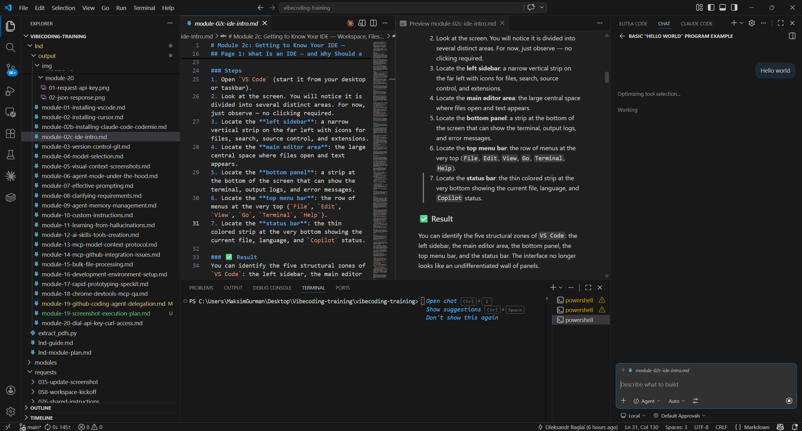

### ✅ Result
You can identify the five structural zones of `VS Code`: the left sidebar, the main editor area, the bottom panel, the top menu bar, and the status bar. The interface no longer looks like an undifferentiated wall of panels.

## Page 2: The Explorer Panel — Your Project File Map
### Background
When you open a folder in `VS Code`, the `Explorer` panel on the left becomes a live map of every file and subfolder inside it. This is your **project tree** — a nested, collapsible view of the entire project's contents.

For managers, the project tree is like a table of contents for a document. It tells you what exists, how it is organized, and where to find specific things. When you ask `Copilot` to create a new file or edit an existing one, it always works within this tree. Knowing how to navigate it means you can follow what the AI is doing — and verify its output.

### Steps
1. Click the top icon in the left sidebar (it looks like two overlapping pages). This opens the `Explorer` panel.
2. If no folder is open yet, click `Open Folder` and select the workspace folder you created in `Module 1` (e.g., `C:\workspace\my-first-project`).
3. The `Explorer` panel now shows the folder name at the top and all files and subfolders below it.

   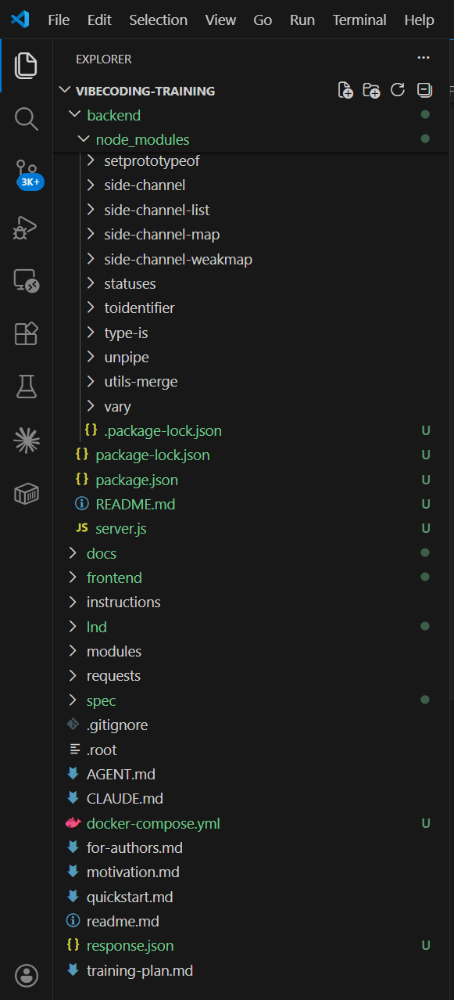

4. Click a file name in the tree — it opens in the main editor area to the right.
5. Click the arrow (▶) next to a folder name to expand it and see its contents. Click again to collapse.
6. Right-click anywhere in the `Explorer` panel to see options: `New File`, `New Folder`, `Rename`, `Delete`. These are the same actions you know from `File Explorer` on `Windows` or `Finder` on `macOS`.

   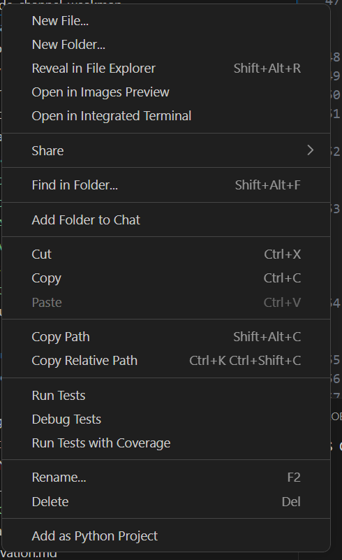

7. Notice that the path of the currently open file is shown at the top of the editor tab and in the status bar at the bottom.

### ✅ Result
You can open a project folder, navigate its structure in the `Explorer` panel, and open any file by clicking on it. You understand that the `Explorer` shows everything the AI can see and interact with in your project.

## Page 3: The Editor Area — Where Files Come to Life
### Background
The large central area of `VS Code` is the **editor**. This is where files open when you click on them, where you read content, and where changes are made — either by you or by the AI assistant.

The editor supports tabs (multiple files open at once), split views (two files side by side), and syntax highlighting (color-coded text that makes different types of content easier to read). For a manager, the most important thing about the editor is that it is where you **review what the AI produced** — reading the output, comparing it to your expectations, and deciding what to keep or change.

### Steps
1. In the `Explorer` panel, click any file to open it. It appears as a tab at the top of the editor area.
2. Open a second file by clicking another name in the tree. A second tab appears next to the first. You can switch between them by clicking the tabs.
3. To see two files at the same time, right-click a tab and select `Split Editor Right`. The editor splits into two columns.

   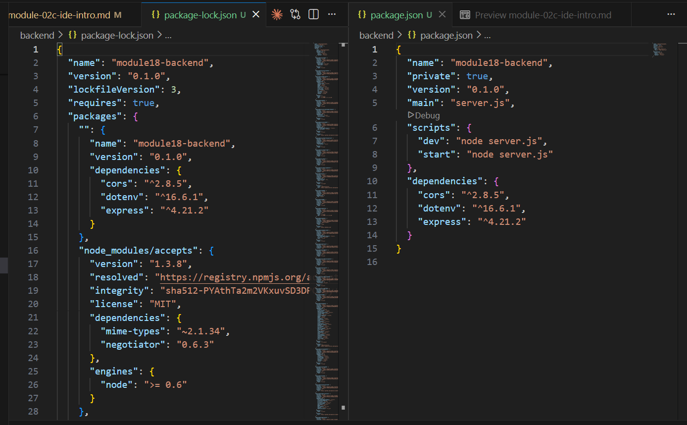

4. Click anywhere in the open file to place your cursor. Type a few characters. Notice that the tab name gains a dot (●) to indicate unsaved changes.
5. Press `Ctrl+S` (`Cmd+S` on `macOS`) to save. The dot disappears.
6. Press `Ctrl+Z` (`Cmd+Z`) to undo the change if needed.
7. To close a tab, click the × icon on the tab, or press `Ctrl+W` (`Cmd+W`).
8. Notice the breadcrumb trail just above the editor — it shows the file path (`folder > subfolder > filename.md`) so you always know where the open file lives.

   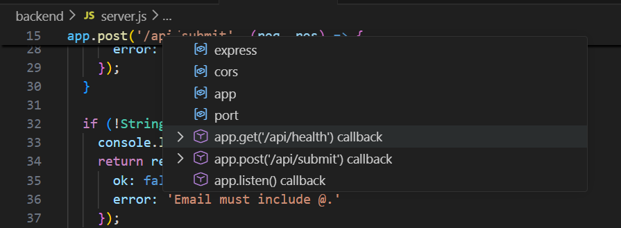

### ✅ Result
You can open multiple files simultaneously, switch between them using tabs, edit content, save changes, and undo edits. You can read AI-generated output in the editor and make manual adjustments where needed.

## Page 4: The Terminal — Running Commands Without Leaving VS Code
### Background
The **Terminal** is a text-based command interface: you type a command, press Enter, and the computer executes it. Developers use the terminal to install tools, run programs, check versions, and automate repetitive tasks.

For a manager using AI, you will encounter the terminal in two situations: when `Copilot` generates a command for you to run (e.g., `pip install requests` to add a software library), and when you want to verify that something worked (e.g., checking a version number). You do not need to memorize commands — the AI will tell you what to type. But you do need to know how to open the terminal and use it.

The `VS Code` integrated terminal is not a separate application. It opens inside the same window, already set to the correct folder, which eliminates a common beginner confusion: "which folder am I in?"

### Steps
1. Open the terminal using the menu: `Terminal` > `New Terminal`. A panel slides up from the bottom of the window.

   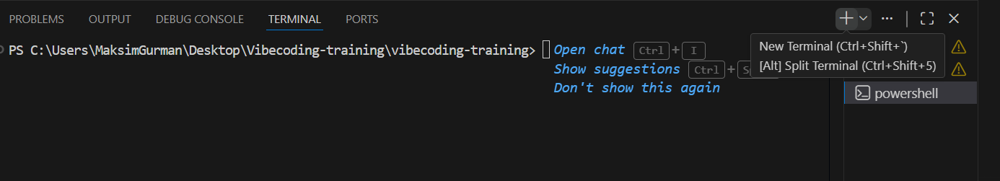

2. Look at the prompt line — it shows your current folder path (e.g., `C:\workspace\my-first-project>`). This confirms the terminal is already inside your project folder.
3. Type the following command and press `Enter` to see what folder you are in:
   - `Windows` (`PowerShell`): `Get-Location`
   - `macOS` / `Linux`: `pwd`
4. The terminal prints the full path of your current folder. This is your working directory.
5. Type the following command and press `Enter` to list all files in the current folder:
   - `Windows`: `Get-ChildItem`
   - `macOS` / `Linux`: `ls`
6. Compare the list with the `Explorer` panel — they show the same files.

   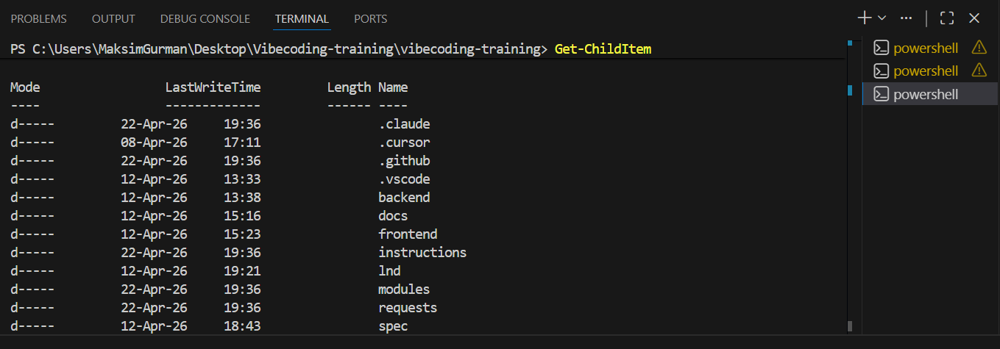

7. To open a second terminal tab, click the `+` icon in the terminal panel header. You can run different commands in parallel in separate tabs.
8. To close the terminal panel, click the × icon or press `Ctrl+`` ` (backtick) again to toggle it.

### ✅ Result
You can open the integrated `Terminal` in `VS Code`, see that it is already scoped to your project folder, and run basic commands. You are ready to execute any command that `Copilot` generates for you — without leaving the editor.

## Page 5: The AI Chat Panel — Your On-Demand Assistant
### Background
The `Copilot Chat` panel is where you have a conversation with `GitHub Copilot`. Think of it as an instant messaging window — except the person on the other side is an AI that knows the contents of your project, can write code, answer questions, generate documents, and take autonomous action on your files.

What makes the chat panel different from a standalone AI assistant (like a browser-based chatbot) is **context**: `Copilot` can see your project files, read what is open in the editor, and understand the structure of your workspace. When you ask it to "create a summary report," it knows where to put the file and what format to use — because it can see your project.

### Steps
1. Click the `Copilot Chat` icon in the left sidebar (it looks like a speech bubble with a sparkle). The chat panel opens on the left.
2. At the bottom of the chat panel, look for the mode selector. Make sure `Agent Mode` is selected (not `Ask Mode`). `Agent Mode` allows `Copilot` to take autonomous actions — creating files, running terminal commands, and making changes — not just answering questions.

   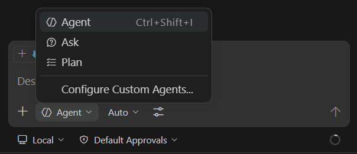

3. In the text field at the bottom of the chat panel, type the following and press `Enter`:
   `What files are in my current workspace?`
4. `Copilot` will read the `Explorer` tree and list the files for you. Notice that it mentions filenames you can see in the `Explorer` panel — proof that the AI has project context.
5. Now try a more practical request. Type:
   `Create a file called notes.md with a short welcome message`
6. Watch the editor and the `Explorer` panel: a new file `notes.md` appears in the tree, and it opens in the editor with the generated content.

   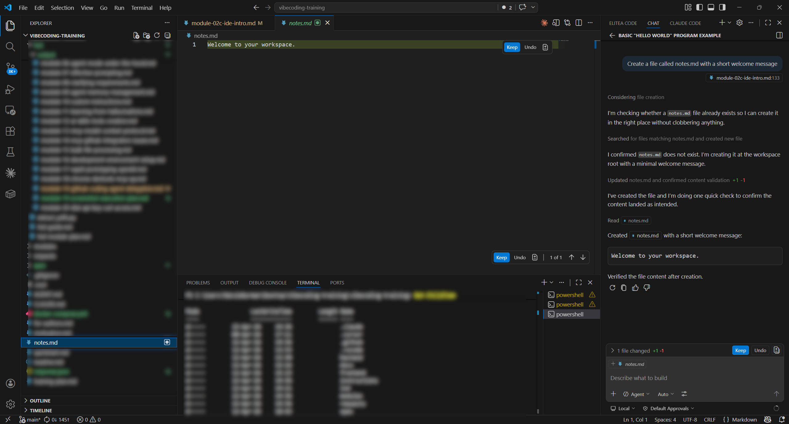

7. Review the content in the editor. Edit it if needed. Save with `Ctrl+S`.
8. You have just used `Copilot` to create a project file — without typing it manually.

### ✅ Result
You can open `Copilot Chat`, select `Agent Mode`, ask questions about your project, and instruct the AI to create or modify files. You understand that `Copilot` operates within the context of your project — not in isolation.

## Page 6: Why Each Project Lives in Its Own Folder
### Background
If you have been following along, you may have noticed that everything — the `Explorer` tree, the `Terminal`, `Copilot`'s context — is tied to a specific folder on your computer. This is not an accident. It is a deliberate design principle: **one project, one folder**.

This principle matters for three reasons:

1. **Isolation.** Files for Project A cannot accidentally interfere with files for Project B when they live in separate folders. Mistakes stay contained.

2. **Context.** When `Copilot` opens your project, it reads the folder's contents to build a picture of what you are working on. If you mix multiple unrelated projects in one folder, the AI gets a confused, noisy context — and its suggestions become less accurate.

3. **Reproducibility.** Anyone (including you, six months from now) can take the folder, open it in `VS Code`, and immediately have the full project — files, structure, history — without reconstruction.

Think of each project folder as a self-contained file cabinet drawer. Each drawer is labelled, holds only what belongs to that project, and can be handed to a colleague without explanation.

### Steps
1. Open `File Explorer` on `Windows` (or `Finder` on `macOS`) outside of `VS Code`.
2. Navigate to the parent folder where you store your projects (e.g., `C:\workspace\`).
3. Create a new subfolder named `project-jira-automation` (right-click > `New` > `Folder`).
4. Switch back to `VS Code`. Go to `File` > `Open Folder` and select `project-jira-automation`.

   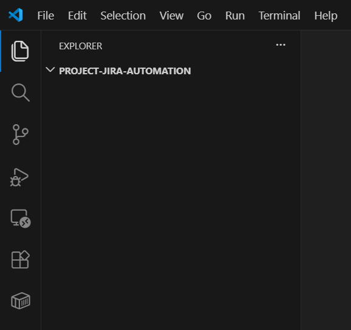

5. The `Explorer` panel now shows an empty tree — a clean slate for a new project.
6. Ask `Copilot` to set up a basic project structure:
   `Create a folder structure for a Jira automation project: a README.md, a scripts/ folder, and a data/ folder`
7. Notice how `Copilot` creates everything inside the current folder — it does not reach outside the project boundary.

   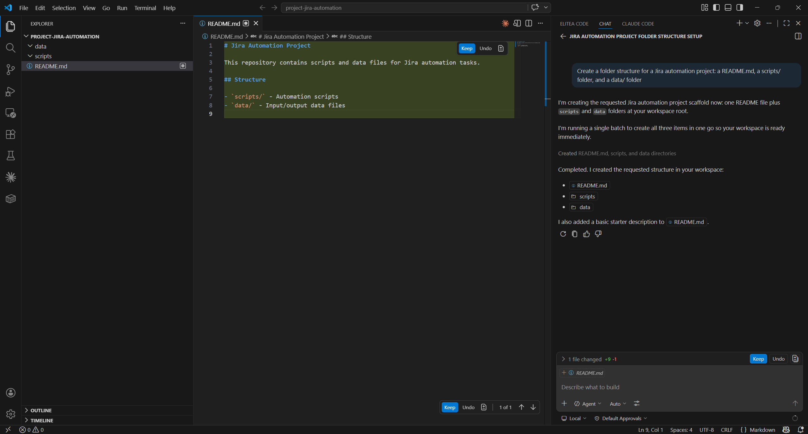

8. Close this folder and reopen your original workspace: `File` > `Open Recent` > select your first project. Everything from before is exactly as you left it — the new folder did not disturb it.

### ✅ Result
You have created a second project folder, opened it in `VS Code`, and confirmed that `Copilot` operates within its boundaries. You understand why keeping projects separate makes work cleaner, safer, and easier to share.

## Summary
In this module, you took a full tour of the `VS Code` interface — the tool you will use for every hands-on exercise in this course. Here is what you now know:

- **`VS Code`** is an Integrated Development Environment — a single window that combines a file browser, an editor, a terminal, and an AI chat panel, all aware of each other.
- **The `Explorer` panel** (left sidebar) shows the project tree: every file and folder in your workspace, available to you and to the AI.
- **The editor area** (center) is where files open, where you read AI-generated content, and where you make manual edits. Tabs let you work on multiple files at once.
- **The integrated `Terminal`** (bottom panel) lets you run commands without leaving `VS Code`. It opens already scoped to your project folder, eliminating the "wrong directory" confusion.
- **`Copilot Chat`** (left sidebar) is your AI assistant, operating in the context of your project. In `Agent Mode`, it can create files, run commands, and take multi-step actions autonomously.
- **One project = one folder.** Keeping projects in separate folders ensures clean AI context, prevents accidental file mixing, and makes projects portable and shareable.

**Useful resources:**
- [VS Code interface overview (official docs)](https://code.visualstudio.com/docs/getstarted/userinterface)
- [VS Code keyboard shortcuts — Windows](https://code.visualstudio.com/shortcuts/keyboard-shortcuts-windows.pdf)
- [VS Code keyboard shortcuts — macOS](https://code.visualstudio.com/shortcuts/keyboard-shortcuts-macos.pdf)
- [GitHub Copilot Chat documentation](https://docs.github.com/en/copilot/using-github-copilot/asking-github-copilot-questions-in-your-ide)

## Quiz

**Question 1.** You open `VS Code` and see a list of files on the left side of the screen. What panel is this?

- A) The `Terminal`
- B) The `Explorer` panel ✅
- C) The `Copilot Chat` panel
- D) The status bar

**Feedback:**
- A) Incorrect. The `Terminal` is located in the bottom panel and shows a command prompt, not a file list.
- B) Correct. The `Explorer` panel displays the project tree — all files and folders in the currently open workspace.
- C) Incorrect. The `Copilot Chat` panel is a conversation interface, not a file browser.
- D) Incorrect. The status bar is the thin strip at the very bottom showing file information and `Copilot` status.

---

**Question 2.** You ask `Copilot` to create a report file. A few seconds later, a new file appears in the `Explorer` panel and opens automatically in the editor. What feature of `VS Code` made this seamless experience possible?

- A) The editor and `Explorer` are two completely separate apps that happened to update at the same time
- B) The `Terminal` executed the file creation and refreshed both views manually
- C) All panels in `VS Code` share the same project context and stay synchronized automatically ✅
- D) You had to refresh the `Explorer` manually — it does not update on its own

**Feedback:**
- A) Incorrect. `VS Code` is an integrated environment. The panels are parts of the same application, not separate tools.
- B) Incorrect. `Copilot` can use the `Terminal`, but the synchronization between the `Explorer` and the editor is a built-in `VS Code` feature, not a manual refresh.
- C) Correct. Integration is the core design principle of an IDE. All panels — `Explorer`, editor, `Terminal`, chat — share the same project context, so changes made in one area are immediately visible in the others.
- D) Incorrect. The `Explorer` updates automatically when files are created or modified.

---

**Question 3.** A colleague asks why you keep each project in a separate folder instead of putting all your files in one big folder. Which answer is most accurate?

- A) It is a personal preference — there is no practical difference
- B) Separate folders give `Copilot` a clean, focused context for each project and prevent files from different projects from interfering with each other ✅
- C) `VS Code` only works with folders that contain a single file
- D) Separate folders are required by the `Terminal` — it cannot navigate between projects otherwise

**Feedback:**
- A) Incorrect. The folder structure has a direct impact on AI context quality, reproducibility, and the ability to share projects cleanly.
- B) Correct. Each folder acts as an isolated workspace. `Copilot` reads the folder to understand the project — mixing unrelated files degrades the AI's context and leads to less accurate suggestions.
- C) Incorrect. `VS Code` opens folders of any size and complexity. The one-folder-per-project practice is about organization, not a technical limitation.
- D) Incorrect. The `Terminal` can navigate anywhere. The folder-per-project principle is about clarity and AI context quality, not a `Terminal` constraint.
