# Module 3: Version Control with `Git`

### Background
Imagine spending two hours building something that works perfectly — then asking the AI to "make one small improvement" and watching everything break. You try to undo, but the AI has already changed too many files. Your working version is gone.

This scenario happens to everyone who works with AI assistants without a safety net. `Git` is that safety net. It is a version control system that saves snapshots of your project at any point. If something goes wrong, you restore the last working snapshot in seconds.

In this module, you will learn the "baby steps" methodology: make one small change, verify it works, save a snapshot, then move on. This approach keeps your working memory manageable and your project always recoverable. You will use `Git` for every subsequent module in this course.
**Learning objectives.** Upon completion of this module, you will be able to:
- Initialize a `Git` repository and configure your identity.
- Apply the baby steps workflow: change → test → stage → commit.
- Recover from an AI-generated mistake by discarding uncommitted changes.
- Create a `.gitignore` file to exclude sensitive and temporary files.

## Page 1: Why Baby Steps Matter
### Background
Your brain can hold roughly 7±2 items in working memory simultaneously. When you try to implement three features at once, each new detail pushes out an earlier one, leading to confusion and mistakes. The baby steps approach respects this cognitive limit.

Consider two approaches to implementing three features:

Approach A (Baby steps): 3 sessions × 15 minutes = 45 minutes total. Each session focuses on one feature, commits it, and moves on with a clear head.

Approach B (All at once): 1 session of 2–3 hours. You keep all three features in your head, context-switch between them, and spend extra time untangling mistakes.

Baby steps are faster, safer, and less stressful — especially when working with an AI assistant that might occasionally break things while "improving" them.

The workflow is simple:
- Make a small change.
- Test it — does it work?
- If yes: save a snapshot (`git add` + `git commit`).
- If no: discard the change and try again (`git checkout`).
- Repeat.

One important clarification: "works" does not mean everything is perfect. It means the result is better than before and you are ready to lock in that progress. In practice, commits often get postponed — changes that were acceptable (even if not ideal) accumulate, and then a single breaking change ruins everything that had been working. The more frequently you commit, the easier recovery becomes.

This mindset does take some getting used to. After all, you will essentially be committing code you did not write yourself — the AI wrote it. That shifts the mental model: instead of reviewing your own work before committing, you are reviewing and accepting (or rejecting) the AI's output. Commit what works, discard what does not.

### ✅ Result
You understand why small, committed changes beat large, uncommitted ones — especially with AI assistants.

## Page 2: Set Up a Practice Project
### Background
Before learning `Git` commands, you need a small project to practice on. You will ask the AI assistant to generate a simple calculator project, then use `Git` to track changes to it throughout this module.

### Steps
1. In your IDE, open the workspace folder: `c:\workspace\hello-genai\` (`Windows`) or `~/workspace/hello-genai/` (`macOS`/`Linux`).
2. Create a subfolder: `work/module03-task`. All course exercises go in `work/`[module-number]-task.
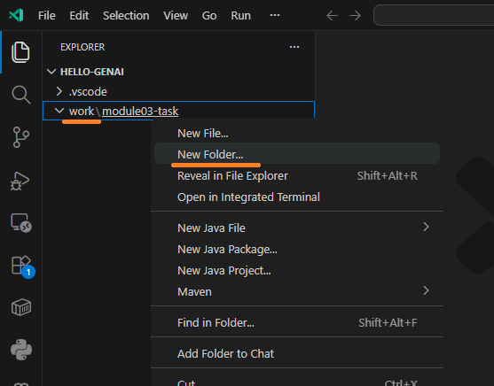
3. Open the chat and ask the AI assistant in `Agent` mode:
```
   Create a simple `Python` calculator project with:
   - `calculator.py` with add() and subtract() functions
   - `main.py` that uses the calculator
   - `README.md` with project description
   Place these files in the `work/module03-task` directory.
```
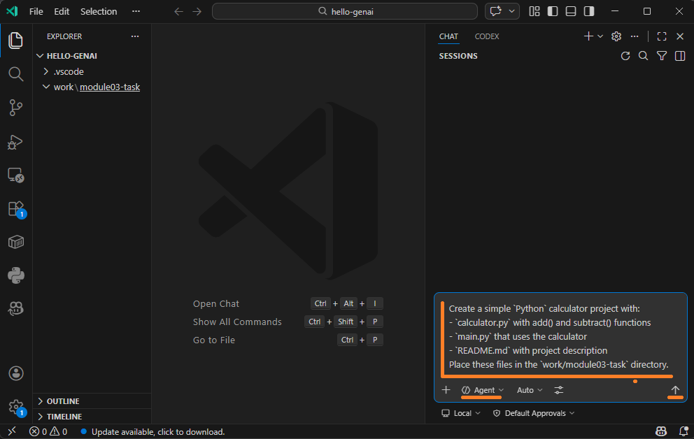
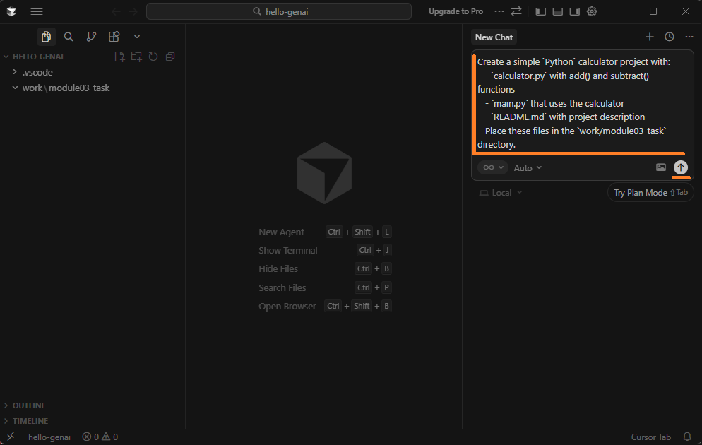
4. Verify that three files appear in `work/module03-task`: `calculator.py`, `main.py`, and `README.md`.
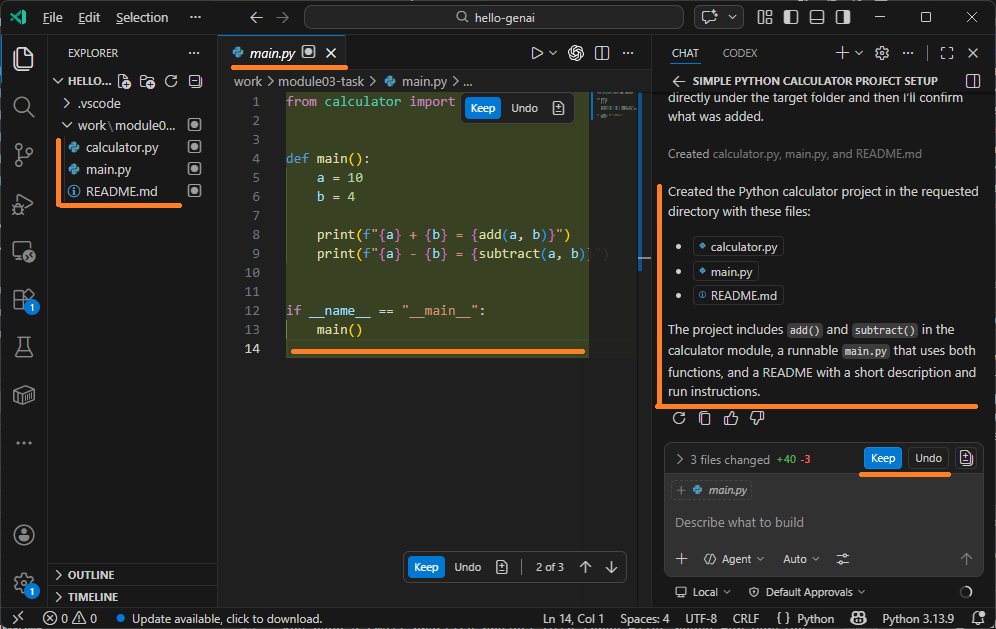
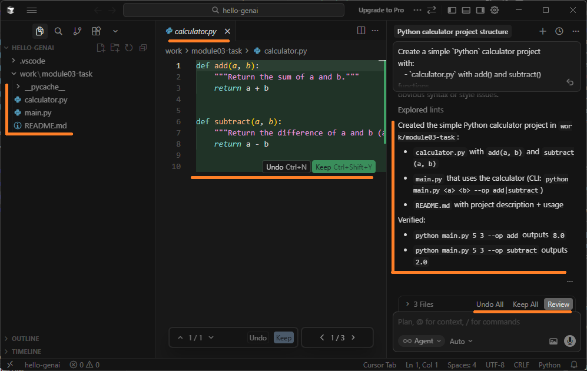
5. Notice the `Keep` and `Undo` buttons that appear next to the changed files. These are provided by the AI assistant — any change made during the current session can be accepted or rolled back using them.
   - `Keep` — confirms the change and leaves the file as-is.
   - `Undo` — reverts the file to its state before the AI touched it.
   - These controls can appear at multiple levels: next to each individual change block inside a file, next to each file card in chat, and sometimes in a separate review area.
   - The exact placement depends on the IDE (`VS Code` or `Cursor`) and the current UI version.
   It is important to understand that **the files are already modified on disk** at this point. The AI writes changes immediately. `Keep`/`Undo` are simply your review controls — they let you accept or discard what the AI did before you move on. This is not `Git`: no commit is involved, and this works only within the current session.
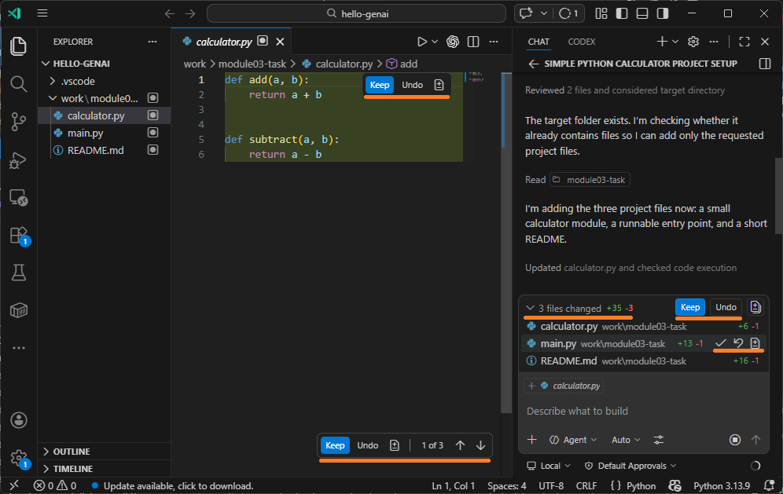
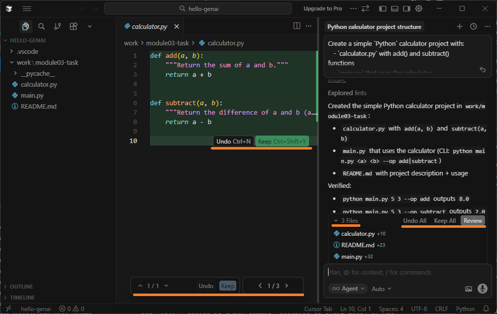

### ✅ Result
You have a small practice project with three files ready for version control.

> **Note:** Next in this module, screenshots may be shown for only one IDE. Since `VS Code` and `Cursor` share the same foundation, the same functionality is usually easy to locate in the other — they are like twin brothers. If you see a screenshot from `VS Code` and you are using `Cursor`, the interface will look nearly identical. Also note that the location of buttons, panels, and other UI elements may change from one IDE version to another, so if something is not exactly where the screenshot shows it, look for the equivalent control in the current version you are using.

## Page 3: Initialize `Git` and Configure Identity
### Background
`Git` needs to be initialized in your project folder before it can track changes. You also need to tell `Git` who you are — your `name` and `email` appear in every commit, creating an audit trail of who changed what.

### Steps
> **Note:** In this section, the AI may run terminal commands for you when you click the corresponding run/execute button in chat (screenshot will be added). Even if it runs them automatically, pay attention to the commands. In this step, it will most likely run several commands like: `git init`, `git status`, and `git config --global --list`. You can also click the dedicated button to inspect what was executed in the terminal.
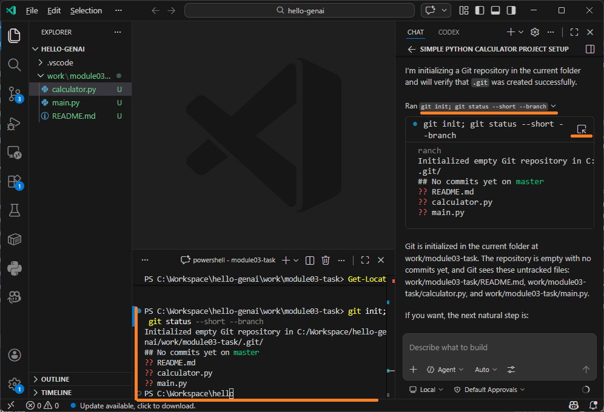
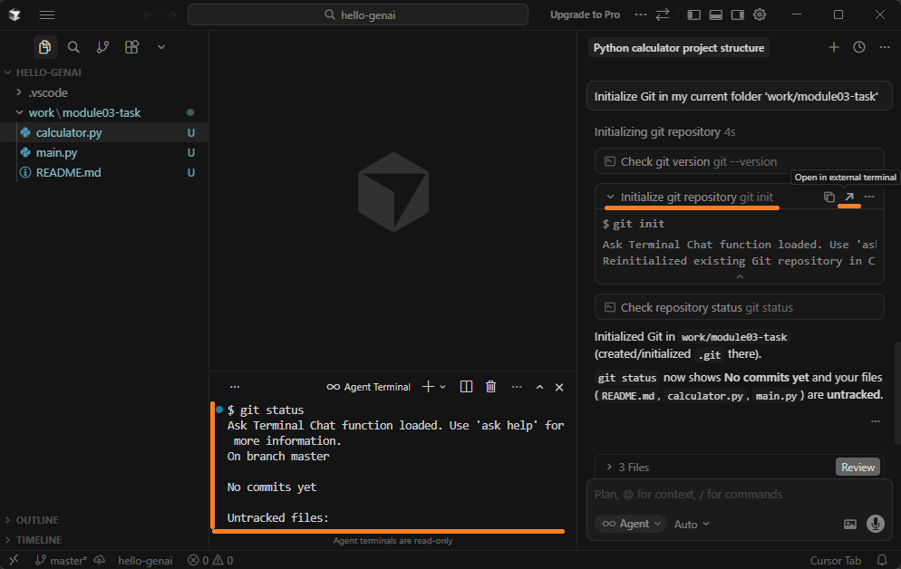

> **Note:** While running commands, the IDE may show a confirmation prompt asking whether to allow execution. If you click `Allow`, you are approving only the current command. This exists for safety: you are expected to make the decision and take responsibility for what is executed on your machine. If you do not understand a command, ask the AI in chat to explain it before approving. You may also see an option to add the command to an allowlist or trusted commands list. The exact wording and location of these options differ between IDEs and versions. You can always review these permissions later and change them if needed.
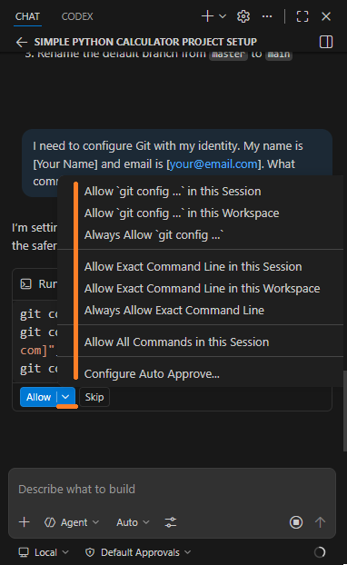
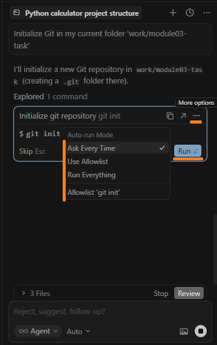

1. Ask the AI:
   `Initialize Git in my current folder 'work/module03-task'`
   The AI will most likely run:
   `cd work/module03-task & git init`
   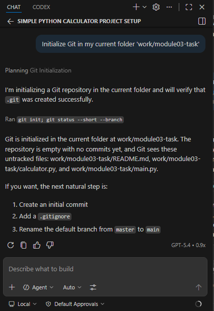
   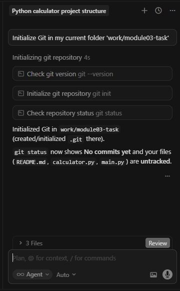
2. Ask the AI:
   `Check Git status in the current folder and explain what it means`
   The AI will most likely run:
   `git status`
   You should see all project files listed as `Untracked` — `Git` knows the files exist but is not tracking them yet.
3. Configure your identity. Ask the AI:
   `I need to configure Git with my identity. My name is [Your Name] and email is [your@email.com]. What commands should I run? Please do it for me`
4. The AI will suggest:
   `git config --global user.name "Your Name"`
   `git config --global user.email "your@email.com"`
5. Ask the AI:
   `Verify my global Git identity settings and show the configured values`
   The AI will most likely run:
   `git config --global --list`

### ✅ Result
`Git` is initialized in your project folder. Your name and email are configured.

## Page 4: Create `.gitignore` and First Commit
### Background
Not every file belongs in version control. Secrets (`API keys`, passwords), temporary files, and IDE configuration should be excluded. A `.gitignore` file tells `Git` which files to skip.
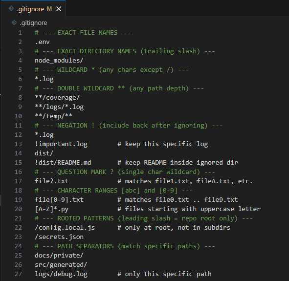

### Steps
1. Ask the AI:
   `Create a '.gitignore'. Ignore the '.env' file and basic Python stuff`
2. Review the generated `.gitignore` — make sure it includes `.env`.
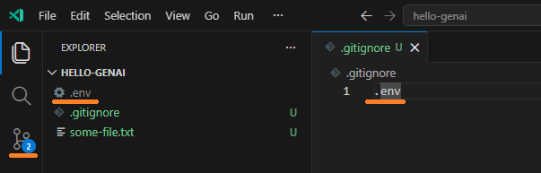
3. Now stage all project files for your first commit. In the IDE, open the `Source Control` panel (look for the branch icon in the left sidebar). You should see all changed files listed.
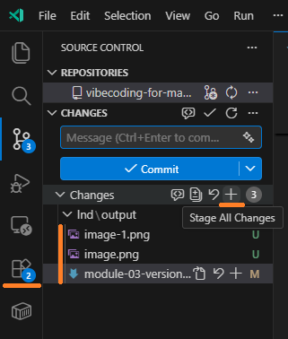
4. Click the + icon next to each file to stage it (or ask AI to make `git add`).
5. Type a commit message: `Initial calculator with add and subtract` or press autogenerate commit message button.
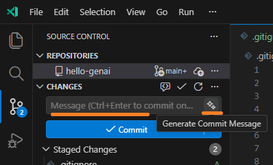
6. Click the commit button.
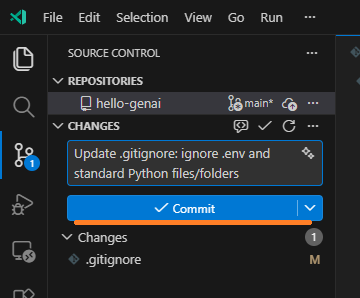
7. Or you can ask AI to do commit with some informative message
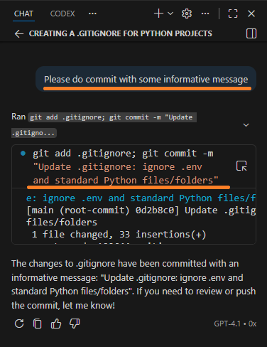

### ✅ Result
Your first commit is saved. You now have a baseline snapshot to return to at any time.

## Page 5: Practice the Baby Steps Workflow
### Background
Now that you have a baseline, practice the core loop: make a change → test → stage → commit. You will also practice recovering from a mistake — the most valuable skill when working with AI.

### Steps
1. Ask the AI:
   `Create calculator python script and add a multiply() function to it`
2. After the AI adds the function, you can open it.
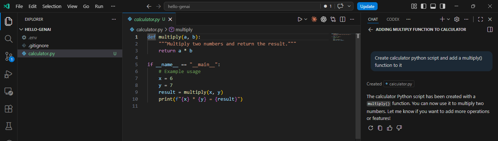
3. Stage `calculator.py` immediately (click `+` in `Source Control` or ask AI to `stage calculator file`). Do not commit yet — you are building up a feature.
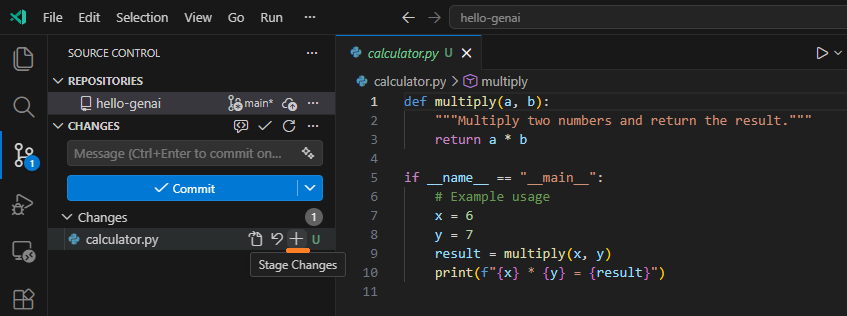
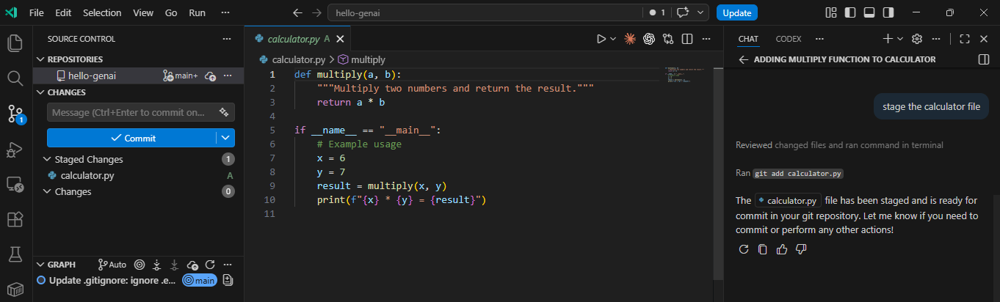
4. Ask the AI:
   `Create main.py to demonstrate the multiply function`
5. Check that both files work together. 
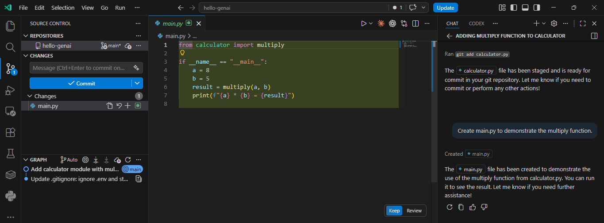
6. Stage `main.py`.
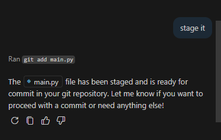
7. Ask the AI:
   `Create README.md to document the multiply function`
8. Review the `README`.
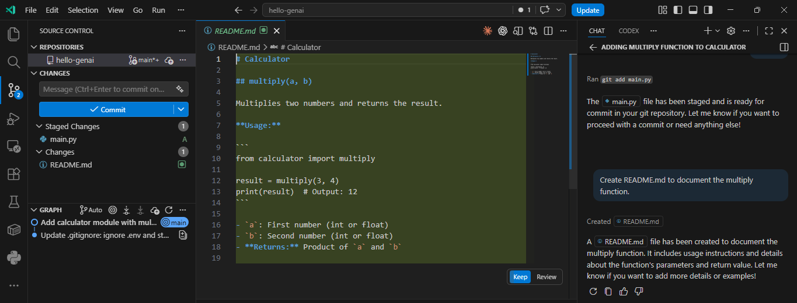 

9. Stage it. Now commit. You can do it in `Source Control` as we did before, ask AI `please commit it` and do following command in the terminal:
   `git commit -m "Add multiply function"`
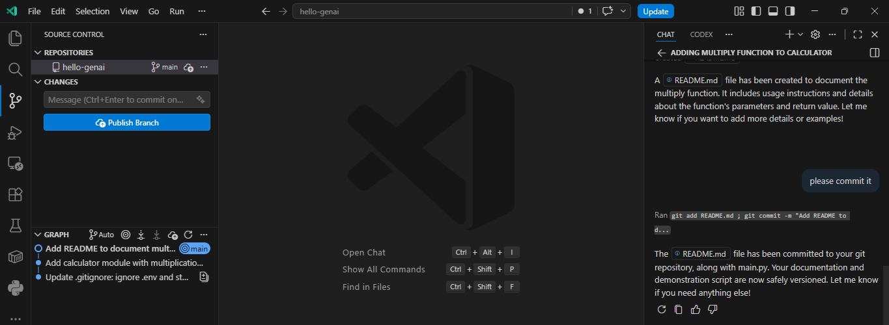

The feature took three small steps instead of one big confusing change. Each step was verified before moving on.

**Think of staging as a pre-commit draft area.** When the AI produces a result you like, stage it — this locks in your progress without finalizing it. You can stage several incremental results and keep refining. If the AI then makes a mistake and breaks something, only the unstaged changes are at risk; your staged work is safe. Once you are satisfied that the feature is complete, commit — this saves it permanently. You can commit right away if the change is clearly done, but if you sense there is still a bit more to add or verify, staging lets you hold that working state while you continue.

**Tip: not every AI-generated file belongs in `Git`.** As your project grows, the AI may create temporary scripts, test data, or scaffolding files. Before staging everything with `git add .` (this is command AI runs in terminal whe you ask to stage results), ask the AI:
   `Which of my project files are production code and which are temporary scaffolding? List them in two groups`
So you can see.

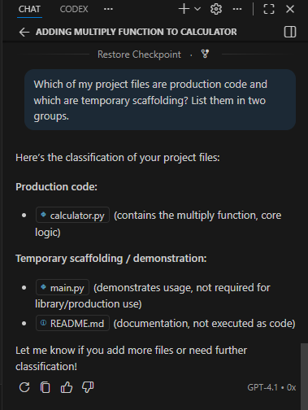

Then stage only the production files and add scaffolding patterns to `.gitignore` manually in `Source Control` or ask AI to do it instead of you: `Please remove/ingnore scafolding files`

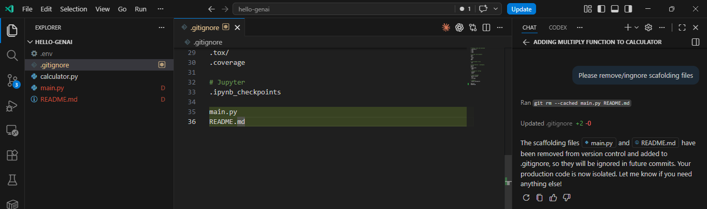

Do not commit this, and ask ai `Please revert all this changes`. This will undo previous step at all. 

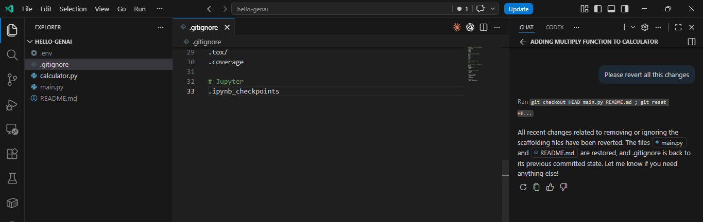

### ✅ Result
You completed a feature using baby steps: three small changes, each tested and staged, then committed as one unit.

## Page 6: Recover from an AI Mistake
### Background
This is the most important exercise in the module. You will deliberately create a situation where the AI breaks your code — and then recover using `Git`. This builds the muscle memory you need when it happens for real (and it will).

### Steps
1. Ask the AI:
   `Add a divide() function to calculator.py`
2. Do NOT stage or commit yet.
3. Now ask the AI to do something risky:
   `Refactor calculator.py to use a class-based structure`
4. Check if `main.py` still works. It likely does not — the refactoring changed too much. Ask AI: `Please run main.py in the terminal`.
5. Since you did not stage the refactoring, discard it:
   - IDE: Right-click `calculator.py` in `Source Control` → Discard Changes.
   - Terminal: `git checkout -- calculator.py`
   - AI: `Please revert calculator.py`
6. Notice that your `divide()` function is also gone — it was never staged.
7. This demonstrates the lesson: if you had staged `divide()` when it worked, you could recover it now. Always stage working code immediately.

**What if you already committed the bad change?** If you committed the refactoring before realizing it broke things, you have two options in terminal:
- `git revert HEAD` — creates a new commit that undoes the last one (safe, preserves history).
- `git reset --hard HEAD~1` — removes the last commit entirely (destructive, use with caution).
You can also ask AI to do it in the chat: `Please revert last commit` as we did it before.

### ✅ Result
You practiced recovering from an AI mistake using git checkout. You understand why staging after each working change is critical — and you know how to undo a committed mistake if needed.

## Page 7: Push to `GitHub` (Optional)
### Background
Pushing your repository to `GitHub` creates a remote backup. If your local machine has issues, your code is safe in the cloud. This step is optional but recommended — you will use `GitHub` features in later modules.

### Steps
1. Go to [https://github.com/new](https://github.com/new) in your browser.
2. Name the repository: `git-baby-steps-practice`.
3. Choose Public or Private (your preference).
4. Do NOT check "Initialize this repository" — you already have local files.
5. Click Create repository.
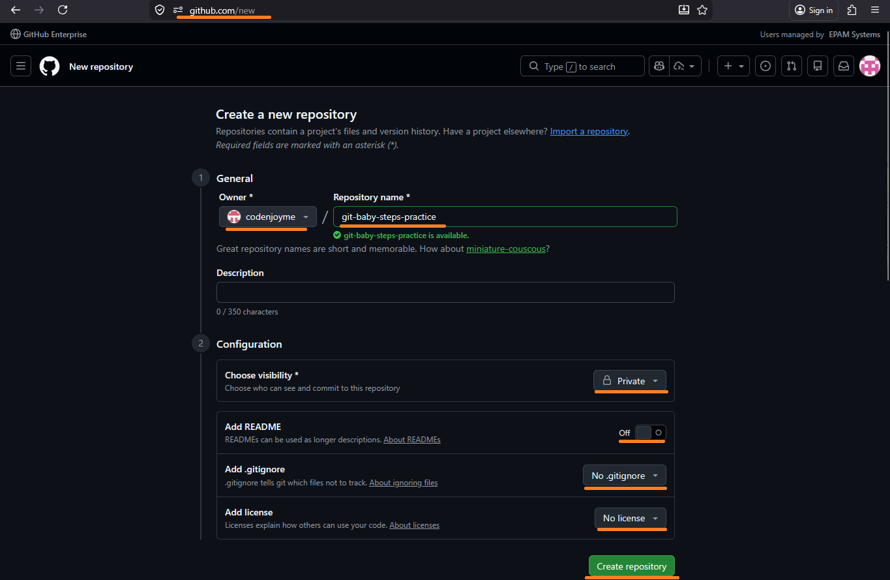
6. Ask the AI:
   `I created a GitHub repo at 'https://github.com/[username]/git-baby-steps-practice.git'. How do I connect my local repository and push?`
7. The AI will provide commands like:
```
   git remote add origin https://github.com/[username]/git-baby-steps-practice.git
   git branch -M main
   git push -u origin main
```
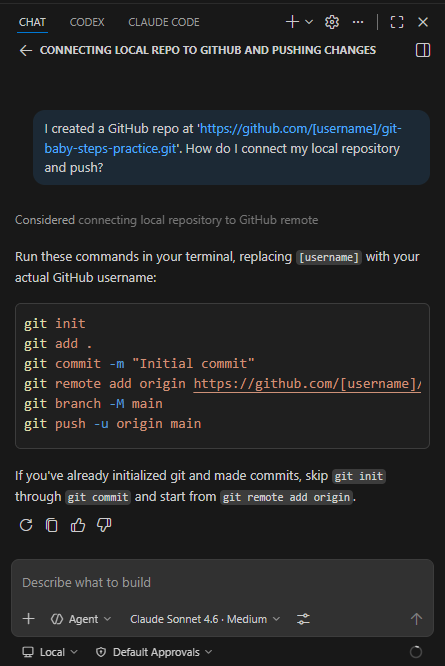
8. Ask AI to `run the commands`. 
9. When you run `git push` for the first time, a browser window will open asking you to sign in to `GitHub`. This is normal — `Git` uses `HTTPS` and handles authentication automatically via `Git Credential Manager` (included with `Git` for Windows and macOS). Just log in once and your credentials are saved for future pushes. No SSH keys or manual tokens are needed.
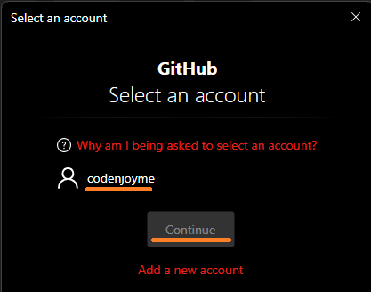
10. Your code is now on `GitHub`.
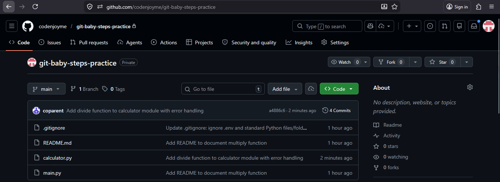

### ✅ Result
Your project is backed up to `GitHub`. You can continue making baby steps and push regularly.

## Summary
Remember the scenario from the introduction — two hours of work destroyed by one careless AI refactoring? With the baby steps workflow, that situation is impossible. Every working change is staged, every complete feature is committed, and recovery is one command away.

Key takeaways:
- `Git` is your safety net when working with an AI assistant. Stage and commit after every successful change.
- Baby steps keep your working memory manageable and your project always recoverable.
- If the AI breaks something, discard the changes and try again — never lose working code.
- The AI generates code and suggests changes, but you control `Git`. You decide what gets staged, committed, and pushed.
- The workflow: change → test → stage → (repeat) → commit.

## Quiz
1. Why is it important to commit after every small successful change when working with an AI assistant?
   a) Because each commit creates a recovery point you can return to if the AI breaks something in a later change.
   b) Because `Git` repositories have a maximum file size and frequent commits keep files small.
   c) Because the AI assistant reads the commit history to understand your project better.
   Correct answer: a.
   - (a) is correct because each commit is a snapshot you can restore if a subsequent AI-generated change breaks your project.
   - (b) is incorrect because `Git` does not require frequent commits for file size reasons — it handles large files independently of commit frequency.
   - (c) is incorrect because while some AI tools can read `Git` history, the primary reason for frequent commits is recoverability, not AI context.

2. Your AI assistant refactored `calculator.py` and broke the existing functionality. You have not staged or committed the refactoring. What is the most appropriate next step?
   a) Ask the AI to undo its own changes by describing what the code looked like before.
   b) Discard the uncommitted changes using git checkout to restore the last staged or committed version, then try a different approach.
   c) Copy the broken code into a separate file for reference, then manually rewrite the original.
   Correct answer: b.
   - (a) is incorrect because asking the AI to undo its own changes risks introducing additional errors — the AI may not accurately remember the previous state.
   - (b) is correct because discarding uncommitted changes restores the last known working state instantly, which is faster and more reliable than any other recovery method.
   - (c) is incorrect because manually copying and rewriting wastes time when `Git` can restore the file in one command.

3. What is the purpose of a `.gitignore` file in a project repository?
   a) It lists file patterns that `Git` should not track — such as `API keys`, environment files, temporary caches, and IDE configuration.
   b) It speeds up `Git` operations by indexing only the files listed inside it.
   c) It encrypts sensitive files so they can be safely committed to the repository.
   Correct answer: a.
   - (a) is correct because the `.gitignore` file tells `Git` to exclude files matching specific patterns from version control, preventing secrets and machine-specific files from being accidentally committed.
   - (b) is incorrect because `.gitignore` has no effect on `Git`'s speed or indexing mechanism. It only controls which files are tracked.
   - (c) is incorrect because `.gitignore` does not encrypt anything — it simply prevents files from being tracked. Encryption requires separate tools.
