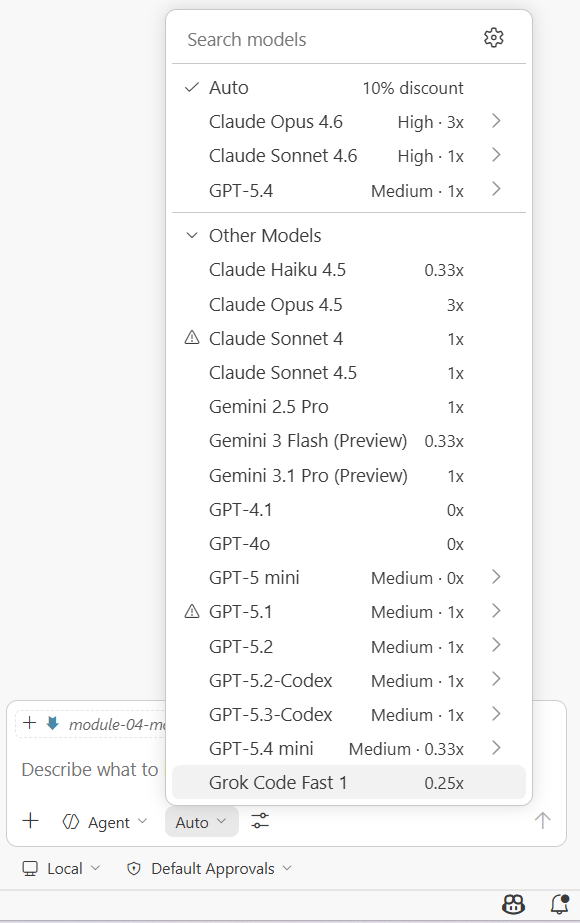
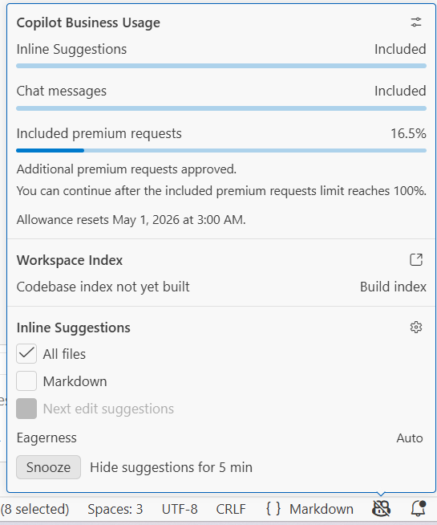
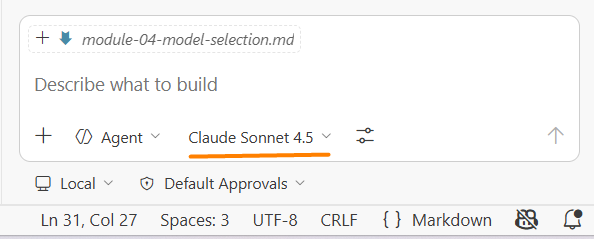
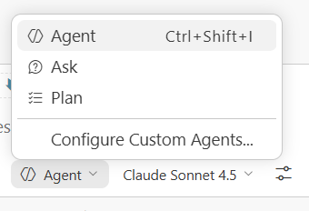

# Module 4: Model Selection

### Background
Not all AI models are created equal — and not all tasks require the most powerful model. Choosing the right AI model is like choosing the right tool from a toolbox: a sledgehammer works for demolition, but you need a screwdriver for assembling furniture.

In this module, you will learn how AI model pricing works, how to select and switch models in your IDE, and a practical strategy for finding your go-to model. By the end, you will have your AI assistant configured with the optimal model and mode for productive work.

Upon completion of this module, you will be able to:
- Explain how AI model pricing tiers (0x, 1x, 3x) affect your premium request quota.
- Select and configure an AI model in your IDE.
- Enable `Agent Mode` and verify it works through practical tests.
- Apply a consistent model selection strategy instead of switching randomly.

## Page 1: Understanding Model Types and Pricing
### Background
AI coding assistants offer multiple models with different capabilities and costs. Most IDEs use a tier system where each model interaction consumes a certain number of "premium requests" from your monthly quota. Understanding this system helps you make informed choices without worrying about unexpected costs.

### Steps
1. Open your AI coding assistant (`VS Code` with `Copilot` or `Cursor`).
2. Navigate to Settings and find the Models or AI section.
3. Review the available models — you will typically see labels like:
   - 0x — Free tier models (no premium request cost).
   - 1x — Standard models (1 premium request per use).
   - 3x — Advanced models (3 premium requests per use).

   
4. The logic: higher multipliers consume quota faster but provide better quality responses.
5. Check your account settings to see your current premium request balance.

> **Note:** If the indicator appears stuck at 100%, this does not necessarily mean your personal quota is exhausted. Organizations often apply a company-level spending cap — typically set between 200% and 400% of the base quota — after which premium models truly become unavailable. To check whether a company-level limit is in effect (for GitHub Copilot), navigate to [github.com/settings/copilot/features](https://github.com/settings/copilot/features) — that page shows both your personal usage and any organization-imposed restrictions.

### ✅ Result
You can see the available models, understand the pricing tiers, view your current quota usage, and identify any organization-level spending limits that may restrict access to premium models.

## Page 2: Select Your Primary Model
### Background
With many models available, it is tempting to switch constantly. Research shows this is counterproductive — each model has its own strengths and quirks, and you only learn them through sustained use. The recommended strategy is to start with the best available model and switch only when you encounter a real limitation.

### Steps
1. Open the model selection in your IDE:
   - `VS Code`: Open the `Command Palette` and type `> Chat: Manage Language Models` — select it from the list.
   
   - `Cursor`: Go to `File` → `Preferences` → `Cursor Settings` → `Models`.
   
   
2. Review the available models. Recommended choices:
   - `Claude Sonnet 4.6` — Best for coding tasks, excellent balance of price and quality.
   - `GPT-4.1` — Free tier (0x), no quota cost, but noticeably mediocre at following instructions and writing code — use only as a fallback when premium quota is exhausted.
3. Select `Claude Sonnet 4.6` as your primary model.

   We recommend staying within the **Claude ecosystem** — these models are purpose-built for coding and perform exceptionally well in Agent Mode. Here is how to think about the three tiers:

   | Model | Multiplier | Best for |
   |---|---|---|
   | `Claude Haiku 4.6` | 0.33x | Simple actions, code review, text generation — lightweight and fast |
   | `Claude Sonnet 4.6` | 1x | Your everyday workhorse — handles the vast majority of tasks well (use ~80% of the time) |
   | `Claude Opus 4.6` | 3x | Complex tasks when Sonnet falls short, or upfront architecture and design thinking |

   > **Tip:** The higher the version number, the better the model — prefer 4.6 over 4.6 wherever available. If your IDE does not yet offer a 4.6 version, select the equivalent 4.6 model instead.

4. Verify: The selected model should be displayed in your settings or status bar.

The practical strategy:
- Start with the best model available.
- Use it consistently while it works well.
- Switch only if it glitches, becomes unavailable, or underperforms on your tasks.
- Try the next best model, evaluate, and stay or move on.
- Most users settle on one or two models for 90% of their work.

### ✅ Result
Your AI assistant is configured with Claude Sonnet 4.6 (or your preferred model).

## Page 3: Enable `Agent Mode`
### Background
Your AI assistant can operate in two modes. `Ask Mode` is simple Q&A — it answers questions but does not take actions. `Agent Mode` is autonomous — it can read files, search your codebase, create files, run commands, and perform multi-step tasks. For this course, `Agent Mode` is essential because you will delegate real tasks to the AI.

### Steps
1. In your AI assistant settings, look for mode selection (usually in the chat panel or settings).
2. Enable `Agent Mode`.

3. Verify by testing all three capabilities:
   - Test 1 — Ask a technical question:
     `Explain the difference between async/await and promises in JavaScript`
     You should receive a detailed, well-structured response.
   - Test 2 — Request code generation:
     `Create a Python function that reads a CSV file and converts it to JSON`
     The AI should generate working code with error handling.
   - Test 3 — Test autonomous file access:
     `List the files in my current workspace and tell me what you see`
     The AI should read the file system and report back (this proves `Agent Mode` works).
     

### ✅ Result
`Agent Mode` is enabled. Your AI assistant can answer questions, generate code, and interact with your file system autonomously.

## Page 4: Understanding Real Costs
### Background
Cost anxiety is the most common barrier to using AI coding assistants effectively. Knowing the real numbers helps you focus on productivity instead of watching a usage meter.

Real-world example from intensive usage:
- One month of daily AI-assisted work.
- Using Claude Sonnet 4.6 extensively — generating code every working day.
- Total cost: approximately $80 over the base subscription — which corresponds roughly to an 800% overage against the default Copilot quota (the relationship is not linear, but the order of magnitude holds).
- That month of AI-assisted work produced more output than an entire previous year of manual work.

If your AI champion is actively exploring the GenAI world, they will likely exhaust their available 200–300% quota well before the month ends. When this happens repeatedly, it is a systemic signal — not a one-off event. It means the spending cap needs to be reconsidered and raised.

Regarding Cursor — it has its own monetization model, similar in structure to Copilot. The principle is the same: do not restrict your engineers.

The core logic is simple: if you are adopting GenAI to save X × $1,000 in engineering hours, it makes no sense to be frugal about Y × $10 on model access. Limiting the tools limits the outcome.

Most learners will not exhaust their free premium requests during this course. The productivity gain far exceeds any cost.

When it comes to a real work project, the consumption intensity is noticeably higher. However, if usage is limited to Agent Mode — without bulk document processing such as scanning an entire codebase, a full Jira backlog, or a Confluence space — the model cost per person per month will typically stay within ~1,000% of the base quota, or roughly $100.

### ✅ Result
You understand real-world cost expectations and can focus on learning without cost anxiety.

## Summary
Remember the toolbox analogy from the introduction? You now have the right tool selected and ready. You configured your AI assistant with `Claude Sonnet 4.6` — the screwdriver for most of your daily coding tasks — and enabled `Agent Mode` so the AI can work autonomously with your files and codebase.

Key takeaways:
- Start with the best available model (`Claude Sonnet 4.6` recommended) and switch only when you hit a real limitation — constant switching wastes time.
- `Agent Mode` is more powerful than `Ask Mode` — it can read files, create code, and perform multi-step tasks autonomously.
- Real costs are modest relative to productivity gains — do not let cost anxiety slow your learning.

## Quiz
1. What is the recommended strategy for selecting an AI model?
   a) Switch models for every new task to find the best match
   b) Start with the best available model, use it consistently, and switch only when you encounter a real limitation
   c) Use the cheapest model first and upgrade only when the output is unusable
   Correct answer: b.
   - (a) is incorrect because constant switching prevents you from learning a model's strengths and quirks, reducing overall productivity.
   - (b) is correct because consistent use of one strong model lets you build intuition for its capabilities, and you switch only when there is a concrete reason.
   - (c) is incorrect because starting with the cheapest model means you work with lower-quality output from the start, which slows learning and may give a misleading impression of AI capabilities.

2. What is the main advantage of `Agent Mode` over `Ask Mode`?
   a) `Agent Mode` uses fewer premium requests per interaction
   b) `Agent Mode` can read files, create code, and perform multi-step actions autonomously
   c) `Agent Mode` produces longer and more detailed text responses
   Correct answer: b.
   - (a) is incorrect because `Agent Mode` typically uses more tokens and resources than `Ask Mode`, not fewer.
   - (b) is correct because `Agent Mode` extends the AI beyond simple Q&A — it can access your file system, run commands, and execute complex workflows.
   - (c) is incorrect because response length is not the differentiator — the key difference is the ability to take autonomous actions, not the length of text output.

3. A colleague says they ran out of premium requests mid-month. What is the most likely consequence?
   a) They can continue working but are limited to free-tier models until the quota resets
   b) They need to reinstall the AI extension to restore the quota
   c) Their IDE switches to `Ask Mode` automatically until the next billing cycle
   Correct answer: a.
   - (a) is correct because exhausting the quota restricts you to free-tier (0x) models, which still work but provide lower quality. The quota resets monthly or can be expanded by purchasing more.
   - (b) is incorrect because reinstalling the extension does not affect your account quota — the limit is tied to your subscription, not the local installation.
   - (c) is incorrect because the mode (Ask/Agent) is a separate setting from quota limits. Running out of premium requests does not change your mode — it limits which models you can use.
