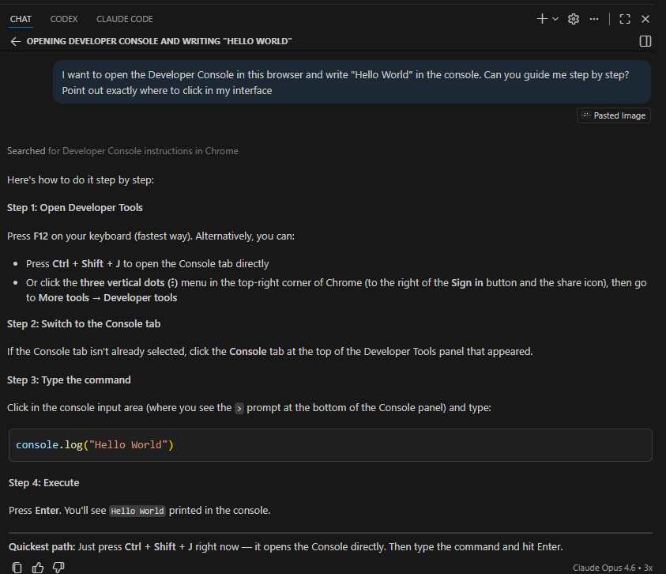
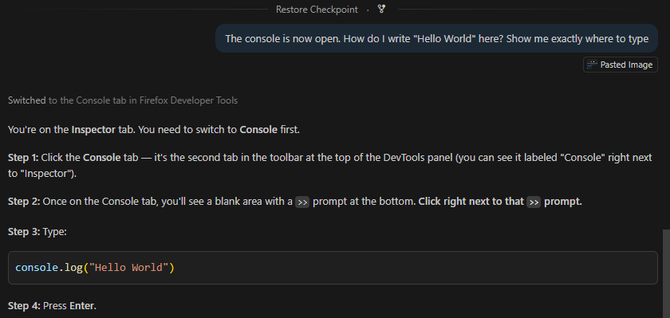
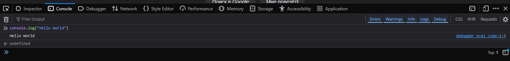
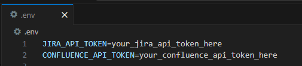

# Module 5: Visual Context with Screenshots

### Background
Have you ever tried to describe a software interface to a colleague over the phone? "Click the button — no, not that one, the blue one in the top right, next to the gear icon..." It is frustrating because words are imprecise when describing visual interfaces.

AI assistants face the same problem. They are trained on data up to a certain date, and software interfaces change constantly. When the AI suggests a menu item that no longer exists or a button that has moved, a single screenshot resolves the confusion instantly.

In this module, you will learn to share visual context with your AI assistant using screenshots. You will practice this skill by creating `API tokens` for `Jira` and `Confluence` — credentials you will need for the practical project in later modules.

Upon completion of this module, you will be able to:
- Capture and paste screenshots into the AI chat to provide visual context.
- Determine when a screenshot adds value versus when text alone is sufficient.
- Use screenshot-assisted guidance to navigate unfamiliar software interfaces.
- Create and securely store `API tokens` for `Jira` and `Confluence`.

## Page 1: Why Visual Context Matters
### Background
AI models rely on their training data to describe software interfaces, but that data may not reflect the latest UI updates. Screenshots bridge this gap by showing the AI exactly what you see on your screen right now.

Common scenarios where screenshots help:
- A new software version has changed the UI since the AI was trained.
- The AI suggests menu items or buttons you cannot find.
- You need to debug a visual layout issue.
- You are working in an unfamiliar tool and do not know the correct terminology.
- An error message or unexpected dialog appears.

One image conveys more than paragraphs of text — and it works across language barriers.

### ✅ Result
You understand when and why to share screenshots with your AI assistant.

## Page 2: Taking Screenshots on Your Operating System
### Background
Every operating system provides built-in tools for capturing screenshots. You do not need to install any additional software. Choose the method that works best for you — the only requirement is that you can paste the captured image into the AI chat.

`Windows`:
- `Snip & Sketch`: Press `Windows` + `Shift` + `S` — select the area to capture. The image is copied to the clipboard.
- `Snipping Tool`: Search for "`Snipping Tool`" in the Start menu — select area to capture.
- Full screen: Press `PrtScn` (`Print Screen`) — copies entire screen to clipboard.
- Active window: Press `Alt` + `PrtScn` — copies the active window only.

`macOS`:
- Selected area: Press `Cmd` + `Shift` + `4` — drag to select area.
- Full screen: Press `Cmd` + `Shift` + `3` — captures entire screen.
- Window: Press `Cmd` + `Shift` + `4`, then Space, then click a window.

`Linux`:
- Full screen: Press `PrtScn` — saves to Pictures folder.
- Selected area: Press `Shift` + `PrtScn` — drag to select area.
- Active window: Press `Alt` + `PrtScn`.

### Steps
1. Practice taking a screenshot now using your preferred method.
2. Open any application — for example, your web browser.
3. Capture a screenshot of the browser window.
4. Open your AI chat (`Copilot` or `Cursor` Chat).
5. Click in the message input field and paste the screenshot (`Ctrl + V` on `Windows`/`Linux`, `Cmd + V` on `macOS`).
6. You should see the image appear as a thumbnail in the input field.

   

### ✅ Result
You can take a screenshot and paste it into the AI chat.

## Page 3: Practical Exercise — Browser Developer Console
### Background
To practice the screenshot workflow, you will complete a real task: opening the browser `Developer Console` and writing `Hello World`. This task varies between browsers (`Chrome`, `Firefox`, `Edge`, `Safari`), making it a perfect case for screenshot-assisted guidance — the AI can see which browser you are using and adapt its instructions. If it misidentifies your browser on the first attempt, keep sharing screenshots as you follow along — each additional image gives the AI more context, and it will quickly self-correct.

### Steps
1. Open any web browser and navigate to any website (for example, [https://www.google.com](https://www.google.com)).
2. Take a screenshot of the entire browser window.
3. Open your AI chat and paste the screenshot.
4. Type this message along with the screenshot:
   `I want to open the Developer Console in this browser and write 'Hello World' in the console. Can you guide me step by step? Point out exactly where to click in my interface`
5. Send the message. The AI will identify your browser and provide specific instructions.

   

6. Follow the AI's instructions to open the `Developer Console`.
7. Once the console is open, take another screenshot showing the console panel.
8. Paste this new screenshot and ask:
   `The console is now open. How do I write "Hello World" here? Show me exactly where to type`

   

9. Follow the AI's instructions. Typically, you will type `console.log("Hello World")` and press `Enter`.
10. Verify: `Hello World` appears in the console output.

    

### ✅ Result
You completed a browser task using screenshot-assisted AI guidance. The AI adapted its instructions to your specific browser.

## Page 4: Create API Tokens for `Jira` and `Confluence`
### Background
For the practical project running through this course, you will eventually connect your AI assistant to `Jira` and/or `Confluence`. Both services require `API tokens` for programmatic access. Creating these tokens involves navigating admin interfaces — exactly the kind of task where screenshots help, since `Atlassian` frequently updates their UI.

If you do not have access to `Jira`/`Confluence` yet, you can skip this exercise and return to it when access becomes available. The screenshot technique itself is the skill being practiced.

There are several account options depending on your situation:

- **EPAM employees:** Use your corporate `EPAM Jira` instance. Check with your team lead or project manager for the URL and access credentials.
- **Free `Atlassian` account (new):** Create a free account at [https://www.atlassian.com/try](https://www.atlassian.com/try) and set up a new `Jira` project for this course.
- **Existing free `Atlassian` account:** If you already use a free `Atlassian Jira` account for personal or other projects, register a new temporary email address (e.g. using `Gmail` or similar) and create a separate `Atlassian` account exclusively for this training. This avoids mixing course work with your existing projects.

### Steps
1. Open your browser and navigate to your `Atlassian` account settings ([https://id.atlassian.com/manage-profile/security/api-tokens](https://id.atlassian.com/manage-profile/security/api-tokens)). 
2. Take a screenshot of the page you see.
3. Paste the screenshot into the AI chat and ask:
   `I need to create an API token for accessing Jira and Confluence via their REST APIs. Here is my current screen. Can you walk me through the steps?`
4. Follow the AI's instructions — it will guide you based on what it sees in your screenshot.
5. When the token is generated, copy it to a safe location (a password manager or a secure note).
6. Do NOT commit this token to your `Git` repository. Store it in a `.env` file (which is already in your `.gitignore` from `Module 3`).
7. Save the token with a descriptive name — for example, `JIRA_API_TOKEN` or `CONFLUENCE_API_TOKEN` — so you can easily identify it later when configuring integrations.

   

Important: `API tokens` are sensitive credentials. **Never** share them in screenshots, chat histories, or code repositories.

Anyone who sees your token can perform — on your behalf — exactly the actions you granted when creating it. Keep these security practices in mind:

- **Never display tokens during screen shares or meetings.** If you accidentally expose a token, revoke it immediately in the same `Atlassian` security settings page.
- **Apply the principle of least privilege.** When creating a token, grant only the permissions you actually need — nothing more.
- **Set an expiry date.** Always create tokens with a limited validity period rather than leaving them open-ended.
- **Delete unused tokens.** If you find a token and cannot remember what it was created for, delete it.
- **Use informative names.** Name each token so it is clear where it is used — for example, `course-jira-mcp-integration` — making it easy to manage and revoke specific tokens without affecting others.

### ✅ Result
You have `API tokens` for `Jira` and/or `Confluence` stored securely. You will use them in later modules for automation.

## Page 5: When to Use Screenshots vs Text
### Background
Not every interaction needs a screenshot. Using them selectively keeps your conversations efficient and ensures the AI focuses on the right information.

Use screenshots when:
- Describing UI elements or layouts.
- The AI's suggestion does not match what you see on screen.
- A software interface looks different from what the AI expects.
- Showing error messages or unexpected behavior.
- You do not know the correct terminology for what you see.
- The text on screen is not selectable and you cannot copy it directly — share a screenshot and ask the AI to read it.
- You need to extract or transcribe text from a screenshot someone else saved — paste the image and ask the AI to convert it to editable text.

Use text only when:
- Asking conceptual questions ("What is a REST API?").
- Requesting code examples or explanations.
- Discussing algorithms or logic.
- Sharing code snippets (paste text, not a screenshot of code).

Combine both when:
- Debugging: show the error screen + describe what you did.
- Implementing UI: show a design mockup + ask for code.
- Following a tutorial: show the tutorial page + your current state.

### ✅ Result
You have a clear decision framework for when screenshots add value to AI interactions.

## Summary
Remember the phone-call scenario from the introduction — "click the button, no, not that one, the blue one in the top right"? You now have a better way. By sharing a screenshot, you skip the guessing game and let the AI see exactly what you see.

Key takeaways:
- A screenshot often communicates more than paragraphs of text description — it eliminates the ambiguity of describing UI elements in words.
- The AI adapts its guidance to your specific interface when it can see your screen.
- Use screenshots for UI tasks, error messages, and unfamiliar interfaces. Use text for conceptual questions and code.
- `API tokens` are sensitive — store them securely and never commit them to `Git`.

## Quiz
1. When is a screenshot more effective than a text description when working with an AI assistant?
   a) When the software interface looks different from what the AI expects, or when you cannot find a UI element the AI describes
   b) When asking the AI to explain the difference between two programming concepts
   c) When requesting the AI to generate a code snippet from a verbal description
   Correct answer: a.
   - (a) is correct because screenshots bridge the gap between the AI's training data and your current interface, letting it give you precise, up-to-date guidance.
   - (b) is incorrect because conceptual explanations are language-based — a screenshot of code adds little value when the question is about abstract concepts.
   - (c) is incorrect because code generation works best from a clear text prompt. A screenshot of a verbal description would actually be harder for the AI to parse than typed text.

2. What should you do with the `API tokens` you created in this module?
   a) Commit them to your `Git` repository so they are version-controlled alongside your code
   b) Store them in a secure location (password manager or `.env` file excluded from `Git`) and never share them in screenshots or chat histories
   c) Paste them into the AI chat so the assistant can use them in future sessions
   Correct answer: b.
   - (a) is incorrect because `Git` repositories — especially public or shared ones — expose credentials to anyone with access. Tokens in version control are a common security breach vector.
   - (b) is correct because `API tokens` are sensitive credentials that grant access to your accounts. Storing them in a password manager or a `.env` file (excluded via `.gitignore`) keeps them secure.
   - (c) is incorrect because chat histories may be logged, shared, or used for model training. Pasting tokens into a chat risks exposing them beyond your control.

3. Why might the AI suggest a button or menu item that does not exist on your screen?
   a) The AI's training data may reflect an older version of the software, and the interface has since changed
   b) Your IDE extension is outdated and needs to be updated to the latest version
   c) The feature requires a paid subscription tier that you have not activated yet
   Correct answer: a.
   - (a) is correct because AI models are trained on data up to a certain date. Software interfaces evolve, so the AI's knowledge may reference UI elements that have been moved, renamed, or removed.
   - (b) is incorrect because the IDE extension version does not affect the AI's knowledge of third-party software interfaces — the issue is the AI's training data, not your local installation.
   - (c) is incorrect because while subscription tiers can hide features, the most common reason for a mismatch is that the software UI has changed since the AI's training cutoff, not a licensing issue.
