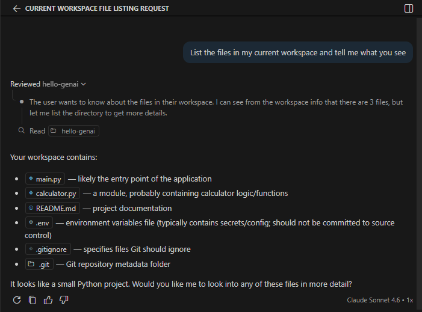
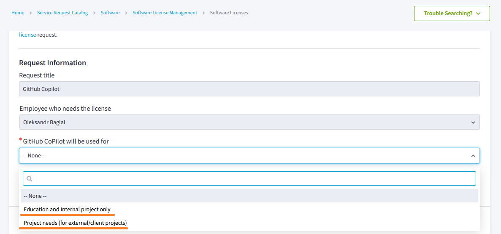
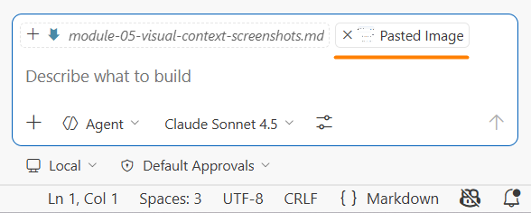
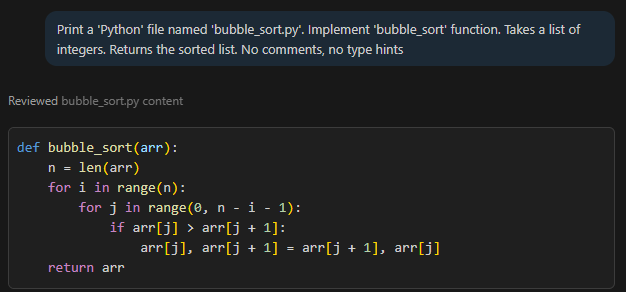
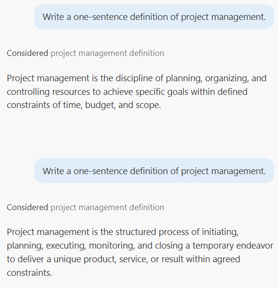
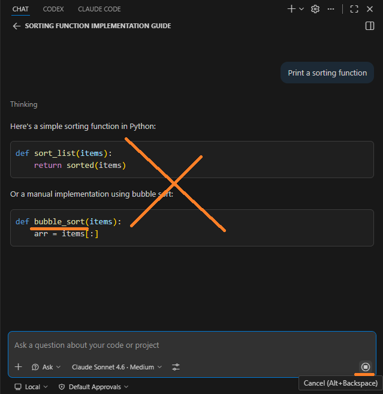
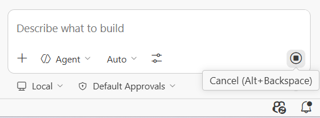

# Module 7: Effective Prompting Without Arguing

### Background
You asked the AI to do something, and the result is wrong. Your instinct is to type `No, that is not what I meant...` and start a back-and-forth conversation trying to fix it. This is the single most common mistake people make with AI assistants — and it makes things worse, not better.

In this module, you will learn why `arguing with the AI` pollutes the `context window`, why restarting with a refined prompt produces better results, and how to control output variability through precise prompting. These techniques will dramatically improve your effectiveness in every future module.

Upon completion of this module, you will be able to:
- Explain how prompt specificity controls the variability of AI output.
- Structure prompts as a series of constraint statements to narrow the solution space.
- Apply the edit-and-regenerate workflow instead of `arguing with the AI`.
- Take ownership of AI output quality by refining prompts rather than `blaming the model`.

## Page 1: The Artist Metaphor — Understanding Prompt Precision
### Background
Imagine you ask 10 world-class artists to paint a still life. The precision of your request determines how similar or different their paintings will be.

Scenario 1 — Abstract prompt: `Paint a still life`
→ 10 completely different masterpieces. Different subjects, styles, colors, compositions. Each is professional, but wildly different.

Scenario 2 — Moderately specific: `Paint a still life with a vase of flowers and a fruit on the left`
→ 10 paintings with recognizable similarities. All have flowers and fruit, but different types, colors, and arrangements.

Scenario 3 — Very specific: `Paint a still life with a vase of lilacs and a pear on the left, on a wooden table, with soft morning light`
→ 10 very similar paintings. Same flowers, same fruit, same placement. Only minor brushstroke variations.

The same principle applies to AI prompts:
- Fewer details = more creative but unpredictable results (high `temperature` effect).
- More details = more consistent and controlled results (low `temperature` effect).
- You choose the level of precision you need.

### ✅ Result
You understand that prompt specificity directly controls the variability of AI output.

## Page 2: The Power of Statements
### Background
The practical tool for controlling precision is breaking your requirements into `statements` — one sentence per requirement. Each `statement` adds one specific constraint.

`Statement` structure:
- Statement 1: What to create (function, file, report, document).
- Statement 2: What it should do (sort, calculate, summarize, format).
- Statement 3: Technical details (language, tool, format, structure).
- Statement 4: Constraints (length, style, what to omit).
- Statement 5: Edge cases or examples (what to do with empty input, special cases).

Example progression:
- 1 statement: `Print a sorting function` → could be any language, any algorithm, any structure.

- 3 statements: `Print a sorting function. Use 'bubble sort'. Write it in 'Python'` → language and algorithm locked, structure still varies.

- 5 statements: `Print a sorting function. Use 'bubble sort'. Write it in 'Python'. Takes a list of integers. Returns the sorted list. No comments, no type hints` → minimal variation, consistent output.

Rule: More statements = less variability = more control. Each statement narrows the space of possible solutions.

Two things to keep in mind about prompt language:
- Natural language does not matter. You can write prompts in `English`, `Ukrainian`, or any language. 
- Typos and informal phrasing are fine — the model understands all of these equally well.
- Technical terms matter a lot. `Python` vs `Java` produces completely different code. `Bubble sort` vs `quicksort` selects a different algorithm. Each precise technical `term` locks in a specific aspect of the solution. When results seem poor, check whether you used the right technical `terms`, not whether your grammar was correct. Beyond precision, a single `term` can unlock an entire body of knowledge: if you describe a problem without knowing its name, the model may give you a partial workaround — but if you know the right `term`, the model immediately connects to the full established solution space. For example, asking about `daily team check-ins` may lead to generic meeting advice, while using the word `scrum` instantly surfaces `standups`, `sprint planning`, `retrospectives`, and the entire `agile` framework. The `term` is the key that opens the right door.

### Steps
1. Open your AI chat in `Agent Mode`.
2. Type a very abstract prompt: `Print a sorting function`
3. Observe the result: note the language, algorithm, extras (comments, tests, docstrings).
4. Now edit your original prompt (Important! **do not write a new message below — go back and edit**) to add two constraints: `... Use 'bubble sort'. Write it in 'Python'`

5. Press `Enter` and compare the new result to the previous one.
6. Edit again, adding more constraints: `... Takes a list of integers. Returns the sorted list. No comments, no type hints`

7. Compare all three results. Notice how each added statement reduced variability.

### ✅ Result
You can control AI output precision by adding specific statements to your prompts.

## Page 3: Why You Should Never Argue with the Model
### Background
When the AI produces something wrong, the natural instinct is to write a follow-up: `No, that is not right. I wanted...` Then the AI apologizes and tries again. You correct again. This cycle is called `arguing` and here is why it fails:

The `context pollution problem`:
- Every message goes on the shared `context window`.
- After several rounds of corrections, the `context` contains: your unclear original `prompt`, multiple failed attempts, apologies, corrections, complaints, and information about what you do NOT want.
- The `model` sees all of this when generating the next response, making each iteration worse, not better.

Defining through negation does not work:
- When you argue, you describe what you want by saying what it is not: `Not like that,` `Without this feature,` `Do not use that approach.`
- Try describing an object only by what it is not — `not red, not big, not soft, not round`. What object is it? Impossible to tell.
- Negative constraints are equally confusing for AI `models`.

### Steps
1. Think about a recent interaction where you went back and forth with the AI trying to fix something.
2. Count how many messages were in that exchange. If more than 3 — context was likely `polluted`.
3. In your next AI session, when you see the `model` generating something wrong, **stop immediately**.

4. Do not write a new message. Instead, **go back and edit your original prompt** with more specific statements.
5. Regenerate from the edited `prompt` — the model starts fresh with a clean `context`.

### ✅ Result
You understand that arguing pollutes the `context window` and that editing + regenerating is the correct approach.

## Page 4: The Right Workflow — Edit, Don't Continue
### Background
The effective workflow for correcting AI output follows a simple loop:

1. Stop immediately when you see the model generating something wrong (do not wait for the complete response).

2. Do not write a new message — this continues the polluted conversation.
3. Go back and edit your original prompt: add more statements, technical terms, or constraints you forgot.
4. Regenerate and observe. The model starts fresh with better instructions on a clean `context`.
5. If still not right — stop, refine more, regenerate again.
6. Continue only when the first few tokens of the response look correct.

Why this works:
- Editing the original prompt = clean slate, fresh start.
- Continuing the conversation = building on polluted context.
- Each prompt refinement makes the solution better.
- Each failed iteration without editing makes the problem worse.

### Steps
1. Open your AI chat in `Agent Mode`.
2. Ask: `Create a status report template`
3. If the result is not what you expected (wrong format, missing sections, wrong tone), do NOT type a correction.
4. Instead, edit your original prompt: `Create a weekly status report template for an engineering manager. Include sections: accomplishments, blockers, next week's plan. Use bullet points. Keep it under 20 lines. Markdown format`
5. Notice how much better the result is with the refined prompt.

### ✅ Result
You can apply the edit-and-regenerate workflow instead of arguing with the AI.

## Page 5: Locus of Control — You Are in Charge
### Background
When AI produces poor results, beginners often blame the tool: "The model is dumb," "AI does not understand me." This is external locus of control — believing the outcome depends on the tool, not on you.

The reality:
- The model does exactly what you ask, based on how you ask, with the precision you provide.
- If results are wrong, the prompt was not specific enough, or technical terms were missing, or constraints were unclear.

The mindset shift:
- Old thinking: "Why is the AI not giving me what I want?"
- New thinking: "How can I describe what I want more precisely?"

This shift puts you in control.

The `Room of Requirement` metaphor: In `Harry Potter`, there is a magical room that appears only when you truly need it — and only if you know exactly what you need. The rules are simple: if you do not know what you need, you cannot ask for it. If you know what you need, you just need to ask correctly. The same logic applies to AI `models`. Vague requests produce random, unpredictable results. Specific, well-formed requests produce exactly what you intended. The magic is not in the `model` — it is in knowing what to ask and how to ask it.

### Steps
1. Think about your most recent frustrating AI interaction.
2. Rewrite the prompt you used, adding at least 3 more specific statements.
3. Try the refined prompt. Is the result closer to what you need?
4. Practice prompting on a project-relevant scenario. Start vague and progressively add statements:
   - Vague: `Create a status report template`
   - Better: `Create a weekly status report template that summarizes 'Jira' sprint progress for stakeholders`
   - Specific: `Create a weekly status report template for an engineering manager. Pull data from a Jira sprint board. Include sections: completed issues, in-progress items, blockers, next sprint goals. Use bullet points. Markdown format. Keep it under 30 lines`
   Compare the three outputs — notice how each statement narrows the result.
5. Commit any files you created in this exercise.

### ✅ Result
You have shifted from blaming the AI to refining your prompts — and you are in control of the results. You also practiced prompting on a `Jira`-related task, building familiarity with the domain you will automate starting in Module 08.

## Summary
Remember the scenario from the introduction — you asked the AI to do something, the result was wrong, and your instinct was to type `No, that is not what I meant`? Now you know a better approach. Instead of arguing, you stop, edit your original prompt to be more specific, and regenerate from a clean `context`.

Key takeaways:
- Prompt specificity controls variability: fewer details = creative chaos, more details = consistent output.
- Break requirements into statements — one constraint per sentence.
- Never argue. Edit the original prompt and regenerate from a clean context.
- You are in control of the results. If the output is wrong, the prompt needs refinement, not the model.

## Quiz
1. Why does arguing with the AI (sending corrections in follow-up messages) make results worse?
   a) Each message adds to the `context window`, polluting it with failed attempts, negative constraints, and noise — the model sees all of this and gets increasingly confused
   b) The AI deprioritizes users who send multiple corrections and allocates fewer resources to their requests
   c) Follow-up messages reset the model's memory, so it loses the original requirements and starts from scratch
   Correct answer: a.
   - (a) is correct because the `context window` accumulates everything — failed attempts, corrections, and negations. This pollution makes each subsequent response worse because the model cannot distinguish your latest intent from the noise.
   - (b) is incorrect because AI models do not track user behavior or deprioritize users. Each request is processed with the same resources regardless of how many corrections you have sent.
   - (c) is incorrect because follow-up messages do NOT reset memory — they ADD to the existing context. That is precisely the problem: the model retains all the noise from failed attempts.

2. What is the correct approach when the AI generates something wrong?
   a) Write a follow-up message explaining what was wrong and ask the AI to try again
   b) Stop immediately, go back and edit your original prompt with more specific statements, then regenerate
   c) Delete the current chat session and start a new one with the exact same prompt
   Correct answer: b.
   - (a) is incorrect because writing a follow-up continues the conversation on a polluted `context`. The accumulated failed attempts and corrections make each iteration worse.
   - (b) is correct because editing the original prompt gives the model a clean `context` with better instructions. You start fresh without the noise of failed attempts.
   - (c) is incorrect because restarting with the same prompt will produce a similar (likely still wrong) result. The issue is not the session — it is the prompt. You need to refine the prompt, not just restart.

3. How does adding more specific statements to a prompt affect the result?
   a) Each additional statement narrows the space of possible solutions, reducing variability and increasing consistency
   b) It slows the model's response time proportionally but does not change the output quality
   c) It helps only when the statements include technical keywords — plain-language constraints have no effect
   Correct answer: a.
   - (a) is correct because each statement acts as a constraint that reduces the model’s degrees of freedom, leading to more predictable and consistent results.
   - (b) is incorrect because while longer prompts may slightly increase processing time, the primary effect is on output quality and consistency, not just speed.
   - (c) is incorrect because plain-language constraints ("keep it under 20 lines," "use bullet points") are equally effective. The model understands natural language constraints just as well as technical keywords.
