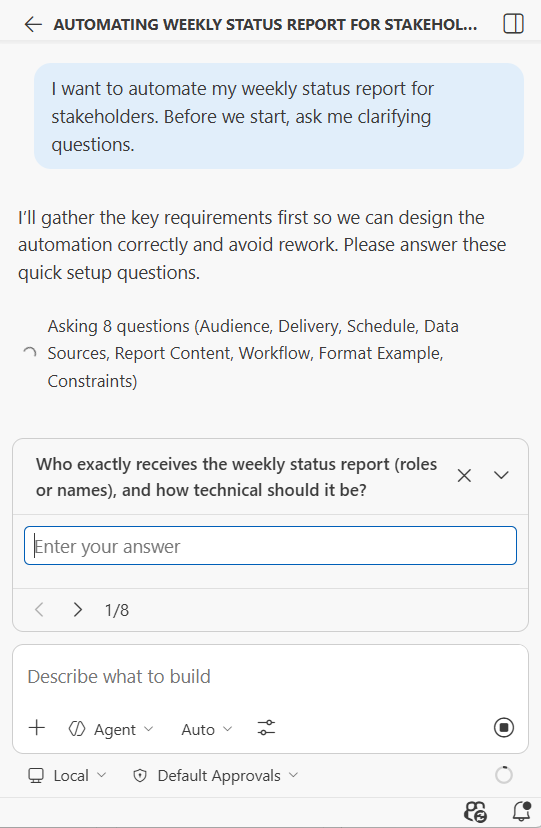

# Module 8: Clarifying Requirements Before Start

### Background
You have a general idea — "I want to automate my weekly status reports" — but when you sit down to write a prompt, you get stuck after two sentences. You know you need more details, but you cannot think of what to specify. Your head feels empty.

This is the most common blocker for non-developers starting an automation project. The good news: the AI itself can solve this problem. Instead of asking the AI to implement something immediately, you ask it to **interview you** first. Through that conversation, the AI extracts the details you did not know you had.

In this module, you will learn the interview technique and use it to create a Technical Specification for your `Jira`/`Confluence` automation project — the central artifact for the rest of the course.

Upon completion of this module, you will be able to:
- Use the `ask me clarifying questions` pattern to transform vague ideas into specific requirements.
- Control the pace, focus, and depth of an AI-led interview.
- Create a structured Technical Specification from interview results.
- Determine when the interview technique is useful versus when to write prompts directly.

## Page 1: The Empty Head Problem
### Background
When you start writing a detailed prompt, you often reach a point where you run out of things to specify. This happens for three reasons:

1. You are not an expert in everything — you may not know all the technical decisions that need to be made, what edge cases exist, or what best practices apply.
2. You have implicit assumptions — things that seem obvious to you but need to be stated explicitly for the AI.
3. You are starting from scratch — an empty project without context means you need to define everything, and it is hard to know where to begin.

This is not a personal failure. Professionals across all fields face this — requirements elicitation is an entire discipline in software engineering.

### Steps
1. Open a text editor or your AI chat.
2. Try writing a detailed prompt for this task: `Automate my weekly status report`
3. Write as many specific statements as you can.
4. Notice where you get stuck. What questions arise that you cannot answer? (Format? Source of data? Who receives it? What sections? How often?) Write them down — you will use them later.

### ✅ Result
You have experienced the "empty head" problem firsthand and identified questions you could not answer on your own.

## Page 2: The Interview Mode Pattern
### Background
The solution is a single phrase that transforms the AI from an implementer into a requirements analyst:

`Before we start, ask me clarifying questions`

When you add this to the end of even a minimal prompt, the AI starts interviews you. Instead of guessing and generating something immediately, it asks the questions you should have thought of but did not.

Why this works:
- The AI "knows" what information is needed for implementation (it has seen thousands of similar projects in its training data).
- The AI can identify gaps in your requirements.
- Your answers fill in the missing details naturally.
- The `context window` accumulates precise information through dialogue rather than through guessing.

### Steps
1. Open your AI chat in `Agent Mode`.
2. Type a minimal prompt:
   `I want to automate my weekly status report for stakeholders. Before we start, ask me clarifying questions`
3. Send it. The AI will ask several questions — about format, data sources, audience, frequency, sections, and so on.

4. Answer the questions honestly. If you do not know the answer, say so — the AI will suggest options.
5. After answering, type: `Are there any more questions?`
6. Repeat until the AI says it has enough information.

### ✅ Result
You have used the interview technique to transform a vague idea into a set of specific requirements.

## Page 3: Controlling the Interview
### Background
You are not just a passive interviewee — you control how the AI asks questions and what it focuses on.

You can specify:
- How to ask: `Ask one question at a time` or `Give me all questions at once`
- What to focus on: `Focus on the data format and delivery method` or `Ask about edge cases`
- When to stop: `Ask questions until you can implement without any assumptions`
- How to explain: `If I do not understand a question, explain the options and their tradeoffs`

You can also ask your own questions during the interview:
- `What is the difference between a 'REST API' and a webhook?`
- `Which format would you recommend for my use case?`
- `What are the tradeoffs between these options?`

The AI will answer your question and then return to the interview.

### Steps
1. Start a new chat and try this enhanced prompt:
   `I want to build a 'Jira' dashboard that shows my team's sprint progress. Before we start, interview me to understand the requirements. Ask one question at a time. If I am unsure about an answer, explain the options and recommend one`
2. Go through the interview process, answering questions and asking your own when needed.
3. After the interview, ask the AI: `Summarize what we discussed as a requirements document`
4. Review the summary — it should capture everything you discussed.

### ✅ Result
You can control the interview process — setting the pace, focus, and depth of questions.

## Page 4: Create Your Technical Specification
### Background
Now you will apply the interview technique to a real task: creating a Technical Specification for your `Jira`/`Confluence` automation project. This ТЗ will be the foundation for all practical work in the remaining modules.

Choose your automation idea (pick one or propose your own):
- Weekly status report generator that pulls data from `Jira` and formats it for stakeholders.
- Change Request (CR) registry that tracks and summarizes CRs across projects.
- Contributor analytics dashboard showing team activity from `Jira` and `Confluence`.
- Meeting notes processor that extracts action items and creates `Jira` tickets.

### Steps
1. Open your AI chat in `Agent Mode`.
2. Write your initial prompt:
   `I want to build [your chosen automation idea]. This is for my role as [your role] managing [team size] people working on [project type]. Before we start building anything, interview me to understand the full requirements. After the interview, create a structured Technical Specification in Markdown format. Save it as 'PROJECT_SPEC.md' in the project root`
3. Go through the interview (2-3 rounds of questions).
4. When the AI creates `PROJECT_SPEC.md`, review it carefully.
5. If anything is missing or incorrect, tell the AI directly (e.g., `Add a section about data refresh frequency — it should be daily`).
6. When you are satisfied, commit the file: use the git workflow from Module 3.

### ✅ Result
You have a Technical Specification for your practical project, committed to your repository.

## Page 5: When to Use the Interview Technique
### Background
The interview technique is not needed for every interaction. Use it strategically:

Use the interview when:
- Starting a new project or feature from scratch.
- You have a general idea but cannot articulate all the details.
- The task involves multiple technical decisions you are not sure about.
- You need to explore what questions you should be asking.

Skip the interview when:
- You already know exactly what you want (write specific statements directly).
- The task is simple and well-defined (`Create a '.gitignore' for 'Python'`).
- You are refining an existing feature with minor changes.

After the interview — two paths:
- Option A: Ask the AI to create a requirements document first (recommended for complex projects). Then use that document as reference for implementation.
- Option B: Proceed directly to implementation if the task is straightforward enough.

For this course, your ТЗ document is the reference artifact. You will revisit and refine it in future modules as you learn new techniques.

### ✅ Result
You know when to use the interview technique and when to skip it.

## Summary
Remember the feeling from the introduction — you had a general idea about automating status reports, but after two sentences your head felt empty? Now you have a reliable solution: ask the AI to interview you first. Through that conversation, the AI pulls out the details you did not know you had, and the result is a structured Technical Specification ready for implementation.

Key takeaways:
- When you cannot think of what to specify, ask the AI: `Before we start, ask me clarifying questions`
- The AI knows what information is needed and can identify gaps in your requirements.
- You control the interview — set the pace, focus, and depth.
- A structured ТЗ document is more valuable than jumping straight to implementation.
- Your ТЗ is now committed to the repository and will evolve as the course progresses.

[MG]: Вот уже начиная отсюда, где студент начинает генерить какие-то файлы по инструкциям, предлагаю переходить от квизов к практическим задачам, формата "загрузите файл такой-то в аудитора, он должен соответствовать критериям таким-то".
## Quiz
1. What is the main purpose of the interview technique?
   a) To help you discover and articulate requirements you did not know you had, by letting the AI ask clarifying questions before implementation
   b) To verify that the AI model can handle your specific programming language and framework
   c) To train the AI on your company’s internal terminology so it produces more accurate results in future sessions
   Correct answer: a.
   - (a) is correct because the interview technique transforms a vague idea into specific requirements through AI-guided questioning. The AI identifies gaps you would not have noticed on your own.
   - (b) is incorrect because model capabilities do not depend on an interview — the model already supports all major languages and frameworks. The interview is about clarifying your requirements, not testing the model.
   - (c) is incorrect because AI models do not retain learning between sessions. The interview enriches the current `context window` with your specific requirements, not the model's long-term knowledge.

2. What should you do after the AI finishes asking clarifying questions?
   a) Delete the entire conversation and start over with a new prompt based on what you learned
   b) Ask the AI to create a structured requirements document (like a ТЗ), review it, and commit it to your repository
   c) Proceed directly to implementation and rely on the AI to remember all the discussed details
   Correct answer: b.
   - (a) is incorrect because the conversation already contains valuable context. Deleting it and rewriting from memory risks losing details that emerged naturally during the interview.
   - (b) is correct because the interview produces valuable requirements that should be captured in a structured document. This document becomes the reference for all future implementation work.
   - (c) is incorrect because relying solely on conversational context is fragile — if the chat resets or the `context window` fills up, those requirements are lost. A committed document persists.

3. When should you skip the interview technique and write specific statements directly?
   a) When you already know exactly what you want and can articulate all the details in your prompt
   b) When the task is complex and has many unknowns
   c) When you are working on a task for the first time and have no experience in the domain
   Correct answer: a.
   - (a) is correct because if you already have a clear picture of the requirements, writing specific statements directly is more efficient. The interview adds value only when you have gaps.
   - (b) is incorrect because complex tasks with many unknowns are precisely when the interview technique is most valuable — the AI helps you surface questions you would not think of alone.
   - (c) is incorrect because first-time tasks in unfamiliar domains are ideal candidates for the interview technique, not for skipping it. The less you know, the more the AI’s questions help.
