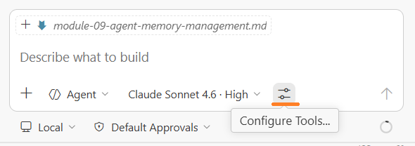
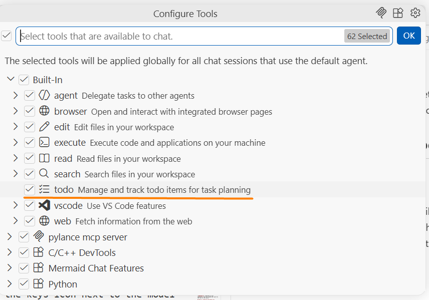
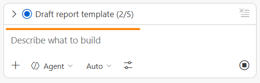
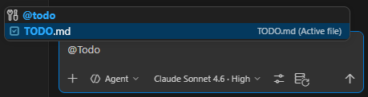
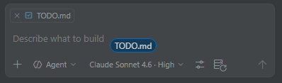

# Module 9: Agent Memory Management

### Background
You spent 30 minutes in a productive AI session — the agent understood your project, made good decisions, and completed half the work. You close the chat, come back later, and... the AI has no idea what you were working on. It asks basic questions you already answered. All that context is gone.

AI agents do not naturally remember anything between sessions. Each conversation starts from zero. This is not a bug — it is how the technology works. But it is also a problem you can solve. In this module, you will learn three techniques for giving AI agents persistent memory, and you will apply one of them to convert your Technical Specification into a structured task backlog for the rest of the course.

Upon completion of this module, you will be able to:
- Explain why AI agents lose context between sessions and how external memory solves this.
- Use the built-in todo tool for real-time progress tracking within a single session.
- Create and maintain external `Markdown` todo lists that persist between sessions.
- Convert a Technical Specification into a structured project backlog (`backlog.md`).

## Page 1: Why AI Agents Forget
### Background
AI models process each message independently within a single conversation. When you close the chat, the `context window` — as it's described in `Module 6` — is discarded. The next conversation starts with an empty context.

This creates problems for multi-session projects:
- The AI does not know what tasks were completed.
- It may redo work or contradict earlier decisions.
- You waste time re-explaining context every session.
- Complex projects stall because the agent cannot maintain a plan.

The solution: create external memory that persists between sessions. The AI reads this memory at the start of each conversation and writes updates at the end.

Three approaches to external memory:
1. Built-in todo tool — visual task list that appears above the chat (single-session).
2. External markdown todo list — a file in your project that the AI reads and updates (multi-session).
3. Project documents — specification + task list combination for complex projects (multi-session, multi-document).

### ✅ Result
You understand why AI agents forget between sessions and the three approaches to solving it.

## Page 2: Built-in Todo Tool
### Background
Most AI coding assistants have a built-in todo tool that creates a visual task list above the chat window. This is useful for real-time progress tracking during a single session.

How to find built-in tools:
- In `VS Code`: click the wrench icon (🔧) or the keys icon next to the model name in the `Copilot Chat` panel. You will see tools like: agent, edit, execute, read, search, todo.
- In `Cursor`: click the tools icon near the model selector in the AI Chat panel.





The AI uses the todo tool automatically when you ask for multi-step work. Items turn from pending → in-progress → completed as the agent works.

### Steps
1. Open your AI chat in `Agent Mode`.
2. Give the AI a multi-step task:
   `I need to create three files in a folder called 'reports': 'template.md' with a status report template, 'instructions.md' with how to fill it out, and 'example.md' with a filled-in example. Create a todo list and work through each item step by step`
3. Watch the todo list appear above the chat.



4. Notice items update as the agent completes each step.
5. When done, observe the final state — all items should be marked complete.

### ✅ Result
You can trigger and observe the built-in todo tool for real-time progress tracking.

## Page 3: External `Markdown` Todo Lists
### Background
Built-in todos disappear when you close the chat. For multi-session projects, you need a persistent todo list — a `Markdown` file in your project that survives between conversations.

The pattern:
1. Create a `TODO.md` file with checkboxes for each task.
2. Reference it in your prompt using @-mention `@TODO.md`.

3. Or just move this file into chat.

4. Ask the AI to read the file, work through items, and update checkboxes as tasks complete.
5. When you start a new session, the AI reads the file and continues from the next uncompleted item.

Example `TODO.md` structure:
```markdown
# Project Tasks

## Phase 1: Setup
- [x] Create project repository
- [x] Configure .gitignore
- [ ] Set up development environment

## Phase 2: Implementation
- [ ] Create data fetching module
- [ ] Build report template
- [ ] Add formatting logic

## Progress Notes
_AI updates this section as work progresses_
```

### Steps
1. Create a file called `TODO.md` in your project root.
2. Add 5-6 tasks organized in phases with checkboxes (use the format above as a starting point).
3. Open your AI chat and type: `Read @TODO.md and work through the uncompleted items in Phase 1. Update the checkboxes as you complete each task`
4. Watch the AI work through items and update the file.
5. Close the chat, open a new session, and type: `Check @TODO.md and continue where you left off`
6. Verify the AI picks up from the correct task.

### ✅ Result
You can create and use external `Markdown` todo lists for persistent task tracking across sessions.

## Page 4: Create Your Project Backlog
### Background
Now you will apply the memory management technique to your practical project. You have a Technical Specification (`project_spec.md`) from `Module 8`. The next step is to convert it into a structured task backlog — a detailed list of implementation steps that will guide the work from `Module 10` till `Module 20`.

This backlog becomes the AI's "memory" of your project. Every future session starts with the AI reading this file to understand what has been done and what comes next.

### Steps
1. Open your AI chat in `Agent Mode`.
2. Reference both your specification and the interview technique:
   `Read @project_spec.md. Break it down into a detailed implementation backlog with specific, actionable tasks. Organize tasks into phases: Setup, Core Features, Integration, Testing, Documentation. Use checkboxes. Save as 'backlog.md'. Before creating it, ask me clarifying questions about priorities and phasing`
3. Answer the AI's questions about priorities (which features first, any dependencies, any time constraints).
4. Review the generated `backlog.md`.
5. Verify it covers all requirements from your specification.
6. If anything is missing, ask the AI to add it.
7. Commit the file to your repository.

### ✅ Result
You have a structured project backlog (`backlog.md`) committed to your repository. This will guide your work for the rest of the course.

## Page 5: Combining Documents for Complex Projects
### Background
For large projects, a single todo list is not enough. The most effective pattern combines two documents:

1. `project_spec.md` — the "why" and "what" (high-level goals, requirements, quality standards). You created this in `Module 8`.
2. `backlog.md` — the "how" and "when" (specific tasks, phases, progress). You created this on the previous page.

When starting a new AI session, reference both:
`Read @project_spec.md for project context and @backlog.md for current progress. Continue where we left off`

The AI now has:
- Strategic context (what the project is about and what quality standards apply).
- Tactical context (what has been done, what is next).
- Persistent memory across sessions.

Tips for maintaining these documents:
- Ask the AI to update `backlog.md` at the end of each session.
- Periodically ask: `Verify @backlog.md reflects actual completion status`
- Add a "Decisions Made" section to record important choices (technology selections, architecture decisions).

### ✅ Result
You understand how to combine specification and backlog documents for persistent project memory across multiple AI sessions.

## Summary
Remember the scenario from the introduction — 30 minutes of productive work, then you close the chat and come back to an agent that has forgotten everything? That frustration is now behind you. With external `Markdown` files (`project_spec.md` and `backlog.md`), you give the AI persistent memory that survives across any number of sessions. Every new conversation starts with `Read @backlog.md and continue where we left off` — and the agent picks up right where it stopped.

Key takeaways:
- AI agents forget everything between sessions — this is by design, not a bug.
- Built-in todo tools provide visual progress tracking during a single session.
- External `Markdown` todo lists (`TODO.md`, `backlog.md`) persist between sessions.
- The most effective pattern combines a specification document (the "why") with a backlog (the "how").
- Your `project_spec.md` + `backlog.md` pair will guide all remaining practical work.

[MG]: Здесть тоже можно просить загрузить файл вместо квиза.
## Quiz
1. Why does the AI agent not remember what you discussed in a previous chat session?
   a) The `context window` is discarded when the chat closes — each new conversation starts from zero
   b) The agent stores context for one hour, then clears it to free up server resources
   c) Memory persistence requires enabling a specific setting in your IDE that is off by default
   Correct answer: a.
   - (a) is correct because AI models process text within a `context window` that exists only for the duration of the conversation. Closing the chat means losing that context entirely.
   - (b) is incorrect because context is not stored on a timer. It exists only within the active conversation and is discarded immediately when the session ends, not after an hour.
   - (c) is incorrect because there is no hidden "memory" setting to toggle. The `context window` limitation is fundamental to how current AI models work, not a configuration option.

2. What is the most effective way to maintain project context across multiple AI sessions?
   a) Copy and paste the key parts of your previous conversation into each new chat
   b) Use external `Markdown` files (like `project_spec.md` and `backlog.md`) that the AI reads at the start of each session and updates at the end
   c) Keep the same chat window open and never close it so the context is preserved
   Correct answer: b.
   - (a) is incorrect because manually copying conversation fragments is error-prone and tedious. You may miss important context, and the pasted text lacks structure for the AI to parse efficiently.
   - (b) is correct because external files provide persistent, updateable context. The AI reads them to understand project state and updates them to reflect progress, creating reliable memory across sessions.
   - (c) is incorrect because even if you keep a chat open, the `context window` has a token limit. Long conversations eventually overflow this limit, causing the AI to lose earlier context anyway.

3. What should a good project backlog include?
   a) A flat list of feature names without priority, phases, or completion status
   b) Specific, actionable tasks organized in phases with checkboxes, plus a progress notes section for AI updates
   c) A verbatim copy of the project specification reformatted as a numbered list
   Correct answer: b.
   - (a) is incorrect because a flat list without structure or checkboxes gives the AI no way to track progress or determine what to work on next. Phases and priorities are essential for sequencing.
   - (b) is correct because a backlog breaks down high-level requirements into specific, trackable tasks with clear completion criteria and progress tracking that the AI can read and update.
   - (c) is incorrect because a backlog serves a different purpose than a specification. The spec defines "what" and "why"; the backlog defines "how" and "when" with actionable, granular tasks.
