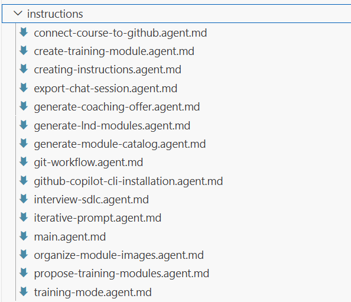
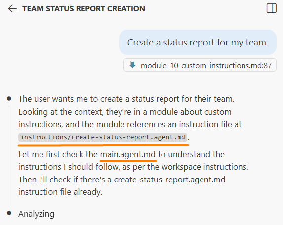

# Module 10: Custom Instructions

### Background
You spent 20 minutes refining a `prompt` until the AI produced exactly what you needed. Next week, the same type of task comes up. Where is that perfect `prompt`? Which chat session was it in? Which message had the final version?

If you cannot recover it, you start from scratch — re-discovering the same constraints, hitting the same pitfalls, wasting the same time. This is the problem custom instructions solve: they transform one-time `prompts` into reusable rules that the AI follows automatically.

> **Connection to `Module 9`:** In the previous module you extracted session information about the *task* — what you are building and what has been done so far. Here you are capturing information about the *process* — how you want the AI to behave in your project. The goal is the same: make sure the agent starts each new session with full context, without you having to re-explain everything from scratch.

In this module, you will learn how `prompts` evolve into instructions, how to organize them into a system the AI reads automatically, and you will create your first instruction files for the `Jira`/`Confluence` workflows in your practical project.

Upon completion of this module, you will be able to:
- Create reusable instruction files in `Markdown` format following the `[verb]-[subject].md` naming convention.
- Build an instruction catalog (`main.agent.md`) that lets the AI discover relevant instructions automatically.
- Apply the `Single Responsibility Principle` (one instruction = one workflow) to keep instructions focused and maintainable.
- Create custom instruction files for your `Jira`/`Confluence` project workflows.

## Page 1: Evolution from `Prompts` to Instructions
### Background
There are four stages of `prompt` maturity, and most people stay at stage 1:

Stage 1 — Everything is a `prompt`: You type the full request every time. Works for one-off tasks, but repetitive for common patterns.

Stage 2 — Text file: You save good `prompts` to a file and copy-paste them when needed. Better, but still manual and the file becomes messy over time.

Stage 3 — `Markdown` format: You ask the AI to create structured `.md` files with organized requirements, lists, and examples (or write them yourself). AI agents process `Markdown` well. Still requires manual attachment or copy-paste to each new chat.

Stage 4 — Instruction system: The AI automatically sees relevant instructions when you ask a question. No copy-paste needed. Consistent output every time. This is where you want to be.

### Steps
1. Think about your recent AI sessions. What tasks did you ask for more than once? (Examples: "create a report," "summarize meeting notes," "write a status update.")
2. Pick the most common recurring task.
3. Try to recall the `prompt` that worked best for it. Can you reproduce it exactly? Most likely not — this is why instructions matter.

### ✅ Result
You understand the four stages of `prompt` maturity and why the instruction system (`Stage 4`) is the goal.

## Page 2: Creating Your First Instruction File
### Background
An instruction file is a `Markdown` document with rules the AI should follow for a specific type of task. It lives in your project's `instructions/` folder.

Naming convention: [action-verb]-[subject].md
Examples: create-function.md, write-tests.md, generate-report.md

A good instruction file contains:
- Bullet points (not paragraphs) — easier for AI to parse.
- Action-oriented statements — what to do, not what to think about.
- Concrete constraints — specific technical terms, formats, and boundaries.
- Examples (optional) — show the expected structure or format.

### Steps
1. Create the `instructions/` folder in your project if it does not exist yet.
2. Ask the AI to help you create an instruction:
   `Create an instruction file at instructions/create-status-report.agent.md for generating weekly status reports. It should specify: 'Markdown' format, sections (accomplishments, blockers, next week), bullet points only, maximum 20 lines, professional tone, no fluff words`
3. Review the generated file. Are the rules specific enough?



4. Test it by asking: `Following instructions/create-status-report.agent.md, create a status report for a team that completed 3 features and has 1 blocker`
5. If the result matches your expectations — the instruction works. If not, refine the instruction file.

### ✅ Result
You have created and tested your first instruction file.

## Page 3: The Instruction Catalog — `main.agent.md`
### Background
As you accumulate instruction files, the AI needs a way to find the right one. The solution is a catalog file: `instructions/main.agent.md`.

This file lists all available instructions with brief descriptions. The AI checks this catalog on every `prompt` to find relevant instructions.

Example structure:
```
# Instruction Catalog
- create-status-report.agent.md — Weekly status report with fixed sections and format
- write-meeting-notes.agent.md — Meeting summary with action items and owners
- generate-jira-query.agent.md — JQL queries for common reporting scenarios
```

To make the AI load this catalog automatically, you need an entry point file:

For `VS Code`: `.github/copilot-instructions.md` with content:
`Important! Always follow the instructions in ./'instructions/main.agent.md' file`

For `Cursor`: `.cursor/rules/main.mdc` with the same content.

### Steps
1. Create `instructions/main.agent.md` with a list of your instruction files (even if you only have one so far).
2. Verify the entry point file exists (`.github/copilot-instructions.md` or `.cursor/rules/main.mdc`).
3. Test auto-discovery: open a new chat and type `Create a status report for my team` Without referencing any instruction explicitly, the AI should find and apply your instruction.



4. If the AI does not find it, use the explicit reference: `Following instructions/create-status-report.agent.md, create a status report for my team`

### ✅ Result
You have an instruction catalog and the AI can find relevant instructions automatically.

## Page 4: Create `Jira`/`Confluence` Workflow Instructions
### Background
Now you will create instruction files for your practical project. Based on the task backlog from `Module 9`, identify 2-3 common workflows you want to automate and create an instruction for each.

Example workflows for `Jira`/`Confluence` automation:
- Fetching issue data from `Jira` API and formatting it.
- Updating a `Confluence` page with project status.
- Generating `JQL` queries for common reporting needs.
- Processing sprint data into a summary table.

Each instruction file captures what the AI should do, what format to use, what constraints apply, and what output to produce.

### Steps
1. Open your `backlog.md` and identify 2-3 tasks that involve repeating patterns.
2. For each pattern, ask the AI to create an instruction file:
   `Following instructions/creating-instructions.agent.md, create an instruction for [describe the workflow]. Include: input format, processing steps, output format, and constraints`
3. If you do not have creating-instructions.agent.md yet, describe the workflow directly and ask the AI to generate the instruction.
4. Review each instruction file — are the rules specific enough to produce consistent results?
5. Update `instructions/main.agent.md` with the new instruction entries.
6. Test each instruction by asking the AI to perform the workflow.
7. Commit all new files to your repository.

### ✅ Result
You have custom instruction files for your `Jira`/`Confluence` workflows and an updated instruction catalog.

## Page 5: Single Responsibility and When to Split
### Background
Instructions follow the `Single Responsibility Principle` — a software engineering rule that means: one thing should do one job. Applied to instructions: one instruction file = one workflow. Keep each file focused on a single task type. Broad, catch-all files become hard to maintain and the AI applies them in the wrong contexts.

Too broad (bad): A single "python-best-practices.agent.md" file with 50 rules covering functions, tests, style, setup, logging, and more. It applies to every `Python` task even when irrelevant, and is hard to maintain.

Well split (good): Separate files for each workflow — create-function.agent.md, write-tests.agent.md, setup-project.agent.md. Each is specific, easy to update, and reusable.

When to create a new instruction:
- Task repeats 3+ times.
- Has a distinct workflow.
- Takes more than 2-3 bullet points to describe.
- Other projects might need the same pattern.

When to keep in the same instruction:
- Steps always happen together.
- Makes no sense separately.
- Very short (2-3 bullets).

One instruction can reference another: "For test creation, follow ./instructions/write-tests.agent.md." The AI loads referenced instructions automatically.

### Steps
1. Review the instruction files you created on the previous page.
2. If any instruction has more than 15 rules, consider splitting it.
3. If any two instructions share common rules, extract the shared rules into a separate instruction referenced by both.
4. After any changes, update `main.agent.md` and commit.

### ✅ Result
You understand the `Single Responsibility Principle` (one instruction per workflow) and can organize instruction files effectively.

## Summary
Remember that perfect `prompt` you spent 20 minutes refining — the one you could not find when the same task came up a week later? That problem is now solved. Your `prompts` live as structured instruction files in the `instructions/` folder, indexed by a catalog the AI reads automatically. No more searching through old chats or re-discovering constraints from memory.

Key takeaways:
- Instructions transform one-time `prompts` into reusable rules the AI follows automatically.
- Naming convention: [verb]-[subject].md in the `instructions/` folder.
- The catalog (`main.agent.md`) lets the AI discover instructions without explicit references.
- Follow the `Single Responsibility Principle`: one instruction per workflow — keep each file focused on a single type of task.
- After every productive AI session, ask yourself: `Should I create or update an instruction from this?` The session contained iterations, failures, and refinements — capturing the result means you never repeat that trial-and-error.
- Your `Jira`/`Confluence` workflow instructions are the first building blocks of your automation toolkit.
## Quiz
1. What is the main advantage of custom instructions over copy-pasting `prompts`?
   a) Instructions are applied automatically, ensuring consistent results every time without manual copy-paste or re-discovery of constraints
   b) Instructions reduce the AI model's processing time because structured `Markdown` is parsed faster than plain text
   c) Instructions allow the AI to bypass the context window limit and handle longer conversations
   Correct answer: a.
   - (a) is correct because instructions provide persistent, reusable rules that the AI loads and applies automatically. This eliminates the need to remember and re-enter constraints for recurring tasks.
   - (b) is incorrect because the AI processes both instruction files and plain text in the same way. The advantage is consistency and reusability, not parsing speed.
   - (c) is incorrect because instructions are loaded into the same context window as everything else. They do not increase the window size — they just provide consistent starting context.

2. What is the purpose of the `main.agent.md` catalog file?
   a) It lists all available instructions with descriptions so the AI can find the relevant instruction for each task
   b) It stores the AI’s conversation history so context is preserved between sessions
   c) It defines global project settings such as programming language and code style preferences
   Correct answer: a.
   - (a) is correct because the catalog file is a directory of all instruction files. The AI checks it on every `prompt` to determine which instructions are relevant to the current task.
   - (b) is incorrect because conversation history is managed by the context window, not by files. The catalog serves as an index of available instructions, not a memory store.
   - (c) is incorrect because while instructions may include style preferences, the catalog itself is an index — it points to specific instruction files rather than defining settings directly.

3. When should you create a new instruction file instead of adding rules to an existing one?
   a) When the task has a distinct workflow that repeats 3+ times and would make an existing instruction too broad or unfocused
   b) Whenever you discover a new AI capability, to document it for future reference
   c) Only after the existing instruction file has been used in at least 10 separate sessions
   Correct answer: a.
   - (a) is correct because the `Single Responsibility Principle` (one instruction = one workflow) means each instruction should cover one distinct workflow. Splitting prevents instructions from becoming overly broad and ensures they are applied only when relevant.
   - (b) is incorrect because instruction files capture reusable workflows, not AI feature documentation. A new capability does not automatically warrant a new instruction unless it forms a repeatable workflow.
   - (c) is incorrect because the trigger for splitting is not a usage count threshold. It depends on whether the instruction has become too broad or whether a distinct, repeatable workflow has emerged.
