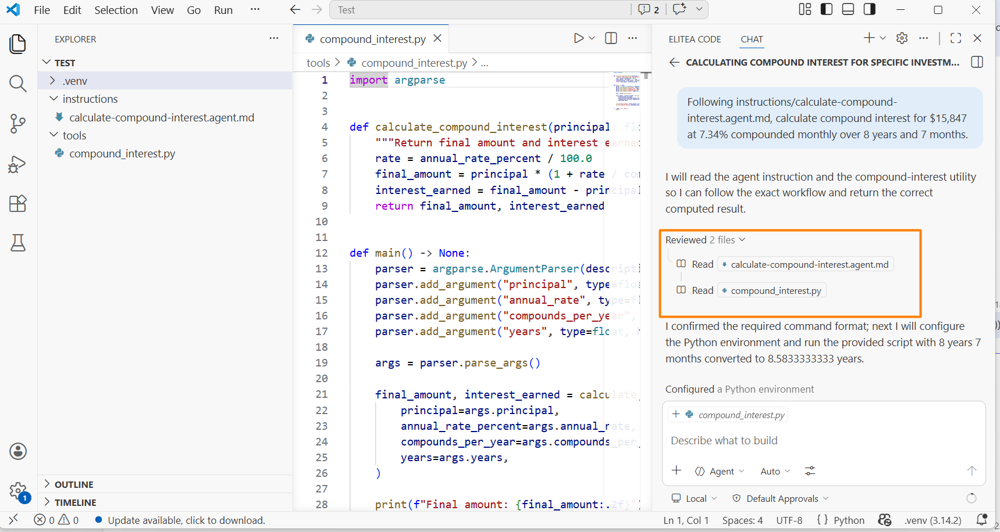

# Module 12: AI Skills and Tools Creation

### Background
You have instructions that tell the AI what to do. But what happens when you ask the AI to calculate compound interest, convert timezones, or count working days between two dates? It generates a plausible answer — but the answer is often wrong. Not because the AI is bad at math, but because it does not calculate at all. It predicts what a correct answer looks like based on text patterns.

The solution: do not ask the AI to calculate — ask it to create a tool that calculates, then tell it when and how to use the tool. The combination of an instruction (when and how) plus a tool (the script that does the work) is called a skill.

In this module, you will witness AI hallucinating calculations, create a proper tool, pair it with an instruction, and build your first skills for the `Jira`/`Confluence` automation project.

Upon completion of this module, you will be able to:
- Explain why AI models predict text patterns instead of performing real calculations.
- Build a skill by pairing a parameterized tool (script) with an instruction file.
- Determine when a task requires a skill versus when a `prompt` is sufficient.
- Create and test reusable skills for your `Jira`/`Confluence` automation project.

## Page 1: AI Does Not Calculate — It Predicts
### Background
Large Language Models generate text `token` by `token`. When asked "what is 15,847 × 1.0734^8.583?", the model does not perform arithmetic. It predicts what the answer should look like based on patterns in its training data. The result is close, plausible, and sometimes wrong.

This is not a limitation you can `prompt` around. No amount of specificity in your `prompt` will make the model perform real arithmetic. The model does not have a calculator inside — it has a text predictor.

The key insight: LLMs generate. They do not compute. For any task that requires precision (math, dates, data queries, API calls), you need a tool.

### Steps
1. Open your AI chat in `Agent Mode`.
2. Ask: "Calculate the compound interest for a principal of $15,847 at 7.34% annual rate, compounded monthly, over 8 years and 7 months. Show the final amount and total interest."
3. Write down the AI's answer.
4. Now verify using a calculator or spreadsheet (or ask the AI to write a `Python` script and run it).
5. Compare the two numbers. They are likely different — the first is a hallucination, the second is a real calculation.

### ✅ Result
You have witnessed AI hallucinating a calculation and understand why tools are needed.

## Page 2: The Skill Formula — Instruction + Tool
### Background
A skill is a reliable capability built from two components:

1. Tool — a script, program, or API call that performs a precise action (e.g., a `Python` script that calculates compound interest).
2. Instruction — a document that tells the AI when to use the tool and how to pass parameters.

Without the instruction, the AI might read the entire script and try to predict its output instead of running it. Without the tool, the AI hallucinates the answer.

The formula: Instruction + Tool = Skill.

Key design principles:
- Tools must be parameterized — accept arguments, never hardcode values.
- Instructions must specify the exact command to run with parameter names and order.
- Together they produce reliable, reproducible, auditable results.

### Steps
1. Ask the AI to create a `Python` script:
   "Create a `Python` script at `tools/compound_interest.py` that calculates compound interest. Accept principal, annual rate, compounds per year, and total years as command-line arguments. Print the final amount and interest earned."
2. Now create an instruction for using it:
   "Create an instruction file at instructions/calculate-compound-interest.agent.md that describes: when to use the `compound_interest.py` tool, how to invoke it with command-line arguments, and how to present results."
3. Test the skill by asking the same question from Page 1, but referencing the instruction:
   "Following instructions/calculate-compound-interest.agent.md, calculate compound interest for $15,847 at 7.34% compounded monthly over 8 years and 7 months."

4. The AI should run the `Python` script instead of hallucinating. Compare the result with your manual verification from Page 1.

### ✅ Result
You have built your first skill (instruction + tool) and verified it produces accurate results.

## Page 3: When to Build Skills vs Use `Prompts`
### Background
Not every task needs a skill. Skills are valuable when precision matters:

Build a skill when:
- The task requires precise calculations (financial, statistical, date math).
- The task involves external API calls (`Jira`, `Confluence`, `GitHub`).
- The task must produce reproducible, auditable results.
- The same operation repeats frequently with different inputs.
- You need to guarantee consistency across team members.

Use a `prompt` when:
- The task is creative (writing, brainstorming, summarizing).
- Approximate answers are acceptable.
- The task is one-time and will not repeat.
- The output does not need to be auditable.

For your `Jira`/`Confluence` project, most automation tasks will need skills because they involve API calls (fetching issues, updating pages) and data processing (counting items, generating reports) — both domains where hallucinations are unacceptable.

### ✅ Result
You can decide when to build a skill versus when a `prompt` is sufficient.

## Page 4: Build Skills for Your Project
### Background
Now you will create tools and instructions for your `Jira`/`Confluence` automation project. Based on your backlog from `Module 9`, identify 2-3 tasks that require precise data handling.

Example skills for a `Jira` automation project:
- A script that constructs `JQL` queries from parameters (project, status, assignee, date range) and returns the query string.
- A script that formats a list of `Jira` issues into a `Markdown` status report with sections.
- A script that calculates sprint velocity from a set of story point values.

### Steps
1. Open your `BACKLOG.md` and identify 2-3 tasks that involve data retrieval or calculation.
2. For each task, ask the AI to create a parameterized script:
   "Create a `Python` script at `tools/`[name].py that [describe what it does]. Accept [parameters] as command-line arguments."
3. For each script, create a matching instruction:
   "Create an instruction at instructions/use-[name].agent.md that describes when and how to use `tools/`[name].py."
4. Test each skill by asking the AI to perform the task while referencing the instruction.
5. If the AI does not use the tool correctly, apply the hallucination-fixing technique from `Module 11` to improve the instruction.
6. Update `instructions/main.agent.md` with the new skill entries.
7. Commit all new files.

### ✅ Result
You have built practical skills for your `Jira`/`Confluence` project with verified accuracy.

## Page 5: Scaling Your Skill Library
### Background
As you build more skills, you create a library of reliable capabilities. Each skill is:
- Discoverable — listed in `main.agent.md`.
- Reusable — works with any input that matches the parameter format.
- Testable — you can verify the tool's output independently.
- Improvable — the hallucination-fixing cycle makes each skill more robust over time.

The pattern scales: instruction in `instructions/` folder, tool in `tools/` folder, entry in the catalog. When you ask the AI a question, it checks the catalog, finds the relevant skill, and uses the tool instead of hallucinating.

Optional: the AgentSkills.io standard proposes a machine-readable format for packaging skills. It is useful for sharing across teams and tools, but colocating instructions with tools in your project is sufficient for individual use.

### ✅ Result
You understand how to build and maintain a growing skill library.

## Summary
Remember the compound interest question from the introduction? The AI confidently produced a number — and it was wrong. Now you know why: the model predicts what an answer should look like, it does not compute. For any task where precision matters, you build a skill — an instruction that tells the AI when and how, paired with a tool that does the actual work.

Key takeaways:
- LLMs generate text — they do not compute. Never trust AI with calculations or precise data operations.
- Skill = Instruction + Tool. The instruction tells when and how; the tool does the work.
- Parameterize tools — never hardcode values, always accept arguments.
- Build skills for tasks requiring precision: calculations, API calls, data processing.
- Use `prompts` for creative tasks where approximate answers are acceptable.

[MG]: Опять же, можно дать практическое задание на написание какого-то особенного тула и потом проверить два файла instruction+tool в качестве практического теста.
## Quiz
1. Why does the AI sometimes produce wrong answers for calculation tasks?
   a) The AI does not perform calculations — it predicts what a correct answer looks like based on text patterns, which can be plausible but incorrect
   b) The AI rounds intermediate steps to save processing time, which introduces cumulative rounding errors in complex formulas
   c) The AI uses an outdated math library that has not been updated with recent corrections
   Correct answer: a.
   - (a) is correct because LLMs generate text `token` by `token` using pattern prediction. They do not have built-in arithmetic capabilities, so "calculations" are actually text predictions that may or may not match the real result.
   - (b) is incorrect because the AI does not perform intermediate calculation steps that could accumulate rounding errors. It does not calculate at all — it generates text that resembles a calculation.
   - (c) is incorrect because there is no math library involved. The model generates numbers as text `tokens` based on training patterns, not by invoking a computation engine.

2. What is the formula for building a reliable AI skill?
   a) Instruction (when and how to use the tool) + Tool (a script or program that performs the action) = Skill
   b) A detailed `prompt` with step-by-step reasoning instructions that force the AI to show its work = Skill
   c) A retry loop that runs the same `prompt` multiple times and selects the most common answer = Skill
   Correct answer: a.
   - (a) is correct because a skill combines an instruction file that guides the AI on when and how to invoke the tool, with a parameterized script or program that performs the actual computation or API call.
   - (b) is incorrect because even with step-by-step reasoning, the AI still predicts text rather than computing. Showing work does not make the underlying arithmetic accurate.
   - (c) is incorrect because running the same hallucination multiple times and voting does not produce reliable results. Consistency across runs does not equal correctness — the model may consistently predict the same wrong answer.

3. When should you build a skill instead of using a `prompt` directly?
   a) When the task requires precise calculations, API calls, or reproducible results that cannot tolerate hallucination
   b) When the `prompt` exceeds 10 lines and becomes difficult to manage in a single chat message
   c) When you need the output in a specific file format such as `JSON` or CSV rather than plain text
   Correct answer: a.
   - (a) is correct because skills are needed when precision matters — calculations, data queries, API integrations, and any task where a “close enough” answer is not acceptable.
   - (b) is incorrect because `prompt` length does not determine whether a skill is needed. Long `prompts` are better addressed with instruction files (`Module 10`), not necessarily with tools.
   - (c) is incorrect because the AI can generate `JSON` or CSV format from a `prompt` alone. File format is a formatting concern, not a precision concern that requires a tool.
