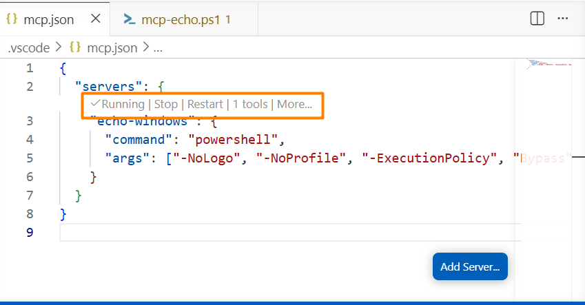
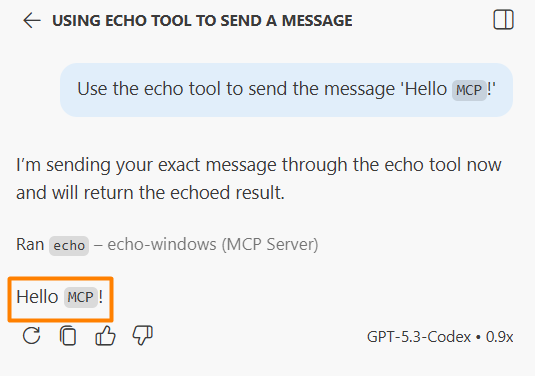

# Module 13: `MCP` — Model Context Protocol

### Background
In the previous module, you built skills by pairing instructions with tools — `Python` scripts that the AI runs on your computer. This works, but every new integration requires writing a new script, creating an instruction, and testing the combination. What if there was a standard way to connect AI assistants to any data source without writing custom code every time?

That is exactly what the Model Context Protocol (`MCP`) provides. Think of `MCP` as USB for AI: a single standard connector that works with any data source — `GitHub`, databases, file systems, APIs — through pluggable servers that the community has already built. In this module, you will set up your first `MCP` server, test it through your AI chat, and understand when to use `MCP` versus custom skills.

Upon completion of this module, you will be able to:
- Explain how `MCP` standardizes the connection between AI assistants and external data sources.
- Configure and start an `MCP` server in your IDE (`VS Code` or `Cursor`).
- Invoke `MCP` tools through AI chat, including the approval workflow.
- Decide when to use an existing `MCP` server versus building a custom skill.

## Page 1: Why `MCP` Matters
### Background
Before `MCP`, connecting your AI assistant to an external service required:
1. Writing a custom script for the integration.
2. Creating an instruction file explaining how to use it.
3. Testing that the AI invokes the script correctly.
4. Repeating this for every new data source.

`MCP` solves this with one standard protocol:
- One configuration format — add any `MCP` server with simple `JSON`.
- Plug-and-play servers — community-built servers for `GitHub`, databases, file systems, `Jira`, `Confluence`, `Slack`, and more.
- Auto-discovery — the AI automatically sees available tools when an `MCP` server connects.
- Consistent interface — all servers use the same `JSON-RPC` protocol.

Real-world `MCP` use cases:
- `GitHub`: manage issues, pull requests, and repositories from chat.
- Databases: query `PostgreSQL`, MySQL, MongoDB without writing `SQL` scripts.
- File systems: search, read, and write files with proper permissions.
- Business tools: connect to `Jira`, `Confluence`, `Slack`, and internal APIs.

### ✅ Result
You understand the problem `MCP` solves and why it is useful for AI-assisted automation.

## Page 2: Setting Up Your First `MCP` Server
### Background
You will set up a simple echo `MCP` server that demonstrates three basic tools: echo (returns text), get_time (returns current timestamp), and calculate (performs arithmetic). This server requires zero external dependencies — it runs in `PowerShell` (`Windows`) or `Bash` (`macOS`/Linux).

Configuration differs by IDE:
- `VS Code`: create `.vscode/mcp.json` with root key "servers".
- `Cursor`: create `.cursor/mcp.json` with root key "mcpServers".

### Steps
1. Create the configuration file for your IDE. For `VS Code`, create `.vscode/mcp.json`:
   ```json
   {
     "servers": {
       "echo-windows": {
         "command": "powershell",
         "args": ["-ExecutionPolicy", "Bypass", "-File", "./path/to/mcp-echo.ps1"]
       }
     }
   }
   ```
   For `Cursor`, create `.cursor/mcp.json` with "mcpServers" instead of "servers".
2. After saving, `VS Code` displays an inline status bar inside the editor: "Running | Stop | Restart | 3 tools."

   

3. Open the Output panel (View → Output → "Model Context Protocol") to verify: "Discovered 3 tools."
4. Important: `MCP` tools are disabled by default for security. Click the tools icon (🔧) in the chat panel, find your `MCP` server section, and check the boxes next to each tool.

### ✅ Result
You have a running `MCP` server with three tools enabled in your IDE.

## Page 3: Testing `MCP` Tools Through Chat
### Background
With the `MCP` server running, you interact with its tools through your normal AI chat. The AI detects available tools, matches them to your request, and shows an approval dialog before executing.

The approval workflow:
1. You ask the AI to perform a task.
2. The AI sees the `MCP` tool descriptions and selects the appropriate tool. Each `MCP` server announces its tools with a `JSON` schema — name, description, and input parameters. Think of it as a restaurant menu: the AI reads the menu, matches your request to a dish, and fills in the order form with the right parameters (e.g., a=42, b=17, operation=multiply).
3. A dialog appears showing the tool name, parameters, and a security warning.
4. You review and click "Allow."
5. The tool executes, and the result appears in the chat.

This is why having too many tools can slow the AI — it is like reading a 500-page restaurant menu before ordering.

### Steps
1. Open your AI chat and type: "Use the echo tool to send the message 'Hello `MCP`!'"
2. Review the approval dialog — check the tool name and parameters. Click "Allow."
3. Verify the response: "Echo: Hello `MCP`!"

   

4. Test the time tool: "What time is it right now? Use the get_time tool." Approve and verify.
5. Test the calculator: "Calculate 42 multiplied by 17 using the calculate tool." Review the parameters in the dialog (a=42, b=17, operation=multiply). Approve and verify the result (714).
6. Try chaining tools: "Echo 'Starting', then calculate 100 divided by 4, then echo 'Done'." You will see three separate approval dialogs — one per tool call.

### ✅ Result
You can invoke `MCP` tools through chat and understand the approval workflow.

## Page 4: Managing `MCP` Tools and Context
### Background
Each `MCP` tool's description is added to the AI's `context window`. With many tools:
- The `context window` fills up faster (tool schemas take space).
- Response times slow down (more tools to evaluate).
- `Token` costs increase (on paid APIs).

Best practice: enable only the tools you are actively using. Disable tools you do not need through the IDE tools configuration.

Managing approvals:
- By default, each tool call requires your explicit approval — a security feature.
- Some IDEs allow configuring trusted servers for automatic approval.
- Always review the approval dialog: check tool name, parameters, and file paths.

Pro tip: expand the details in the approval dialog to see the raw `JSON-RPC` request and response. This is valuable for debugging and for understanding how `MCP` works under the hood.

### Steps
1. Open the tools configuration in your chat panel.
2. Disable one of the echo server tools (e.g., uncheck "echo" but keep "calculate" and "get_time").
3. Try asking the AI to use the disabled tool. It should not be available.
4. Re-enable the tool.

### ✅ Result
You can manage `MCP` tool visibility and understand its impact on performance and security.

## Page 5: `MCP` vs Custom Skills — When to Use Which
### Background
You now have two approaches for extending your AI assistant: custom skills (`Module 12`) and `MCP` servers (this module). When should you use which?

Use `MCP` when:
- A community-built server already exists for your service (`GitHub`, databases, `Slack`).
- You want plug-and-play connectivity without writing code.
- The integration is standard and does not require custom business logic.
- You want to share the integration across projects and teams easily.

Use custom skills when:
- No `MCP` server exists for your specific service.
- You need custom business logic (e.g., a specific report format or calculation).
- You want full control over the tool's behavior and parameters.
- The integration is specific to your project and will not be reused widely.

For your `Jira`/`Confluence` project: explore whether `MCP` servers exist for `Atlassian` products. If they do, use them for standard operations (fetching issues, reading pages). If you need custom formatting or analysis, combine `MCP` tools with custom scripts.

### Steps
1. Search your `MCP` server ecosystem (or ask the AI) for any existing `Jira` or `Confluence` `MCP` servers.
2. Evaluate whether the existing servers cover the tasks in your `BACKLOG.md`.
3. Identify which backlog tasks need custom skills and which can use existing `MCP` servers.
4. Document your decision in `BACKLOG.md` (add a note next to each task: "`MCP`" or "custom skill").
5. Commit the updated backlog.

### ✅ Result
You have a strategy for combining `MCP` and custom skills in your project.

## Summary
Remember the problem from the introduction — writing a custom script, creating an instruction, and testing the combination for every single data source? `MCP` solves this the same way USB solved the cable chaos of the 1990s: one standard connector that works with everything. You set up a server, the AI auto-discovers its tools, and you approve each call through a security dialog.

Key takeaways:
- `MCP` is a standard protocol (like USB) for connecting AI to external tools and data sources.
- Configuration is a simple `JSON` file in `.vscode/mcp.json` or `.cursor/mcp.json`.
- `MCP` tools require explicit approval for security — always review before allowing.
- Enable only the tools you need to avoid filling the `context window`.
- Use `MCP` for standard integrations and custom skills for specialized business logic.

## Quiz
1. What problem does the Model Context Protocol (`MCP`) solve?
   a) It provides a standard way to connect AI assistants to external data sources and tools without writing custom integration code for each service
   b) It compresses the AI model's `context window` so more conversation history fits into a single session
   c) It encrypts communication between the AI model and the cloud server to protect proprietary `prompts`
   Correct answer: a.
   - (a) is correct because `MCP` standardizes how AI assistants connect to external services, enabling plug-and-play integrations through community-built servers instead of custom code for each data source.
   - (b) is incorrect because `MCP` does not affect `context window` compression. In fact, each enabled `MCP` tool's schema takes up space in the `context window`.
   - (c) is incorrect because `MCP` is a connectivity protocol for tools and data sources, not an encryption layer. Communication security is handled at the transport level, not by `MCP` itself.

2. Why are `MCP` tools disabled by default after configuration?
   a) For security — `MCP` tools can execute code and access files, so you must explicitly enable and approve each tool before it can be used
   b) Because the IDE needs to verify that the `MCP` server is compatible with the current AI model before enabling tools
   c) To reduce startup time — each enabled `MCP` tool adds overhead to the IDE’s initialization process
   Correct answer: a.
   - (a) is correct because `MCP` tools can perform real actions (execute code, read/write files, access APIs), so security requires explicit user activation and per-call approval.
   - (b) is incorrect because `MCP` tools use a standard `JSON-RPC` protocol that works with any AI model. There is no compatibility check between the server and the model.
   - (c) is incorrect because while tools do consume `context window` space, the primary reason they are disabled by default is security, not performance optimization during startup.

3. When should you use a custom skill instead of an `MCP` server?
   a) When no `MCP` server exists for your service, or when you need custom business logic that standard `MCP` servers do not provide
   b) When the external service requires authentication, since `MCP` servers cannot handle `API tokens` or credentials
   c) When you want better performance, since local scripts execute faster than `MCP`’s `JSON-RPC` protocol
   Correct answer: a.
   - (a) is correct because custom skills fill gaps where `MCP` servers do not exist and handle specialized logic specific to your project or business needs.
   - (b) is incorrect because `MCP` servers can handle authentication — credentials are typically passed through environment variables or configuration parameters.
   - (c) is incorrect because the performance difference between a local script and an `MCP` tool call is negligible for most tasks. The choice depends on whether a standard server exists and whether you need custom logic, not raw speed.

## Practical Task

You have configured an `MCP` server and used it to connect your AI assistant to an external data source or service.

**Submit your `report.md` for automated check:**

1. In your AI agent (`Copilot` / `Cursor` / `Claude Code`), open your project workspace and run the prompt below. The agent will collect raw artifacts from your project and write them into a `report.md` file in the project root. The server-side `autocheck` will read the raw data and decide whether the submission is acceptable — your local agent must NOT make judgments itself.

   ```markdown
   You are a data-collection agent. Your job is to gather RAW artifacts from my project workspace and write them into a file named `report.md` in the project root. Do NOT make judgments, do NOT summarize, do NOT add opinions. Paste file contents verbatim. Paste command outputs verbatim. If a value is genuinely missing, write `N/A`. Use tilde fences (`~~~`) for every inner code block so they don't conflict with the outer markdown fence. Replace any real `tokens`, `API keys`, passwords, or secrets with the literal text `[REDACTED]` everywhere they appear.

   Collect the following raw artifacts for Module 13 — MCP. Write them into `report.md` in this exact structure. CRITICAL: scan the configuration for any `tokens`, `API keys`, or password-like values and replace them with `[REDACTED]` BEFORE pasting; never paste real secrets.

   # Module 13 Submission — Raw Data
   - Module: 13 — MCP (Model Context Protocol)
   - Repository remote URL: `[output of `git remote get-url origin` or `N/A`]`
   - Repository local path: `[absolute path to the project root]`
   - Current commit SHA: `[output of `git rev-parse HEAD`]`
   - Current branch: `[output of `git rev-parse --abbrev-ref HEAD`]`
   - Report generated at: `[ISO 8601 timestamp]`

   ## MCP Config File
   - Path: `[.vscode/mcp.json | .cursor/mcp.json]`
   - Size (bytes): `[N]`

   ### Verbatim Contents (with secrets redacted)
   ~~~json
   [Paste full JSON contents here. Replace every token/key/secret value with the literal string "[REDACTED]". Keep all keys, server names, command paths, and tool lists intact.]
   ~~~

   ## Git Tracking Status
   Output of `git ls-files .vscode/mcp.json .cursor/mcp.json`:
   ~~~
   [paste output verbatim]
   ~~~

   ## Secret Audit Detection
   List every key/path in the JSON that you replaced with `[REDACTED]` (one per line, format `key.path: REDACTED`). If none, write `NONE`:
   ~~~
   [list]
   ~~~
   ```

2. Submit `report.md` to the `autocheck` system (the submission endpoint is being set up in parallel; instructions for accessing it will be shared once it is available).
3. The `autocheck` system will check that:
   - At least one `MCP` server is configured and functional.
   - Only tools relevant to your project are enabled.
   - The configuration file is committed to your repository with no credentials or `tokens` included.
