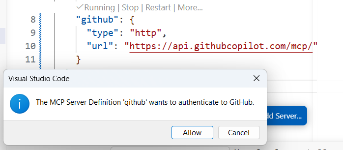

# Module 14: `MCP` `GitHub` Integration — Issues

### Background
You know how to set up `MCP` servers and use their tools through chat. Now it is time to connect to a real production service — `GitHub`. The `GitHub` `MCP` server lets you manage repositories, issues, pull requests, and branches directly from your AI chat without switching to the browser.

In this module, you will configure the `GitHub` `MCP` server, create issues in your project repository from the task backlog, and practice managing project work through AI-driven `GitHub` interactions.

**Learning Objectives**

Upon completion of this module, you will be able to:
- Configure the `GitHub` `MCP` server in your IDE using `HTTP`-based connection.
- Create and manage `GitHub` repositories through the AI chat interface.
- Convert a project backlog file into structured `GitHub` issues without leaving the IDE.
- Manage the full issue lifecycle (create, comment, filter, close) through `MCP` tools.

## Page 1: Why `GitHub` `MCP`
### Background
The traditional workflow for managing `GitHub` involves constant switching: open the browser, navigate to the repository, click through menus, fill in forms, switch back to the IDE, resume coding. This context switching adds up.

With the `GitHub` `MCP` server, the entire workflow happens in one place — your AI chat:
- "List my repositories" — done.
- "Create a new repository called project-automation" — done.
- "Create an issue titled 'Set up `Jira` API integration' with a description of the task" — done.
- "Show me all open issues in my project" — done.

The `GitHub` `MCP` server is `HTTP`-based — it connects to `GitHub`'s official API endpoint, requires no local installation, and authenticates through your `GitHub Copilot` subscription.

### ✅ Result
You understand the value of `GitHub` `MCP` for streamlining project management.

## Page 2: Configure the `GitHub` `MCP` Server
### Background
The `GitHub` `MCP` server differs from the echo server in `Module 13`: it connects to a remote `HTTP` endpoint rather than a local script.

Configuration for `VS Code` (`.vscode/mcp.json`):
```json
{
  "servers": {
    "github": {
      "type": "http",
      "url": "https://api.githubcopilot.com/mcp/"
    }
  }
}
```

Configuration for `Cursor` (`.cursor/mcp.json`):
```json
{
  "mcpServers": {
    "github": {
      "type": "http",
      "url": "https://api.githubcopilot.com/mcp/"
    }
  }
}
```

Key differences from local servers: type is "http" (not a local command), the URL points to `GitHub`'s infrastructure, and authentication uses your `GitHub Copilot` subscription.

### Steps
1. Open your `MCP` configuration file (`.vscode/mcp.json` or `.cursor/mcp.json`).
2. Add the `GitHub` server configuration shown above (add it alongside your existing echo server, not replace it).
3. Save the file and reload the IDE window (`Command Palette` → "Reload Window").
4. Check the Output panel (View → Output → "Model Context Protocol") for connection confirmation.
5. Verify your `GitHub` login in the IDE. In `VS Code`, check the bottom-left corner for the `GitHub` account indicator. Sign in if needed.



6. Enable `GitHub` `MCP` tools in the chat panel tools configuration.

**Important: switching `GitHub` accounts.** If you need to use a different `GitHub` account for `MCP`, changing the account in `VS Code`'s bottom-left corner is NOT enough — `MCP` uses its own authentication. To switch: open your `mcp.json`, hover over the `GitHub` server entry, click "More..." → "Disconnect Account." The server restarts and `prompts` you to authenticate with a different account.

### ✅ Result
The `GitHub` `MCP` server is configured and connected in your IDE.

## Page 3: Test `GitHub` Operations
### Background
The `GitHub` `MCP` server provides tools for repositories, issues, pull requests, branches, commits, and files. For this module, you will focus on repositories and issues — the tools most relevant to project management.

### Steps
1. Test listing repositories: "Show me all my `GitHub` repositories using the `GitHub` `MCP` tool." Approve the tool call. You should see a list of your repositories.
2. If your practical project does not have a `GitHub` repository yet, create one: `Create a new public GitHub repository called 'jira-confluence-automation' with a description Jira/Confluence automation toolkit built with AI assistance` Approve the tool call.
3. If you created a new repository, add it as a remote and push your code:
   "Add a new `Git` remote called 'origin' pointing to the repository we just created, then push the main branch."
4. Verify the code appeared on `GitHub` by asking: "Show me the contents of the `README.md` file in the jira-confluence-automation repository."

### ✅ Result
You can perform basic `GitHub` operations (list repos, create repos, push code) through your AI chat.

## Page 4: Create Issues from Your Backlog
### Background
Your `BACKLOG.md` contains a structured list of tasks for the `Jira`/`Confluence` automation project. Instead of manually creating `GitHub` issues in the browser, you will have the AI create them directly from the backlog.

This is a powerful workflow: the AI reads your backlog, creates properly formatted issues with descriptions, labels, and milestones, and you manage the entire project without leaving the IDE.

### Steps
1. Open your AI chat and reference the backlog:
   "Read @BACKLOG.md. For each uncompleted task in Phase 1, create a `GitHub` issue in my jira-confluence-automation repository. Include the task description as the issue body. Add the label 'phase-1'."
2. Approve each issue creation (one approval per issue).
3. After all issues are created, verify: "List all open issues in the jira-confluence-automation repository."
4. Pick one issue and add a comment: "Add a comment to issue #1 saying 'Starting work on this in `Module 14` of the training course.'"
5. Update your `BACKLOG.md` to note which tasks now have corresponding `GitHub` issues (add the issue number next to each task).
6. Commit the updated `BACKLOG.md`.

### ✅ Result
Your project backlog tasks are now `GitHub` issues that you can track, assign, and manage.

## Page 5: Managing Project Work Through Issues
### Background
`GitHub` issues are more than a todo list — they are a project management system. Each issue has:
- A title, description, and labels for categorization.
- Comments for discussion and progress updates.
- Assignees for responsibility.
- Milestones for grouping by release or phase.
- Status (open/closed) for tracking completion.

As you progress through the remaining modules, use `GitHub` issues to track your work. When you complete a task, close the corresponding issue through the AI chat: "Close issue #3 with comment 'Completed in `Module 15`.'"

This workflow follows the **Agent Delegation Pattern** — a two-session approach:
- **Session 1 (now):** You create structured, well-described issues — capturing context, requirements, and acceptance criteria.
- **Session 2 (later):** A future AI session (or the `GitHub` coding agent in `Module 19`) reads the issue, has complete context, implements the solution, and closes the issue.

The key benefit: no information loss between sessions. The issue preserves everything needed for implementation, whether the implementer is you, another person, or an autonomous agent.

### Steps
1. Explore the issue management tools: "What `GitHub` issue management tools are available through `MCP`?"
2. Try updating an existing issue: "Update the description of issue #1 to include a checklist of subtasks."
3. Try filtering: "Show me all open issues in my repository with label 'phase-1'."
4. Practice closing: "Close issue #[number] with comment 'Task completed.'"
5. Think about which issues from your backlog could be delegated to the `GitHub` coding agent in `Module 19`. Make a note in `BACKLOG.md`.

### ✅ Result
You can manage your project's issue lifecycle entirely through AI chat.

## Summary
Remember the context-switching problem from the introduction — browser tabs, `GitHub` menus, copy-pasting URLs, switching back to the IDE? With the `GitHub` `MCP` server configured, that entire loop collapses into one conversation in your AI chat.

In this module, you configured the `GitHub` `MCP` server using an `HTTP` endpoint, created `GitHub` issues directly from your project backlog, managed the issue lifecycle (create, comment, filter, close), and established a single-window workflow for project management.

Key takeaways:
- The `GitHub` `MCP` server provides `HTTP`-based access to repositories, issues, PRs, and more.
- Authentication uses your `GitHub Copilot` subscription — no personal access `tokens` needed.
- Creating issues from a backlog file is one of the most practical `MCP` workflows.
- `GitHub` issues will serve as the foundation for task delegation in `Module 19`.
- The context switching that slowed you down is now eliminated — everything happens in one place.

Ну или же, как мы в начале обсуждали - всегда же можно просто чат сессиию выгрузить, т.е. не обязательно сильно заморачиваться с практическими задачками, но как минимум проверить что человек поимел у себя в IDE чат сессию в агентном режиме на тему модуля, а не просто квиз натыкал.

## Quiz
1. How does the `GitHub` `MCP` server differ from a local `MCP` server like the echo server?
   a) It does not require any configuration at all
   b) It connects to a remote `HTTP` endpoint (`GitHub`'s API) rather than running a local script, and authenticates through your `GitHub Copilot` subscription
   c) It works the same way but supports fewer tools
   Correct answer: b.
   - (a) Incorrect. The `GitHub` `MCP` server still requires an entry in `mcp.json` with the server type and URL — configuration is simpler but not absent.
   - (b) Correct. The `GitHub` `MCP` server uses "type": "http" to connect to `GitHub`'s cloud infrastructure, while local servers run scripts on your machine. Authentication leverages your existing `Copilot` subscription.
   - (c) Incorrect. The `GitHub` `MCP` server actually provides a rich set of tools (repositories, issues, PRs, branches). The difference is in connection type (`HTTP` vs local), not in the number of tools.

2. What is the practical benefit of creating `GitHub` issues from your `BACKLOG.md` through AI chat?
   a) It ensures that issue descriptions follow a standardized template from `GitHub`
   b) You can manage project tasks without leaving the IDE — the AI reads the backlog, creates properly formatted issues, and lets you track everything in one workflow
   c) It automatically assigns priority levels to each issue based on the backlog order
   Correct answer: b.
   - (a) Incorrect. The AI formats the issue based on the content you provide in the backlog file, not based on a predefined `GitHub` template.
   - (b) Correct. The workflow eliminates context switching between browser and IDE. The AI creates structured issues from your backlog, enabling seamless project management.
   - (c) Incorrect. `GitHub` issues do not have built-in priority levels assigned automatically. You would need to add labels or milestones manually or through an explicit `prompt`.

3. Why is the `GitHub` `MCP` integration important for `Module 19` (`GitHub` Coding Agent)?
   a) The coding agent requires `MCP` to understand your programming language
   b) The issues you create now become tasks that can be delegated to an autonomous coding agent for implementation — the agent picks up issues and creates pull requests
   c) The coding agent uses `MCP` to report its progress back to your IDE in real time
   Correct answer: b.
   - (a) Incorrect. The coding agent understands programming languages through its training, not through `MCP`. `MCP` provides access to `GitHub` services, not language comprehension.
   - (b) Correct. `GitHub` issues serve as task descriptions for the coding agent. You write the issue, the agent implements the solution and opens a PR for your review.
   - (c) Incorrect. The coding agent works asynchronously on `GitHub`'s infrastructure. You review results through pull requests, not through real-time `MCP` updates in the IDE.

## Practical Task

You have configured the `GitHub` `MCP` server and created `GitHub` issues directly from your project backlog.

**Submit your updated backlog for review:**

1. Locate the `backlog.md` file you updated with `GitHub` issue references during this module.
2. Send it to: `Oleksandr_Baglai@epam.com`
   - Subject line: `Module 14 - GitHub Issues Submission`
   - Attach the updated `backlog.md`, or paste its contents in the email body.
3. The reviewer will check that:
   - At least 3 backlog tasks have corresponding `GitHub` issue numbers or URLs added.
   - Issues were created from the AI chat using the `GitHub` `MCP` server (not manually through the web interface).
   - The updated `backlog.md` is committed to your repository.