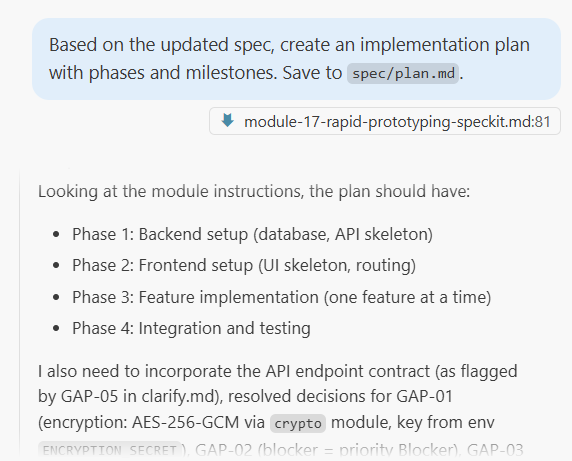
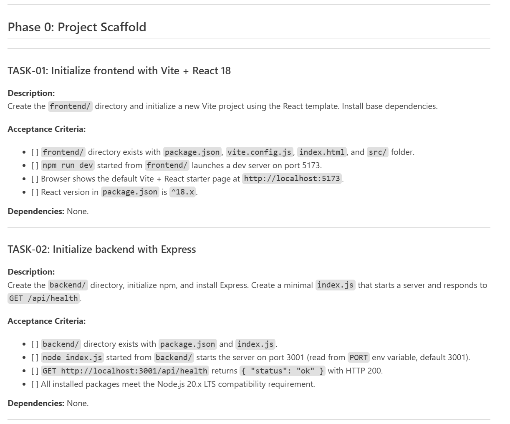

# Module 17: Rapid Prototyping with `SpecKit`

### Background
You have a technical specification, a backlog of tasks, instruction files, and a fully configured development environment. Now it is time to build the actual working prototype. But how do you go from a text spec to a running web application when you have never coded before? The answer is `SpecKit` — a structured methodology that turns a specification document into a working application through a series of AI-guided phases: specify → clarify → plan → tasks → analyze → implement → checklist. In this module, you will follow the full `SpecKit` workflow and, by the end, have a working web application connected to your `Jira`/`Confluence` APIs.

**Learning Objectives**

Upon completion of this module, you will be able to:
- Explain the `SpecKit` phases (constitution, specify, clarify, plan, tasks, analyze, implement, checklist) and what each produces.
- Create a constitution and specification document that guides AI-assisted implementation.
- Use the clarify phase to catch gaps and contradictions before writing code.
- Follow the one-task-at-a-time discipline to build a working prototype incrementally.

## Page 1: What is `SpecKit` and Why It Matters
### Background
`SpecKit` is a spec-driven development methodology designed for AI-assisted prototyping. Instead of jumping into code immediately (which leads to hallucinations, inconsistent architecture, and endless rework), `SpecKit` forces a structured preparation phase before a single line of code is written.

The core idea: the more thoroughly you define what you are building, the better the AI will build it. Each phase produces a concrete artifact (a `Markdown` file) that feeds into the next phase.

**`SpecKit` phases:**
1. **Constitution** — Define the project identity, tech stack, and constraints.
2. **Specify** — Write a detailed specification from your requirements.
3. **Clarify** — Ask the AI to find gaps and contradictions in the spec.
4. **Plan** — Generate an implementation plan with milestones.
5. **Tasks** — Break the plan into individual tasks with acceptance criteria.
6. **Analyze** — Review the tasks for risks, dependencies, and feasibility.
7. **Implement** — Execute tasks one by one with the AI.
8. **Checklist** — Validate the result against the original spec.

### Steps
1. Open your project in `VS Code`.
2. Ask the AI: "What is `SpecKit`? Explain the spec-driven development methodology and its phases."
3. Read the response and understand what each phase produces.
4. Locate your specification from `Module 08` — this will be the input to the `SpecKit` workflow.

### ✅ Result
You understand the `SpecKit` phases and have your specification ready as input.

## Page 2: Constitution and Specification
### Background
The Constitution file defines the non-negotiable rules for your project: tech stack, coding conventions, folder structure, and constraints. The Specification expands your specification into a detailed, AI-parseable document.

**Tech stack for this project:**
- Frontend: `React` 18 + `Vite` (fast, modern UI framework).
- Backend: `Node.js` + `Express` (server for API handling).
- Database: `PostgreSQL` 15 (run via `Docker`).
- Infrastructure: `Docker` + docker-compose.

**Important principle:** The specification captures WHAT the product does and WHY — without mentioning specific technologies. The plan (next page) captures HOW, with specific tech choices. This separation is intentional: a non-technical stakeholder can review and validate the spec without understanding `React` or `PostgreSQL`. And if you later change the tech stack, the spec remains valid.

### Steps
1. Ask the AI: "Create a `SpecKit` constitution file for my `Jira`/`Confluence` automation project. Tech stack: `React` 18 + `Vite` frontend, `Node.js` + `Express` backend, `PostgreSQL` 15 database via `Docker`. Save it to `spec/constitution.md`."
2. Review the file. It should define:
   - Project name, purpose, and target user.
   - Tech stack with specific versions.
   - Folder structure conventions.
   - Coding standards (naming, file organization).
3. Ask the AI: `Based on my specification, create a detailed specification file following 'SpecKit' format. Save to 'spec/specification.md'`
4. Review the spec. It should expand the specification into:
   - User stories or use cases.
   - API endpoints (what data goes where).
   - UI screens (what the user sees).
   - Data model (what is stored in the database).
5. Commit both files.

### ✅ Result
You have a constitution and a detailed specification ready for the next phases.

## Page 3: Clarify, Plan, and Tasks
### Background
The Clarify phase catches mistakes before they become code. The Plan phase creates a roadmap. The Tasks phase produces individual work items with acceptance criteria.

These three phases are the critical preparation that separates `SpecKit` from "just start coding." Without them, the AI will make assumptions — and those assumptions will be wrong.

### Steps
1. Ask the AI: "Read `spec/constitution.md` and `spec/specification.md`. Act as a senior developer reviewing this spec. List all gaps, contradictions, and unclear requirements. Save to `spec/clarify.md`."
2. Review the gaps. For each one, either:
   - Answer the question (add detail to the spec).
   - Mark it as "out of scope" (will not be implemented in this prototype).
3. Ask the AI: "Based on the updated spec, create an implementation plan with phases and milestones. Save to `spec/plan.md`."
4. Review the plan. It should have:
   - Phase 1: Backend setup (database, API skeleton).
   - Phase 2: Frontend setup (UI skeleton, routing).
   - Phase 3: Feature implementation (one feature at a time).
   - Phase 4: Integration and testing.

5. Ask the AI: "Break the plan into individual tasks with acceptance criteria. Save to `spec/tasks.md`."
6. Review the tasks. Each should have: title, description, acceptance criteria, dependencies.

7. Commit all three files.

### ✅ Result
You have a validated spec, an implementation plan, and a detailed task list.

## Page 4: Analyze and Implement
### Background
The Analyze phase reviews tasks for risks before you start coding. The Implement phase is where the AI writes the code, guided by everything you prepared.

Implementation follows the "baby steps" pattern from `Module 03`: implement one task → verify it works → commit → move to the next task. Never implement multiple tasks at once.

The analysis should surface four types of issues:
- **Gaps** — requirements mentioned in the spec but not covered by any task.
- **Contradictions** — conflicting statements across the specification, plan, or task list.
- **Missing artifacts** — API contracts or data model elements needed by tasks but not yet defined.
- **Risk flags** — tasks that are unusually complex or have unclear dependencies.

### Steps
1. Ask the AI: "Analyze the tasks in `spec/tasks.md`. For each task, assess: complexity (low/medium/high), risks, and dependencies. Check for gaps, contradictions, and missing artifacts across spec, plan, and tasks. Save to `spec/analyze.md`."
2. Review the analysis. Reorder tasks if needed (lower risk first, dependencies resolved).
3. Start implementing: "Implement task 1 from `spec/tasks.md`. Follow the constitution and specification. Show me what you are going to do before you do it."
4. Review the AI's plan for the task. Approve or adjust.
5. Let the AI implement. Verify the result works:
   - Backend task? Ask: "Start the server and test this endpoint."
   - Frontend task? Ask: "Start the frontend and show me what the UI looks like."
   - Database task? Ask: "Run docker-compose up and verify the database is accessible."
6. If it works → commit with a descriptive message.
7. If it does not work → ask the AI to debug. Do not argue; provide the error message and let the AI fix it.
8. Repeat for each task. This is the longest part of the module — take your time.

### ✅ Result
Your prototype is implemented, task by task, with each step verified and committed.

## Page 5: Checklist and Final Verification
### Background
The Checklist phase validates the finished prototype against the original specification. This is your QA step — catching anything that was missed, broken, or incorrectly implemented.

### Steps
1. Ask the AI: "Read `spec/specification.md` and compare it to the current implementation. For each requirement, check: is it implemented? Does it work? Save the results to `spec/checklist.md`."
2. Review the checklist. For each unchecked item:
   - Is it a real gap? → Implement it now.
   - Is it out of scope? → Mark it clearly.
   - Is it a minor polish item? → Add to a "nice-to-have" list.
3. Run the full application: "Start docker-compose, start the backend, start the frontend. Walk me through the entire user flow."
4. Step through each screen. Does it match the spec?
5. If everything checks out, commit the final state with message: "feat: complete prototype per specification."
6. Push to `GitHub`.

### ✅ Result
Your working prototype is verified against the specification, committed, and pushed to `GitHub`.

## Summary
Remember the question from the introduction — how do you go from a text spec to a running web application when you have never coded before? `SpecKit` is the answer: a structured methodology that turns your specification into working code through eight disciplined phases.

You followed the full workflow: constitution defined the rules, specification described the product, clarify caught gaps, plan and tasks broke the work into baby steps, and implementation turned each task into verified, committed code. The result is a working prototype built without prior coding experience — because the AI had clear instructions at every step.

Key takeaways:
- `SpecKit`'s structured phases prevent the AI from making assumptions that lead to rework.
- Constitution defines the rules; Specification defines the product; Clarify catches gaps early.
- Plan and Tasks break the project into baby steps — each verified and committed.
- Implementation follows one-task-at-a-time discipline: implement → verify → commit → next.
- The Checklist phase is your final QA gate before declaring the prototype complete.

## Quiz
1. Why does `SpecKit` require a detailed specification before writing any code?
   a) It helps the team estimate the project timeline more accurately
   b) The more precisely you define what to build, the fewer assumptions the AI makes — reducing hallucinations, rework, and inconsistent architecture
   c) It generates documentation that can replace user testing
   Correct answer: b.
   - (a) Incorrect. While a spec can help with estimation, that is not `SpecKit`'s primary purpose. The spec exists to give the AI clear, unambiguous instructions so it generates correct code, not to predict timelines.
   - (b) Correct. AI assistants generate better code when given detailed, unambiguous instructions. Without a spec, the AI fills in gaps with assumptions that often do not match your intent, causing costly rework.
   - (c) Incorrect. Documentation and testing serve different purposes. The spec guides implementation; user testing validates that the implementation meets real user needs. One does not replace the other.

2. What is the purpose of the Clarify phase in the `SpecKit` workflow?
   a) To reduce the spec to only the most critical requirements so the AI can work faster
   b) To ask the AI to find gaps, contradictions, and unclear requirements in the specification before any code is written — catching mistakes early when they are cheap to fix
   c) To convert the specification from business language into technical terminology
   Correct answer: b.
   - (a) Incorrect. The Clarify phase does not remove requirements. It adds precision by resolving ambiguities and filling gaps. Removing details would make the spec less useful, not more.
   - (b) Correct. The Clarify phase is a pre-implementation review. The AI acts as a critical reviewer, surfacing problems that would otherwise become bugs. Fixing a gap in a text document takes minutes; fixing it in code takes hours.
   - (c) Incorrect. The Clarify phase works in the same language as the spec. It does not translate — it questions. The output remains in business-understandable terms so non-technical stakeholders can still review it.

3. Why should you implement one task at a time instead of asking the AI to build the whole application at once?
   a) The AI's context window cannot hold a full application's code, so it needs smaller pieces to work with
   b) Implementing one task at a time lets you verify each step works before moving on — if something breaks, you know exactly which change caused it and can fix or rollback quickly
   c) Each task requires a separate approval from the project manager before implementation
   Correct answer: b.
   - (a) Incorrect. While context windows have limits, this is not the primary reason. Even with a large context window, implementing everything at once creates a debugging nightmare because you cannot isolate which change caused a failure.
   - (b) Correct. The baby-steps approach gives you a working checkpoint after each task. If task 5 breaks something, you know task 5 is the cause. If you implemented 10 tasks at once and it breaks, you have no idea which change caused the problem.
   - (c) Incorrect. `SpecKit` is a development methodology, not a governance process. You control the pace of implementation. The one-task-at-a-time discipline is about quality and debuggability, not approvals.

## Practical Task

You have built a working prototype using the `SpecKit` methodology.

**Submit your prototype specification files for review:**

1. Locate the `specification.md` (or equivalent spec file) created during the `SpecKit` workflow and the task list used for implementation.
2. Send them to: `Oleksandr_Baglai@epam.com`
   - Subject line: `Module 17 - Prototype Specification Submission`
   - Attach the specification and task list files, or paste their contents in the email body.
3. The reviewer will check that:
   - The specification describes a real use case from your project (not a placeholder example).
   - Tasks are broken into baby steps with clear acceptance criteria.
   - At least one task was implemented, verified, and committed.
   - A repository URL or commit reference demonstrates working code was produced.