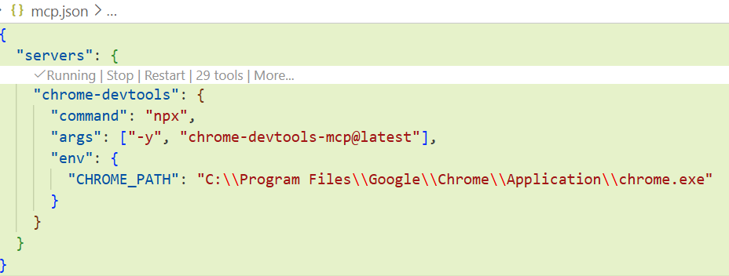
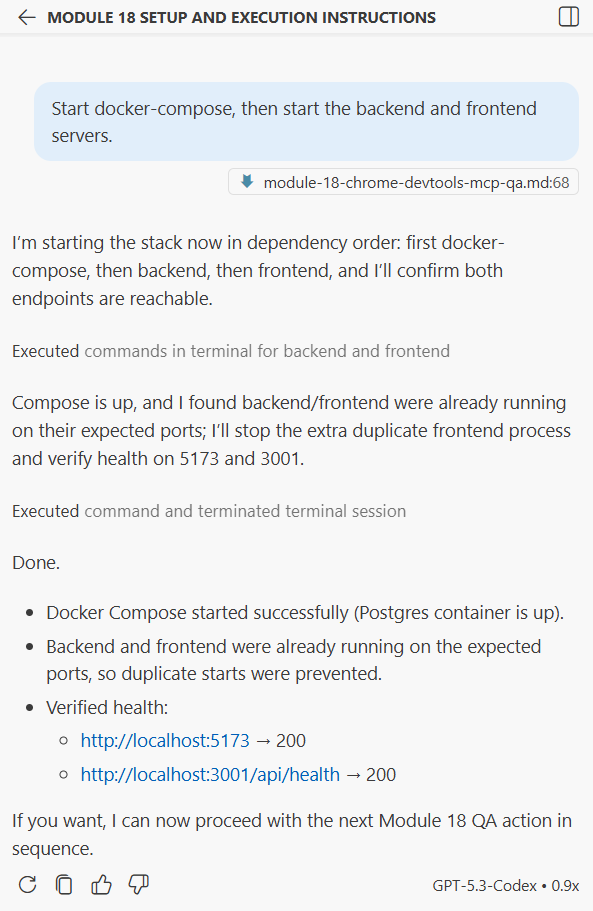
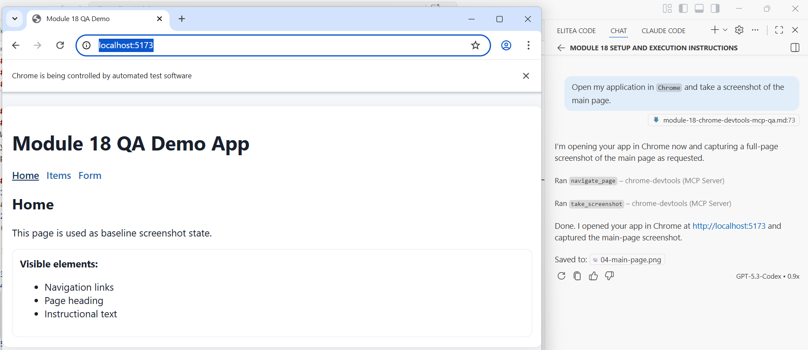
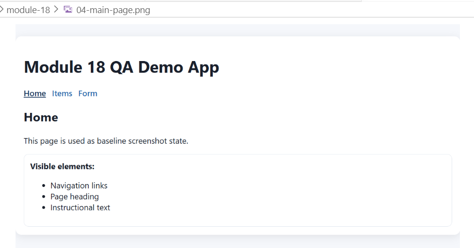
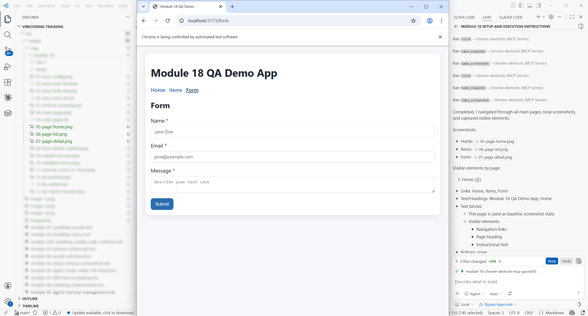
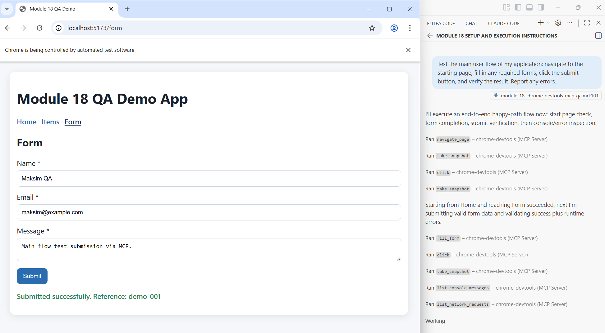
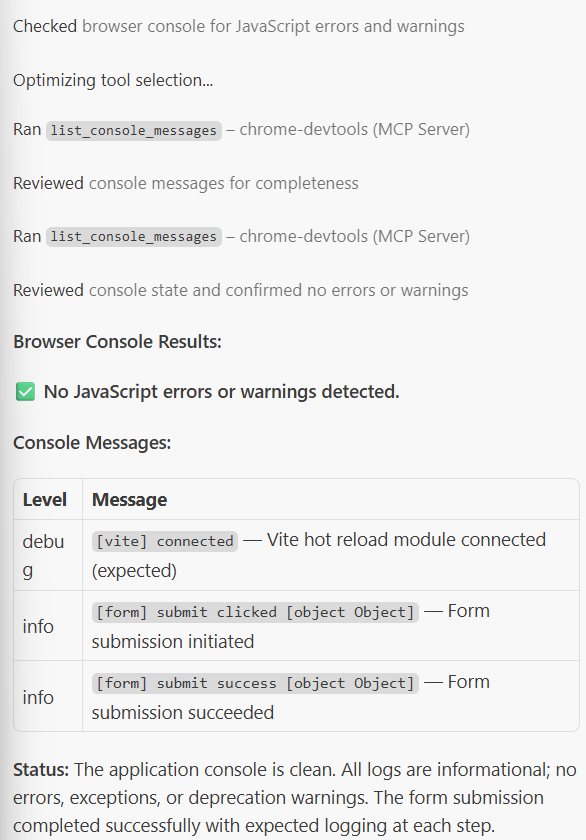
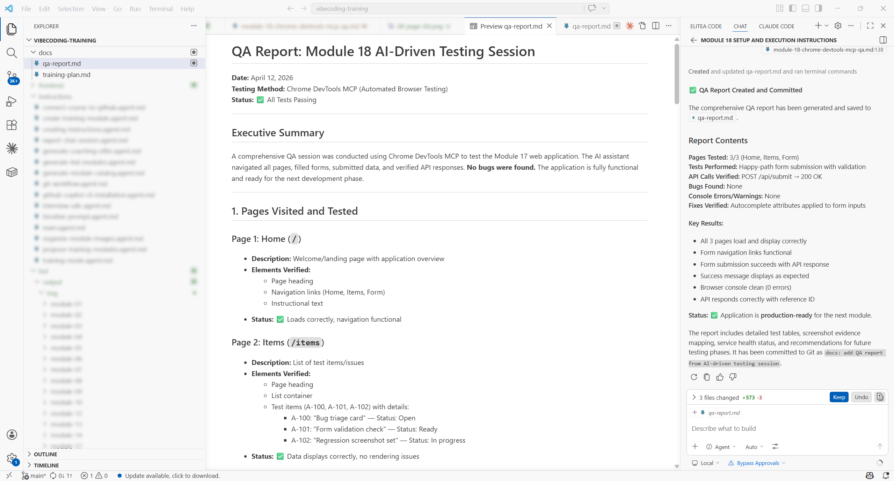

# Module 18: AI-Powered QA with `Chrome DevTools MCP`

### Background
You have a working web application from `Module 17`. Now you need to test it — but you are not a QA engineer. Manual testing (clicking through every screen, checking every button) is tedious and easy to do incompletely. What if the AI could open your application in a real browser, click buttons, fill forms, take screenshots, and report issues — all by itself? That is exactly what `Chrome DevTools MCP` enables. It connects your AI assistant to a real `Chrome` browser, turning the AI into an automated QA tester that can see and interact with your application.

**Learning Objectives**

Upon completion of this module, you will be able to:
- Explain how `Chrome DevTools MCP` connects the AI assistant to a running web application in the browser.
- Configure and start the `Chrome DevTools MCP` server in your IDE.
- Run an AI-driven QA session that navigates pages, fills forms, clicks buttons, and captures screenshots.
- Create a documented QA report from the AI testing session.

## Page 1: What is `Chrome DevTools MCP`
### Background
`MCP` (Model Context Protocol) connects your AI assistant to external tools. In `Module 13`, you learned about `MCP` in general. `Chrome DevTools MCP` is a specific `MCP` server that gives the AI the ability to control a `Chrome` browser.

What the AI can do through `Chrome DevTools MCP`:
- **Open URLs** — navigate to any page of your application.
- **Inspect elements** — read text, check styles, find buttons and links.
- **Click elements** — press buttons, follow links, open menus.
- **Fill forms** — type text into input fields, select dropdown options.
- **Take screenshots** — capture what the browser shows at any moment.
- **Read console logs** — detect `JavaScript` errors your application produces.
- **Evaluate `JavaScript`** — run diagnostic scripts in the browser context.

This means the AI can perform the same manual testing a human would — but faster, more consistently, and without getting bored.

### Steps
1. Open your project in `VS Code`.
2. Ask the AI: "What is `Chrome DevTools MCP` and how does it help with testing web applications?"
3. Read the response. The key concept: `MCP` bridges the gap between the AI (which can reason about testing) and the browser (which runs your application).

### ✅ Result
You understand what `Chrome DevTools MCP` does and why it is useful for QA.

## Page 2: Installing and Configuring `Chrome DevTools MCP`
### Background
To use `Chrome DevTools MCP`, you need: (1) `Google Chrome` installed on your machine, and (2) the `MCP` server configured in `VS Code`.

The `Chrome` browser must be launched in a special "debugging mode" that allows external tools to connect to it. The `MCP` server acts as a bridge between the AI assistant and the debugging interface.

### Steps
1. Verify `Chrome` is installed: ask the AI "Check if `Google Chrome` is installed on my machine."
2. If not installed, download it from the official website and install.
3. Configure `Chrome DevTools MCP` server in `VS Code`:
   - Ask the AI: "Help me configure `Chrome DevTools MCP` server in `VS Code` settings."
   - The AI will add the `MCP` server configuration to your `VS Code` `settings.json` or `.vscode/mcp.json`.
   - The configuration specifies how to launch `Chrome` in debugging mode and connect the `MCP` server.
4. Restart `VS Code` to load the new `MCP` server.
5. Verify the `MCP` server is available: ask the AI "List all available `MCP` tools." The `Chrome DevTools` tools should appear in the list (e.g., browser_navigate, browser_click, browser_screenshot).

If the `MCP` server does not appear, common issues include:
- `Chrome` not found at the expected path — ask the AI to detect the correct path.
- Port conflict — another application is using the debugging port.
- Missing npx or `Node.js` — the `MCP` server requires `Node.js` (installed in `Module 16`).

### ✅ Result
`Chrome DevTools MCP` is configured, and the AI has access to browser control tools.

## Page 3: Running Your First AI-Driven Test
### Background
With the `MCP` server connected, the AI can now open your application and interact with it. This is your first automated QA session — the AI will navigate your application, check that key elements are present, and report what it finds.

### Steps
1. Start your application from `Module 17`: ask the AI "Start docker-compose, then start the backend and frontend servers."
2. Wait for all services to start. The frontend should be accessible at [http://localhost:5173](http://localhost:5173) (or similar).

3. Ask the AI: "Open my application in `Chrome` and take a screenshot of the main page."
4. The AI will use `MCP` tools to:
   - Launch `Chrome`.
   - Navigate to localhost.
   - Take a screenshot.
   - Show you the screenshot.

   
5. Review the screenshot. Does it match what you expected?

6. Ask: "Navigate through all main pages of the application. For each page, take a screenshot and list all visible elements (buttons, links, forms, text)."
7. The AI will walk through your application page by page, documenting what it sees.

8. Review the output. This is your first QA report — a visual record of every screen.

### ✅ Result
You have run your first AI-driven QA session and have screenshots of every page.

## Page 4: Interactive Testing — Forms, Buttons, Error Handling
### Background
Seeing the pages is the first step. Now the AI will interact with your application — filling forms, clicking buttons, and checking that actionable elements work correctly. This is where you catch real bugs: broken buttons, forms that do not submit, error messages that never appear.

### Steps
1. Ask the AI: "Test the main user flow of my application: navigate to the starting page, fill in any required forms, click the submit button, and verify the result. Report any errors."
2. The AI will:
   - Navigate to the form page.
   - Fill in test data.
   - Click submit.
   - Check the response (success message, redirect, error).
   - Report the result.

3. If the AI finds an error (broken button, missing validation, server error):
   - Read the error details.
   - Ask the AI: "Fix this issue" — the AI can switch from QA mode to developer mode and fix the bug.
   - **Hot reload loop:** If your application uses a development server (like `Vite`), the browser refreshes automatically when the AI saves the fixed code. The AI then immediately re-tests — creating a rapid cycle: code → auto-refresh → test → fix → verify. This self-correcting loop is the real power of combining `MCP` with hot reload.
4. Ask: "Check the browser console for any `JavaScript` errors or warnings."
5. The AI will read the console output and report anything suspicious.

6. For each bug found and fixed, commit with a descriptive message (e.g., "fix: form validation error on submit").

### ✅ Result
You have tested interactive elements, caught and fixed bugs, and verified the fixes.

## Page 5: Building QA Documentation and Regression Suite
### Background
Testing is only useful if the results are documented. A single-session QA report captures what was tested today. A regression suite is a growing document that accumulates test scenarios across all features — so you can re-run them whenever you change code, ensuring new features do not break existing ones.

Advanced QA patterns to be aware of:
- **Test-Driven Development (`TDD`):** Write test scenarios first, then ask the AI to implement the feature until all tests pass.
- **Continuous Regression:** Run the full test suite before every deploy — catch regressions before users do.
- **Visual Regression:** Take baseline screenshots, then compare after changes to detect unintended visual differences.
- **Accessibility Testing:** Use `Chrome DevTools` to check `ARIA` labels, keyboard navigation, and color contrast.

A typical development day with this workflow: start the morning by running regression tests, develop a new feature with AI-driven QA mid-day, fix any bugs found, and end the day with a final regression pass before pushing to `GitHub`.

### Steps
1. Ask the AI: "Create a QA report for my application based on everything we tested in this session. Include: pages visited, elements tested, bugs found, fixes applied, current status. Save to `docs/qa-report.md`."
2. Review the report. It should contain:
   - Summary of tested pages.
   - List of interactive tests performed.
   - Bugs found (with description, screenshot reference, and severity).
   - Fixes applied (with commit references).
   - Current application status (all tests passing / known issues).

3. If additional testing is needed, add test cases to the report and execute them.
4. Commit the report: "docs: add QA report from AI-driven testing session."
5. Push to `GitHub`.

### ✅ Result
You have a documented QA report and a tested, verified prototype ready for the next module.

## Summary
Remember the problem from the introduction — you have a working application but you are not a QA engineer, and manual testing is tedious and incomplete? `Chrome DevTools MCP` solved that by turning the AI into your QA team.

The AI navigated pages, filled forms, clicked buttons, took screenshots, and read console logs — performing the same work a human tester would, but faster and more consistently. Bugs were caught, fixed, and verified in a single session. The result is a tested prototype with a documented QA report, built without QA expertise.

Key takeaways:
- `Chrome DevTools MCP` gives the AI the ability to see and interact with your running application.
- The AI can navigate pages, click elements, fill forms, take screenshots, and read console errors.
- AI-driven QA is faster and more consistent than manual clicking, especially for repetitive checks.
- Every bug found should be fixed and committed immediately — baby steps approach applies to QA too.
- A QA report documents what was tested and what was found — essential for project tracking.

## Quiz
1. What does `Chrome DevTools MCP` enable the AI assistant to do?
   a) It gives the AI direct access to `Chrome`'s internal source code for modification
   b) It connects the AI to a real `Chrome` browser, allowing it to navigate pages, click elements, fill forms, take screenshots, and read console errors — performing automated QA testing
   c) It runs your web application inside the AI's environment instead of a real browser
   Correct answer: b.
   - (a) Incorrect. `Chrome DevTools MCP` uses `Chrome`'s debugging interface, not its source code. The AI controls the browser through standardized debugging commands, not by modifying `Chrome` itself.
   - (b) Correct. `Chrome DevTools MCP` is a bridge between the AI assistant and `Chrome`'s debugging interface. The AI uses it to control the browser as a human tester would — but faster and more systematically.
   - (c) Incorrect. The application runs in a real `Chrome` browser on your machine. The AI sends commands to that browser through the `MCP` server — it does not simulate or replace the browser environment.

2. Why is it important to check the browser console during AI-driven testing?
   a) The console logs show the exact sequence of `MCP` commands the AI sent to the browser
   b) The browser console displays `JavaScript` errors and warnings that may not be visible in the UI — catching hidden bugs that would only appear in production
   c) The console provides performance metrics that determine whether the application meets speed requirements
   Correct answer: b.
   - (a) Incorrect. The browser console shows your application's logs, not `MCP` commands. `MCP` communication happens through a separate debugging channel, not through the browser's developer console.
   - (b) Correct. Many bugs do not produce visible UI errors but leave traces in the browser console (failed API calls, null reference errors, deprecation warnings). Checking the console catches these hidden issues before they reach real users.
   - (c) Incorrect. While the console can show some timing information, its primary value during QA is catching `JavaScript` errors and failed network requests. Dedicated profiling tools are better suited for performance analysis.

3. What should you do when the AI finds a bug during QA testing?
   a) Document the bug in the QA report and schedule it for a separate fix session to keep testing and fixing separate
   b) Read the error details, ask the AI to fix the issue, re-test the fix, and commit with a descriptive message — keeping the baby-steps approach even during QA
   c) Revert to the last known working commit and re-implement the feature from scratch
   Correct answer: b.
   - (a) Incorrect. While documenting is important, deferring fixes creates risk. You may forget the context of the bug, or the fix may conflict with later changes. Fixing immediately while the details are fresh is more efficient.
   - (b) Correct. Fixing bugs immediately when found keeps the prototype in a working state. Each fix is a small, verifiable commit. If you defer all fixes to later, you risk forgetting details and creating harder-to-debug compound issues.
   - (c) Incorrect. Reverting and re-implementing is a drastic response to a single bug. The baby-steps approach means each commit is a working checkpoint — you only need to fix the specific issue, not rebuild the feature.

## Practical Task

You have run AI-driven QA on your prototype using `Chrome DevTools MCP` and produced a QA report.

**Submit your QA report for review:**

1. Locate the QA report file generated during this module.
2. Send it to: `Oleksandr_Baglai@epam.com`
   - Subject line: `Module 18 - QA Report Submission`
   - Attach the QA report, or paste its contents in the email body.
3. The reviewer will check that:
   - The report covers at least 3 distinct UI scenarios (e.g., page navigation, form submission, error handling).
   - Found bugs are documented with descriptions.
   - All bugs found were fixed and committed before the report was finalized.
   - The report confirms the prototype passed QA in its final state.