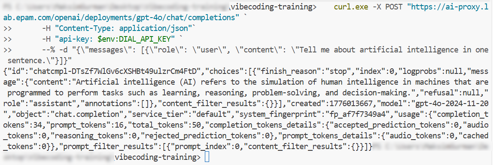

# Module 20: `DIAL API` Key and `cURL` Access

### Background
Throughout this course, you have used AI through graphical interfaces — `VS Code`, `GitHub`, `Chrome`. But AI models can also be accessed directly through code, using simple `HTTP` requests. `EPAM` `AI DIAL` is an internal platform that gives you API access to multiple AI models (`GPT-4o`, `Claude`, `Gemini`) through a single endpoint. In this final module, you will request an `API key`, make your first programmatic call to an AI model using `cURL`, and understand the parameters that control model behavior. This opens the door to custom automation that goes beyond what any IDE plugin can offer.

**Learning Objectives**

Upon completion of this module, you will be able to:
- Explain what `EPAM` `AI DIAL` is and why programmatic API access is valuable for managers.
- Request a `DIAL` `API key` and store it securely using environment variables.
- Make a `cURL` request to an AI model and interpret the `JSON` response.
- Adjust API parameters (temperature, max_tokens) to control model behavior for different use cases.

## Page 1: What is `DIAL` and Why Programmatic Access Matters
### Background
`EPAM` `AI DIAL` is `EPAM`'s internal AI gateway. It provides a unified API interface to multiple AI providers — `OpenAI` (`GPT`), `Anthropic` (`Claude`), and `Google` (`Gemini`) — through a single endpoint and a single `API key`.

**Why would a manager need programmatic access?**
- Automate document analysis and report generation for your team.
- Build custom tools that integrate AI into existing project workflows.
- Process large batches of data (e.g., analyze 100 customer feedback forms at once).
- Create proof-of-concepts to evaluate AI capabilities for your business case.
- Control costs and usage by implementing your own rate limiting.

**What is an `API key`?** Think of it as a password that identifies you when your scripts talk to `DIAL` servers. It is a long string like `57bde47684bd39aebc382b4ca4638abd` that you include in every request. Without it, the server rejects your request.

**What is `cURL`?** A command-line tool for making `HTTP` requests — the same kind of requests your browser makes when you open a webpage. `cURL` is pre-installed on most operating systems.

**What is a `REST API`?** A way for programs to talk to servers using `HTTP`. You send a request (your question) and receive a response (the AI's answer) — all in structured `JSON` format.

### Steps
1. Ask the AI: "Explain what `EPAM` `AI DIAL` is, what a `REST API` is, and what `cURL` does — in simple terms for someone who has never programmed."
2. Read the response. The key concepts: `DIAL` = AI gateway, `API key` = your identity, `cURL` = command-line `HTTP` client, `REST API` = structured request/response protocol.

### ✅ Result
You understand what `DIAL` is, why you need an `API key`, and how `cURL` sends requests.

## Page 2: Requesting Your API Key
### Background
To access `DIAL` programmatically, you need an `API key`. The key is requested through `EPAM`'s support portal and is typically approved within 1-3 business days.

**Security warning:** Your `API key` is like a password. Anyone with your key can make requests on your behalf, consume your quota, and all actions will be logged under your name. Never commit `API keys` to `Git` repositories, share them in chats, or store them in plain text files accessible to others.

### Steps
1. Open your browser and navigate to [https://chat.lab.epam.com/](https://chat.lab.epam.com/)
2. Scroll to the bottom of the page.
3. Find and click the **"Request `API key`"** link in the footer.


4. You will be redirected to the `EPAM` Support Portal with a pre-filled ticket.
5. Fill in:
   - **What is your API usage pattern?** "Personal usage: experimentation, self-education"
6. Read and Accept all the Conditions and Policies, and Submit
7. Wait for the approval email (1-3 business days). The email will contain:
   - Your `API key` (a long hexadecimal string).
   - The endpoint URL: `https://ai-proxy.lab.epam.com`
8. Store the `API key` securely. Ask the AI: "What is the safest way to store an `API key` on my machine for local testing?" (Typical answer: environment variable, not a text file.)

### ✅ Result
You have submitted the `API key` request and understand how to store the key securely.

## Page 3: Making Your First `cURL` Request
### Background
With the `API key` in hand, you can now send a request to an AI model. The request includes: (1) the endpoint URL with the model name, (2) your `API key` in the headers, and (3) your prompt in the request body.

Available models include:
- **OpenAI:** `gpt-4o`, `gpt-4.1-mini`
- **Anthropic:** `claude-sonnet-4`, `claude-3-7-sonnet`
- **Google:** `gemini-2.5-pro`, `gemini-2.5-flash`

### Steps
1. Open `PowerShell` (`Windows`) or Terminal (`macOS`/Linux).
2. Verify `cURL` is installed:
   - **`Windows` `PowerShell`:** `curl.exe --version`
   - **`macOS`/Linux:** `curl --version`
   You should see version information.
3. Set your `API key` as an environment variable (so you do not paste it repeatedly):
   - **`Windows` `PowerShell`:** `$env:DIAL_API_KEY = "your-key-here"`
   - **`macOS`/Linux:** `export DIAL_API_KEY="your-key-here"`

[MG]: Нужно попросить ии написать правильные курлы под каждую из систем чтобы они точно работали

4. Send your first request (`Windows` `PowerShell`):
   ```
   curl.exe -X POST "https://ai-proxy.lab.epam.com/openai/deployments/gpt-4o/chat/completions" `
      -H "Content-Type: application/json"`
      -H "api-key: $env:DIAL_API_KEY" `
      --% -d "{\"messages\": [{\"role\": \"user\", \"content\": \"Tell me about artificial intelligence in one sentence.\"}]}"
   ```
5. You should receive a `JSON` response containing the model's answer in `choices[0].message.content`.



6. If you get an error:
   - **401 Unauthorized:** Check the `API key` — make sure it is copied correctly with no extra spaces.
   - **Connection refused:** Make sure you are on the `EPAM` `VPN`.
   - **Model not found:** Check the model name in the URL — it must match an available deployment.
7. Try a different model: replace the model name in the URL with `claude-sonnet-4@20250514` and send the same prompt. Compare the responses.

### ✅ Result
You have made your first programmatic AI request and received a response.

## Page 4: Understanding API Parameters
### Background
The basic request sends only a prompt. But `DIAL API` supports parameters that control how the model generates its response. The most important ones:

- **temperature** (0.0–2.0, default 1.0): Controls creativity. Low values (0.0–0.3) = deterministic, factual. High values (0.9–2.0) = creative, unpredictable. Use low for data analysis, high for brainstorming.
- **max_tokens**: Limits response length. 50–100 for short summaries. 500–1000 for detailed explanations. No limit by default.
- **stream** (true/false): If true, the response arrives word by word in real time. If false, the full response arrives at once. Use false for scripts, true for chat interfaces.
- **n**: Number of response variations to generate. Default is 1. Set to 3 to get multiple options (useful for creative tasks).

### Steps
1. Send a request with low temperature for a factual answer:
   ```
   curl.exe -X POST "https://ai-proxy.lab.epam.com/openai/deployments/gpt-4o/chat/completions" `
   -H "Content-Type: application/json"`
   -H "api-key: $env:DIAL_API_KEY" `
   --% -d "{\"messages\": [{\"role\": \"user\", \"content\": \"What is the capital of France?\"}], \"temperature\": 0.0}"
   ```
2. Send the same request with high temperature (1.5) and compare — the factual request should be nearly identical, but creative prompts will vary significantly.
3. Send a request with `max_tokens: 50` and observe how the response is cut short.
4. Try `n: 3` to get three different response variations for the same prompt.
5. Document your observations: which parameter settings make sense for your project use cases?

### ✅ Result
You understand the main API parameters and how they affect model behavior.

## Page 5: Practical Application — Test `DIAL` for Your Project
### Background
Now connect what you learned to your `Jira`/`Confluence` automation project. `DIAL API` can power custom automation that goes beyond the IDE — for example, a script that reads `Jira` issue descriptions and generates summary reports, or a batch processor that classifies customer feedback.

### Steps
1. Think about one task from your project backlog that could benefit from direct API access. Examples:
   - Summarize all issues in a `Jira` sprint using AI.
   - Classify a list of feedback items by category.
   - Generate a weekly status report from raw project data.
2. Write a prompt that accomplishes this task. Test it via `cURL`:
   ```
   curl.exe -X POST "https://ai-proxy.lab.epam.com/openai/deployments/gpt-4o/chat/completions" `
   -H "Content-Type: application/json"`
   -H "api-key: $env:DIAL_API_KEY" `
   --% -d "{\"messages\": [{\"role\": \"user\", \"content\": \"Your task-specific prompt here\"}], \"temperature\": 0.2, \"max_tokens\": 500}"
   ```
3. Review the response. Is it useful? Adjust the prompt or parameters.
4. If the task involves processing multiple items, consider combining this with the script-based approach from `Module 15` — iterate over items, sending each to `DIAL API` individually for consistent results.
5. Save your working `cURL` command as a script file (e.g., `work/170-task/test-dial.ps1`).
6. Commit the script: "feat: `DIAL API` test script for project automation."

### ✅ Result
You have tested `DIAL API` access for a practical project task and have a reusable script.

## Summary
Remember how, at the start of this module, your entire AI experience happened through graphical interfaces — clicking buttons in `VS Code`, approving tool calls in chat, reviewing PRs on `GitHub`? Now you can go beyond those interfaces and talk to AI models directly through code.

With a `DIAL` `API key` and a simple `cURL` command, you have access to `GPT`, `Claude`, and `Gemini` through a single endpoint. Parameters like temperature and max_tokens give you precise control over how the model responds. Combined with everything you learned in this course — prompting, instructions, skills, `MCP`, prototyping, QA, delegation — you now have a full toolkit for leveraging AI in your management workflows.

Key takeaways:
- `EPAM` `AI DIAL` provides unified API access to multiple AI providers through a single key and endpoint.
- `cURL` is a simple command-line tool for testing API requests — no programming language required.
- API parameters like temperature and max_tokens let you control creativity and response length.
- Your `API key` is a credential — store it securely, never commit to `Git` or share in chats.
- Direct API access enables custom automation: batch processing, report generation, data classification.
- This completes your toolkit: IDE assistant → instructions → skills → `MCP` → prototyping → QA → delegation → API access.

[MG]: Давай этот весь модуль сделаем Optional, далеко не каждому он понадобится.

## Quiz
1. What is the purpose of `EPAM` `AI DIAL`?
   a) It is a proxy that routes requests to the cheapest available AI provider to minimize costs
   b) It is an internal AI gateway that provides unified API access to multiple AI providers (OpenAI, Anthropic, Google) through a single endpoint and `API key`
   c) It is a monitoring dashboard that tracks AI usage across `EPAM` projects
   Correct answer: b.
   - (a) Incorrect. `DIAL` does not select providers based on cost. It provides access to specific models you choose in the request URL. You decide which model to use; `DIAL` routes the request to that model.
   - (b) Correct. `DIAL` acts as a single entry point to multiple AI models. Instead of getting separate keys for `GPT`, `Claude`, and `Gemini`, you use one `DIAL` `API key` to access all of them through the same request format.
   - (c) Incorrect. While `DIAL` does log usage, its primary purpose is providing API access to AI models, not monitoring. Usage tracking is a side feature, not the core function.

2. What does the temperature parameter control in an AI API request?
   a) The speed at which the response is generated
   b) The balance between deterministic (factual) and creative (varied) responses — low values produce consistent output, high values produce diverse and unpredictable output
   c) The maximum number of tokens the model considers before generating each word
   Correct answer: b.
   - (a) Incorrect. Temperature has no effect on response speed. Speed depends on model load, token count, and server capacity. A request with temperature 0.0 takes roughly the same time as one with temperature 2.0.
   - (b) Correct. Temperature controls randomness in token selection. At 0.0, the model picks the most likely next word (deterministic). At higher values, it considers less likely alternatives, producing more varied and creative responses.
   - (c) Incorrect. The number of tokens considered during generation is not controlled by temperature. That relates to the model's vocabulary and context window. Temperature affects how the model chooses among candidate tokens, not how many it evaluates.

3. Why should you never commit an `API key` to a `Git` repository?
   a) `Git` commit hooks automatically reject files containing `API key` patterns
   b) Anyone who accesses the repository can see the key, make requests under your name, consume your quota, and potentially violate security policies — all traced back to your account
   c) `API keys` contain special characters that can corrupt the `Git` index
   Correct answer: b.
   - (a) Incorrect. Standard `Git` does not have built-in `API key` detection. Some organizations add pre-commit hooks for this, but by default `Git` will happily commit any string. You cannot rely on `Git` to protect you.
   - (b) Correct. `Git` history is permanent — even if you delete the key later, it remains in the commit history. Anyone with access to the repo (including public repos) can extract the key and use it. Store keys in environment variables or secure vaults instead.
   - (c) Incorrect. `API keys` are plain text strings (typically hexadecimal) and do not cause any technical issues with `Git`. The risk is security exposure, not file corruption.
