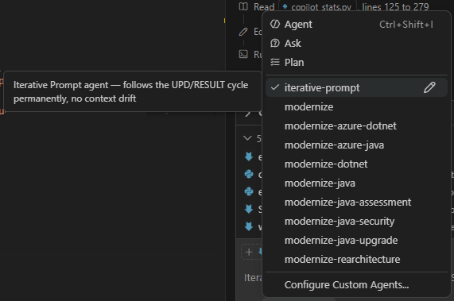

# Workspace Kickoff with Iterative Prompt - Hands-on Walkthrough

You're about to learn a technique for starting any AI-assisted investigation: dump all your materials into a folder, then write a single `main.prompt.md` file — your `development log` — that tells the AI what's there and what you want. This file lives alongside the materials and becomes a permanent artifact — your breadcrumb trail for future reference. As the work evolves, you add `## UPD[N]` blocks instead of starting new chats.

## Prerequisites

See [module overview](about.md) for full prerequisites list.

## What We'll Build

You'll create a small research workspace with sample materials and a `development log` named `main.prompt.md`. You'll then run it from **two different runtimes** — first from the IDE (VS Code Copilot Chat), then from the **Copilot CLI** in a plain terminal — and see how the same `development log` drives both. Finally, you'll extend it with `## UPD` blocks to evolve the investigation without losing context.

| Component | Purpose |
|---|---|
| Research folder | Holds all the raw materials (code, transcripts, notes) |
| `main.prompt.md` | The `development log` — describes the materials and what you want done |
| `<follow>` block | Links to the iterative prompt skill so the agent knows the UPD workflow |
| `## UPD[N]` blocks | Incremental updates that grow the `development log` over time |
| **IDE runtime** | VS Code Copilot Chat + async watcher with terminal-notification wakeups |
| **CLI runtime** | `copilot` CLI process with `--autopilot` driven by the same watcher |

---

## Part 1: Understand the Problem This Solves

### Why not just type in the chat?

When you start a chat session, your prompt disappears into history. A week later, when you (or a teammate) open the same folder and wonder "how did this analysis start?" — the chat is gone or buried.

A `.prompt.md` file saved in the folder:
- Stays with the project in version control
- Can be run again at any time
- Shows future readers exactly what question kicked off the work
- Can be shared, reviewed, or improved like any other file
- Grows with `## UPD[N]` blocks without losing the original context

### When does this technique apply?

- You cloned a repository you've never seen and need to understand it quickly
- Someone shared meeting transcript files and you want to extract decisions
- You have scattered notes and chat excerpts and want to synthesize them
- You want to write a document, proposal, or summary from raw inputs

---

## Part 2: Set Up a Research Folder

### What we'll do

Create a small folder that simulates a real research scenario: a mix of materials you want AI to analyze.

### Steps

1. Create the practice folder for this module:
   - Windows: `c:/workspace/hello-genai/work/058-task/`
   - macOS/Linux: `~/workspace/hello-genai/work/058-task/`

   > This follows the course convention: all module exercises go into `work/[module-number]-task/`. The `work/` folder is gitignored, so it's safe to experiment here.

2. Open the folder in your IDE (File → Open Folder).

3. Add some raw materials to the folder. For this exercise, create or copy in at least two of the following kinds of files:
   - A short `.md` file with notes or ideas
   - A `.txt` file with a short meeting transcript (you can paste a few lines of a real or invented meeting)
   - A short code file from any project you're familiar with

   > These are your raw inputs. In a real scenario you might clone a repo here, copy chat excerpts, paste transcript text, or download documents.

4. Open the folder in the IDE file tree and confirm you see your materials listed.

### What just happened

You simulated the "landing zone" — a folder where all the raw inputs live. The `work/058-task/` folder acts as your research workspace for this exercise. The AI will be able to read everything in this folder when you run your kickoff prompt.

---

## Part 3: Write the Kickoff Prompt File

### What we'll do

Create `main.prompt.md` — your `development log` — at the root of the research folder. This file does three things:
1. Links to the iterative prompt skill via a `<follow>` block
2. Tells the AI what materials are in the folder and what you want done
3. Provides a starting point that can grow with `## UPD` blocks

### Steps

1. Create a file named `main.prompt.md` at the root of your `work/058-task/` folder.

2. Write the following structure (adapt the content to match your actual materials):

```markdown
<follow>
iterative-prompt/SKILL.md
</follow>

## UPD1

# Research Kickoff

## What's in this folder

This folder contains:
- [describe file 1, e.g. "notes.md — my braindump on the project"]
- [describe file 2, e.g. "transcript-2024-11-15.txt — meeting with the team"]
- [any other materials]

## What I want

[Write your raw goal here — don't over-polish it.
Example: "I want to understand what decisions were made in these meetings
and what's still unresolved. Also flag anything that looks like a risk."]

## Action items

1. Read all files in this folder and understand their content.
2. [Your second action, e.g. "Extract all open questions and decisions"]
3. Save the result as `output.md` in the same folder as this prompt.

go
```

3. Save the file.

### What just happened

The `development log` is now part of the research workspace. It captures your intent in your own words, links to the materials via folder co-location, and uses the `<follow>` block to tell the agent about the iterative prompt workflow. The `go` keyword at the end signals the agent to start processing.

---

## Part 4: Run the Kickoff Prompt from the IDE (IDE runtime)

### What we'll do

Open the prompt file and run it directly in the IDE — this is the **IDE runtime** of the iterative prompt pattern. In VS Code with GitHub Copilot, you can run `.prompt.md` files without copying the content into the chat. The IDE runtime uses an `mode=async` Python watcher and wakes the agent through VS Code terminal notifications — see [`runtime-ide.md`](https://github.com/codenjoyme/vibecoding-training/blob/main/instructions/iterative-prompt/runtime-ide.md) for the full mechanics.

### Steps

1. Open `main.prompt.md` in the editor.

2. In VS Code: look for the **Run Prompt** option:
   - Open the Command Palette and search for "Run Prompt in New Chat"
   - Or use the play button that appears at the top of the editor when a `.prompt.md` file is open

   In Cursor: open the file, select all content, and use it as a chat input with the folder as context.

3. Make sure the AI assistant is in **Agent Mode** and has access to the workspace folder.

4. Trigger the prompt and watch the AI work through the action items.

5. After it finishes, check that `output.md` (or whatever you named the result file) was created in the same folder.

6. The agent should write a `### RESULT` block under your `## UPD1` — this is the changelog of what was done.

### What just happened

The AI read everything in the folder, understood the context, and completed your action items. The `development log` remains in place with a `### RESULT` documenting what was produced. The chat will end, but the log and its results stay.

---

## Part 5: Save It as a Breadcrumb Trail

### Why this matters

Chat sessions can be closed, lost, or buried. But the `development log` (`main.prompt.md`):
- Stays in the folder alongside the outputs
- Gets committed to version control with the rest of the project
- Shows anyone who opens the folder later where the analysis started
- Can be re-run at any time to reproduce the initial exploration
- Contains both the request (`## UPD`) and the result (`### RESULT`) — a complete record

### Good practices

- The default name is `main.prompt.md`, but you can use any name that fits: `phase1.prompt.md`, `aggregate.prompt.md`, `research-kickoff.prompt.md` — whatever describes the purpose
- **Check for secrets before committing.** The `development log` is a text file that goes into version control. Before `git add`, scan it for accidentally pasted API keys, tokens, or credentials. Use `instructions/handle-secrets-in-ai-workflows.agent.md` to run a safety check
- You can reference files and images located next to the `development log` — in most IDEs, copy-pasting a file into a markdown document creates a relative link automatically
- **Commit the `development log` together with the changes it produced.** This gives readers a historical connection: what was asked, in what context, what changes it led to, and how the agent reported back
- You can share a `development log` from one workspace with an agent running in another workspace — just give it the file path or paste a link. This way, two agents in different projects can coordinate through shared logs

---

## Part 6: Grow the Prompt with UPD Blocks

### Why this matters

A kickoff prompt is rarely final. As your investigation evolves, you think of new angles, clarifications, or follow-up instructions. Instead of opening a new chat and re-explaining context from scratch, you add a new `## UPD[N]` block at the bottom of the same file.

### How it works

Each `## UPD[N]` block is a self-contained update. The AI reads the original prompt **plus** all previous UPDs and RESULTs in one file — full context, no re-explanation needed. After completing each UPD, the agent appends `### RESULT` with a changelog and commits.

The `go` keyword at the end of a UPD block signals the agent to start working. Without `go`, the agent assumes you're still writing and waits.

### Steps

1. Reopen `main.prompt.md` from the earlier exercise.

2. At the bottom of the file, add a new section:

```markdown
## UPD2

Also extract any action items assigned to specific people.
Add them to output.md under a separate heading `## Action Items`.

go
```

3. Save the file.

4. Run the prompt again (or if the agent is still in its polling loop, it will pick up the change automatically).

5. Observe that the AI reads both the original goal, the first RESULT, and your new update — producing an incremental improvement without re-doing the original work.

### What just happened

The `development log` is now a living document. It holds your original intent, the AI's results, and your refinements — all in version control, all in one place. Future readers (including your future self) can reconstruct the full story of the investigation by reading one file.

### Installing the Iterative Prompt skill

The UPD/RESULT pattern is formalized as **Iterative Prompt** — a reusable skill you can install in any workspace:

```
Setup https://github.com/codenjoyme/vibecoding-training/blob/main/instructions/iterative-prompt/SKILL.md
```

The skill is split into three files:

| File | What it covers |
|------|----------------|
| [`SKILL.md`](https://github.com/codenjoyme/vibecoding-training/blob/main/instructions/iterative-prompt/SKILL.md) | The runtime-agnostic pattern: file format, `<follow>` header, UPD/RESULT cycle, `go` keyword, atomic commits |
| [`runtime-ide.md`](https://github.com/codenjoyme/vibecoding-training/blob/main/instructions/iterative-prompt/runtime-ide.md) | IDE runtime mechanics: `mode=async` watcher, terminal-notification wakeups, anti-drift rules |
| [`runtime-cli.md`](https://github.com/codenjoyme/vibecoding-training/blob/main/instructions/iterative-prompt/runtime-cli.md) | CLI runtime mechanics: blocking watcher inside one long turn, `--autopilot --max-autopilot-continues N` |

Once installed, any `main.prompt.md` with the `<follow>iterative-prompt/SKILL.md</follow>` header will use the full workflow: `go` keyword triggering, `### RESULT` changelogs, atomic commits per UPD, and an autonomous polling loop that saves premium requests — in whichever runtime you launch it from.

### Creating the Copilot agent (no context drift)

For **GitHub Copilot in VS Code**, you can turn the skill into a dedicated agent so it never drifts out of the iterative-prompt loop. Create the file `.github/agents/iterative-prompt.agent.md` with YAML frontmatter and a one-line body pointing at the skill:

```markdown
---
name: iterative-prompt
description: "Iterative Prompt agent — follows the UPD/RESULT cycle permanently, no context drift"
tools: [vscode/askQuestions, execute/runInTerminal, read/readFile, edit/editFiles, edit/createFile, search/codebase, search/changes]
---

Follow the `instructions/iterative-prompt/SKILL.md`. Ask questions after each UPD.
```

After the file exists, reload the Copilot Chat window. The agent appears in the **agent picker** dropdown — select `iterative-prompt` to activate it:



With the agent active, every chat turn stays inside the UPD/RESULT cycle automatically — no need to re-state the rules.

---

## Part 7: Run the Same Development Log from the Copilot CLI (CLI runtime)

### Why this matters

The same `development log` you just used in the IDE can be driven from a plain terminal — no VS Code, no Copilot Chat. This is the **CLI runtime**. It's useful when:

- You want to run the agent on a server, in WSL, in Docker, or over SSH where no IDE is available
- You want to run multiple agents in parallel — one CLI process per `development log` in different terminal windows
- You want a transparent, scriptable workflow you can wrap in CI/CD or shell automation
- You want to see exactly what the agent is doing live in the terminal stream

The key trick that makes CLI runtime work is `--autopilot --max-autopilot-continues N`: without it, the `copilot` CLI process exits after the first `git commit` and never picks up the next `## UPD`. With it, the model self-continues past the natural turn-end points and keeps the watcher loop alive.

### What we'll do

Install the Copilot CLI, then launch the same `development log` from a terminal using the wrapper script that ships with the iterative prompt skill.

### Steps

1. **Install the Copilot CLI** (one-time):

   ```
   npm install -g @anthropic-ai/copilot
   ```

   Verify with `copilot --version`. If `copilot: command not found`, ensure your `npm` global bin folder is on `PATH`.

2. **Authenticate.** Set a GitHub fine-grained PAT with `Copilot Requests` permission as `GH_TOKEN` in your environment. Without it, you'll see a `402 quota` error on first run.

3. **Open a terminal** at the workspace root (where `instructions/iterative-prompt/` lives). Make sure no IDE Copilot Chat agent is already running on the same `development log` — the two runtimes are mutually exclusive on a single file.

4. **Launch the CLI runner**, pointing it at the same `main.prompt.md` you wrote in Part 3:

   ```
   python ./instructions/iterative-prompt/scripts/run_cli.py work/058-task/main.prompt.md
   ```

   The script:
   + Resolves the helm-log path (positional argument here, but you can also use `--helm-log`, the `ITERATIVE_PROMPT_HELM_LOG` env var, or rely on the default `instructions/iterative-prompt/cli.prompt.md`)
   + Auto-creates the file from a starter template if it doesn't exist
   + Builds the right `copilot` command: `-p @cli-agent.md --add-dir <ws> --allow-all --no-ask-user -s --autopilot --max-autopilot-continues 50 --model claude-opus-4.6`
   + Streams the CLI's stdout/stderr live to your terminal

5. **Watch what happens.** The CLI process reads [`cli-agent.md`](https://github.com/codenjoyme/vibecoding-training/blob/main/instructions/iterative-prompt/cli-agent.md) (an executable agent-identity file with an imperative `EXECUTE NOW` header), reads the protocol files, then enters a blocking watcher loop on your `development log`.

6. **Add a new `## UPD3` block** to `main.prompt.md` ending with `go`. Watch the terminal: the watcher should detect the change, the CLI agent should process the UPD, append `### RESULT`, commit, and loop back to wait for the next `## UPD`.

7. **Stop the CLI runtime** with `Ctrl+C` in the terminal when done.

### Useful tweaks

- **Different model:** `python ./instructions/iterative-prompt/scripts/run_cli.py path/to/log.prompt.md --model claude-sonnet-4.6` (or set `COPILOT_MODEL` env var)
- **More continues:** `--continues 999` (or env `COPILOT_AUTOPILOT_CONTINUES`) for very long sessions
- **Print the command without running:** `--print-cmd` for smoke-testing
- **Skip auto-create:** `--no-auto-create` if you don't want a stub created when the file is missing

### What just happened

The same `development log` was driven by two completely different runtimes. The pattern (UPD/RESULT, `<follow>`, `go`, atomic commits) is identical — only the wakeup mechanism differs. In the IDE runtime, VS Code's terminal-notification mechanism wakes the agent. In the CLI runtime, `--autopilot` keeps a single long process alive across many UPDs. Pick whichever runtime fits the situation.

---

## Success Criteria

- ✅ Created `work/058-task/` with at least 2 sample materials
- ✅ Wrote a `main.prompt.md` with a `<follow>` block and a `## UPD1` containing your goal
- ✅ Ran the prompt from the IDE in Agent Mode (IDE runtime)
- ✅ Verified the AI completed the action items and wrote a `### RESULT`
- ✅ Confirmed the output file was saved in the same folder as the prompt
- ✅ Added a `## UPD2` block and saw the agent pick it up incrementally
- ✅ Installed the Copilot CLI and launched the same `development log` via `run_cli.py` (CLI runtime)
- ✅ Saw the CLI runtime process a new `## UPD3` and survive past the commit thanks to `--autopilot`

---

## Understanding Check

1. **Why save the kickoff prompt as a file instead of typing in the chat?**  
   Key points: chat history is temporary and hard to rediscover; a file is permanent, version-controlled, and re-runnable.

2. **What does the `<follow>` block do at the top of the prompt file?**  
   Key points: it tells the agent to load the iterative prompt skill, which defines the UPD/RESULT workflow, the `go` trigger, and the polling loop.

3. **What is the purpose of `## UPD[N]` blocks?**  
   Key points: they extend the prompt incrementally without overwriting the original intent; they preserve a chronological record of how the task evolved; the AI reads everything in one file.

4. **What does the `go` keyword do?**  
   Key points: it signals the agent to start processing the current UPD block; without it, the agent assumes you're still writing and waits.

5. **What's the risk of exporting a full chat session vs. keeping a prompt file?**  
   Key points: chat exports can include code fragments, `.env` contents, or other sensitive data; a prompt file contains only your intent and is safe to commit.

6. **Can you re-run a prompt file on updated materials?**  
   Key points: yes — because the prompt is a file, you can rerun it as the folder contents evolve, effectively "refreshing" the analysis.

7. **What should the folder contain before you write the kickoff prompt?**  
   Key points: all the raw materials (code, transcripts, notes, chat excerpts) should already be placed in the folder so the AI can access them when the prompt runs.

8. **How does the iterative prompt approach save premium requests?**  
   Key points: the agent enters a polling loop after completing each UPD, consuming zero requests while waiting; you add the next UPD at your own pace and the agent picks it up automatically.

9. **What's the difference between the IDE runtime and the CLI runtime?**  
   Key points: same pattern (`<follow>`, UPD/RESULT, `go`, atomic commits), different wakeup mechanism. IDE runtime uses `mode=async` watcher + VS Code terminal notifications and runs many short turns. CLI runtime uses a single long `copilot` process kept alive by `--autopilot --max-autopilot-continues N` and a blocking watcher inside that one turn.

10. **Why does the CLI runtime require `--autopilot`?**  
    Key points: the `copilot` CLI normally ends the turn after a clear completion point (e.g. successful `git commit`); without `--autopilot` it would exit after the first UPD. `--autopilot` lets the model self-continue past those natural turn-end points so the watcher loop can iterate.

---

## Troubleshooting

**The AI didn't read all my files**  
Make sure Agent Mode is active and the folder is open as the workspace root. In VS Code, the AI reads files relative to the open workspace — if the research folder is a subfolder, you may need to open it as its own workspace.

**The agent didn't write a `### RESULT` block**  
Check that the `<follow>iterative-prompt/SKILL.md</follow>` block is at the top of the file. Without it, the agent doesn't know about the UPD/RESULT convention.

**The output file was saved in the wrong location**  
Be specific in your action items: "Save as `output.md` in the same folder as this prompt file." The AI interprets relative paths from wherever it's currently working.

**The prompt file doesn't have a Run button in VS Code**  
Check that you have a recent version of the GitHub Copilot extension. The `.prompt.md` runner was introduced in later releases. Alternatively, open the file, select all, and paste into the Copilot chat manually.

**The agent stopped after UPD1 and didn't pick up UPD2**  
Make sure UPD2 ends with `go`. The agent only processes blocks that have the `go` trigger at the end.

**(CLI runtime) `copilot: command not found`**  
Install the Copilot CLI: `npm install -g @anthropic-ai/copilot`. Make sure your npm global bin folder is on `PATH`.

**(CLI runtime) `402 quota` error on launch**  
No or invalid token. Set `GH_TOKEN` to a GitHub fine-grained PAT with `Copilot Requests` permission.

**(CLI runtime) CLI process exits after the first UPD**  
The `--autopilot` flag is missing. The `run_cli.py` wrapper enables it by default — if you're invoking `copilot` manually, add `--autopilot --max-autopilot-continues 50`.

**(CLI runtime) CLI summarises the agent file and asks "what would you like to do?"**  
You passed the helm-log directly as `-p` instead of the agent-identity file. Use `run_cli.py`, or pass `-p @instructions/iterative-prompt/cli-agent.md` and set `ITERATIVE_PROMPT_HELM_LOG` to the helm-log path.

---

## Next Steps

This technique pairs well with the IDE Workspace as Knowledge Base module — where you learn to set up an entire workspace folder as a persistent knowledge base for ongoing AI conversations, not just one-time kickoffs.
