# Microsoft Teams AI Chat Summarizer - Tools & Visual Walkthrough

This folder is a drop-in starter kit. Below is a visual narrative of the same flow described in [walkthrough.md](../walkthrough.md), with all 27 screenshots in order. Use this page as the "show me what I should see" companion.

## What's in This Folder

| File | Purpose |
|---|---|
| [graph_auth.py](graph_auth.py) | MSAL device-code flow + persistent token cache |
| [smoke_test.py](smoke_test.py) | `GET /me` — verifies authentication works |
| [list_chats.py](list_chats.py) | Lists top 20 Teams chats with members |
| [read_messages.py](read_messages.py) | Fetches N messages from a chat by id |
| [create_notification_chat.py](create_notification_chat.py) | Idempotently creates the **AI Teams Summaries** chat |
| [summarize_and_notify.py](summarize_and_notify.py) | Reads → summarizes (GitHub Models) → posts back to Teams |
| [download_transcript.py](download_transcript.py) | Downloads a meeting transcript via Graph (`.docx` or `.vtt`) |
| [requirements.txt](requirements.txt) | `msal`, `requests`, `python-dotenv` |
| [Dockerfile](Dockerfile) | `python:3.12-slim` base; `PYTHONUNBUFFERED=1` |
| [docker-compose.yml](docker-compose.yml) | Three services: `app`, `smoke`, `list-chats` |
| [.dockerignore](.dockerignore) | Excludes `.env`, `data/`, screenshots; **keeps `requirements.txt`** |
| [.env.example](.env.example) | Template for the four required variables |
| [SKILL.md](SKILL.md) | Concise LLM-targeted instruction to reproduce the setup |

---

## Visual Walkthrough

### Part 1 — Open the Azure Portal

Sign in with your corporate account at https://portal.azure.com, then navigate to **Microsoft Entra ID**.


### Part 2 — Open App Registrations and Click "+ New registration"

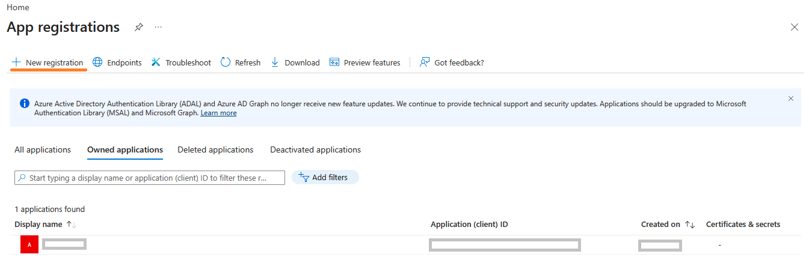

### Part 3 — Choose Single Tenant

The most restrictive (and safest) account type. You only need users from your own organization.


### Part 4 — Fill in the Registration Form

Name = `teams-ai-assistant-<username>`, redirect URI type **Public client/native (mobile & desktop)** = `http://localhost`. Click **Register**.

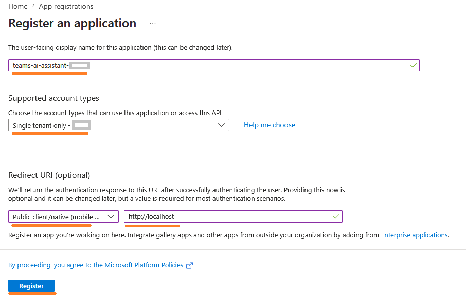

### Part 5 — Capture Tenant ID and Client ID

From the new app's Overview page copy `Application (client) ID` and `Directory (tenant) ID`. These become `AZURE_CLIENT_ID` and `AZURE_TENANT_ID` in `.env`.


### Part 6 — (Optional) Open Certificates & Secrets

The device-code flow does **not** require a client secret. Generate one only if you may switch to a confidential client later.

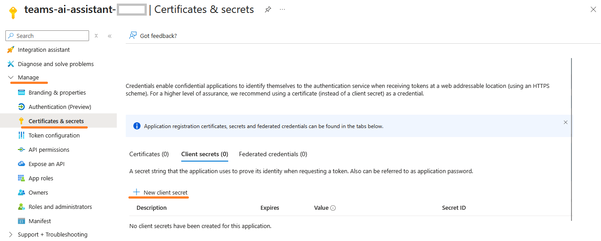

### Part 7 — Add a Client Secret (Optional)


### Part 8 — Copy the Secret Value Immediately

The secret value is only shown once. After leaving the page you can never retrieve it again.

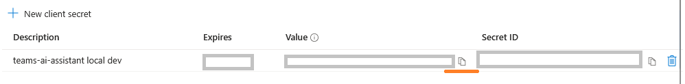

### Part 9 — Open API Permissions

The default `User.Read` is fine — keep it and click **+ Add a permission**.


### Part 10 — Choose Microsoft Graph

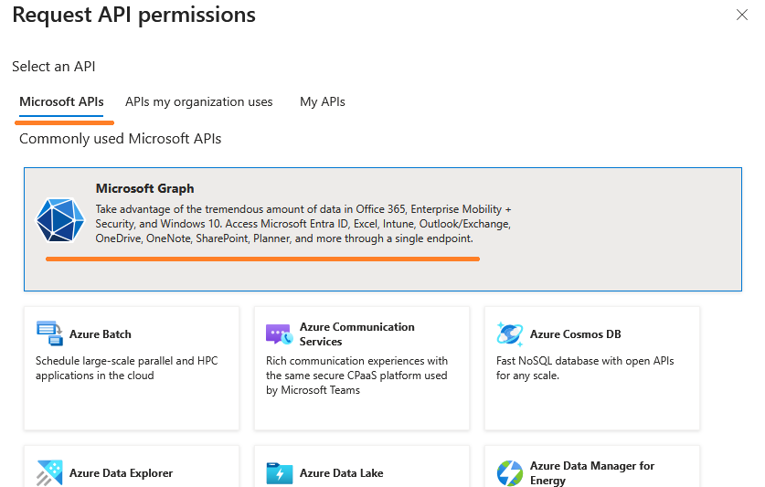

### Part 11 — Pick "Delegated permissions"

Delegated = the app acts on behalf of the signed-in user. This is what we want for a personal assistant.


### Part 12 — Add `ChatMessage.Read`


### Part 13 — Add `Chat.Read`

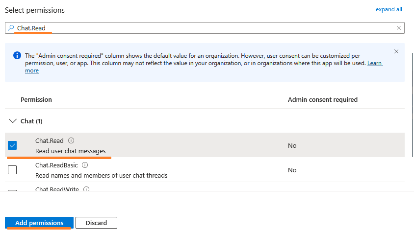

### Part 14 — Add `offline_access`

This sits under **OpenId permissions**. It enables refresh tokens so we don't have to re-authenticate every time the access token expires.


### Part 15 — Add `Chat.ReadWrite`

Needed to create the dedicated notification chat.

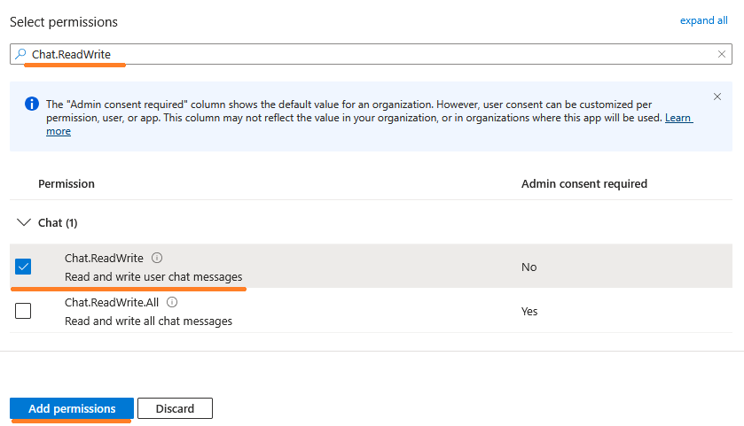

### Part 16 — Add `ChatMessage.Send`

Needed to post the AI summary back into Teams.


### Part 17 — Verify the Final Permission List

You should see all six permissions with **Admin consent required = No** in a typical corporate tenant.


### Part 18 — Generate a GitHub Personal Access Token

Open https://github.com/settings/tokens and click **Generate new token (classic)**.

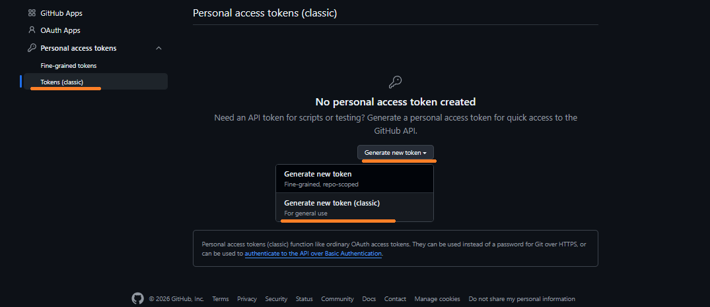

### Part 19 — Pick a Sensible Expiration

A 30-90 day expiration is reasonable for a personal automation.


### Part 20 — Tick `read:user`

This is the only scope needed for GitHub Models access. Do **not** add repo or admin scopes.

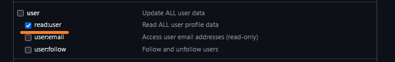

### Part 21 — Copy the Token Immediately

Like the Azure client secret, the GitHub PAT is shown only once. Save it into `tools/.env` as `GITHUB_TOKEN`.


### Part 22 — Run the Smoke Test

```powershell
docker compose run --rm smoke
```

You should see a device-code prompt asking you to open `https://login.microsoftonline.com/device` and enter a one-time code.


### Part 23 — Possible First-Time Blocker: `AADSTS7000218`

The first time you run the smoke test you may hit `AADSTS7000218: client_assertion or client_secret`. This means your App Registration is missing one toggle. Despite registering as `Public client/native`, Azure still refuses the device-code flow until you explicitly **Allow public client flows**.

Fix it in **Authentication (Preview) → Settings → Allow public client flows = Yes**, then **Save** at the top:


### Part 24 — Enter the Device Code in the Browser

Open the URL printed in the terminal, paste the code, click **Next**, then sign in with your corporate account and accept the requested permissions.

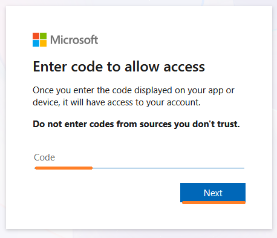

### Part 25 — Successful Sign-In

The browser confirms you have signed in to the application. You can close the window — the terminal will continue and print your `displayName`, `mail`, and `id` from `GET /me`. The token is cached at `data/token_cache.bin`; future runs will refresh silently without another device code.


### Part 26 — Notification Chat Appears in Teams

After running:

```powershell
docker compose run --rm app python create_notification_chat.py
```

a new chat **AI Teams Summaries** appears in your Teams chat list. Save the printed `NOTIFICATION_CHAT_ID=...` line into `tools/.env`.

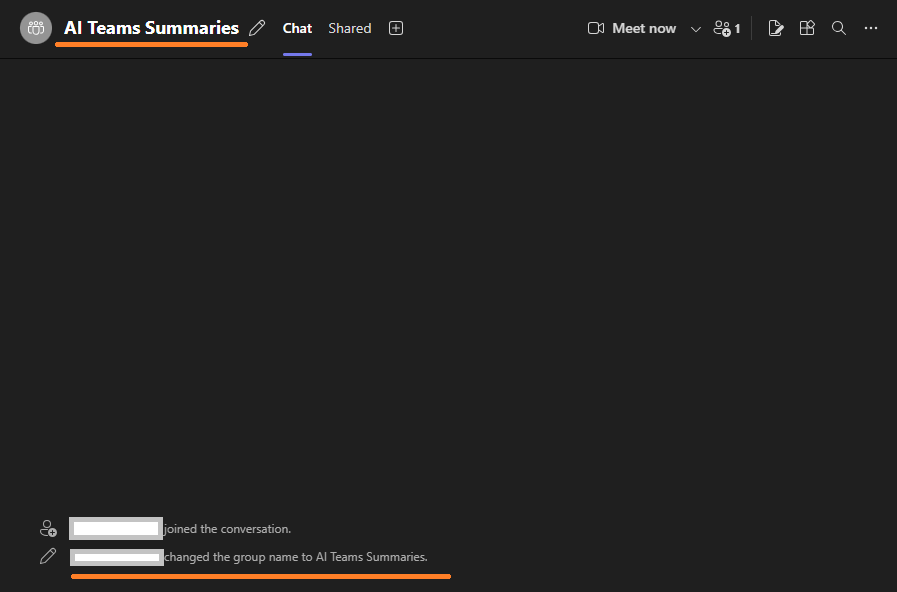

### Part 27 — Summary Posted into Teams

```powershell
docker compose run --rm --build app python summarize_and_notify.py "<source-chat-id>" --top 20
```

A new message appears in **AI Teams Summaries** with a 3-7 bullet AI summary of the source chat. End-to-end loop complete.


### Part 28 — Add Transcript Permissions (optional, for `download_transcript.py`)

To use [download_transcript.py](download_transcript.py) you need two more delegated Graph permissions on the App Registration. Add them via **API permissions → Add a permission → Microsoft Graph → Delegated permissions**:

- `OnlineMeetings.Read` — `Admin consent required = No`, you grant it on first device-code login.

  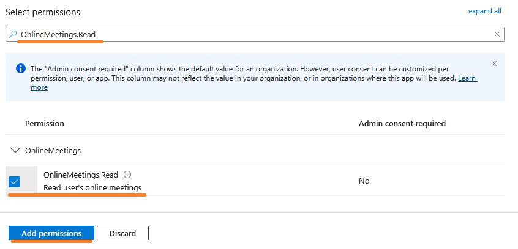

- `OnlineMeetingTranscript.Read.All` — `Admin consent required = Yes`. Microsoft marks this admin-only at the Graph level; without an admin consent the device-code flow will be blocked with a "Need admin approval" screen.

  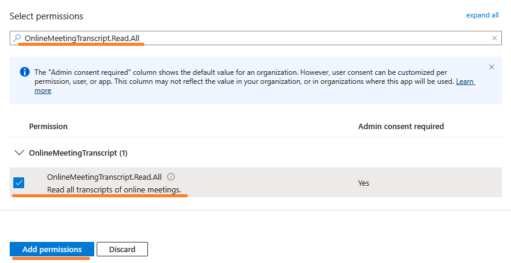

After adding both, the page shows a ⚠️ `Not granted for <tenant>` next to the transcript permission until an admin clicks **Grant admin consent**:

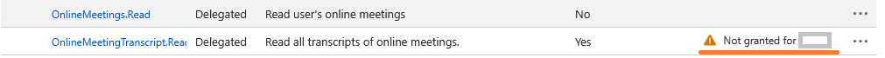

The detail panel confirms the policy:

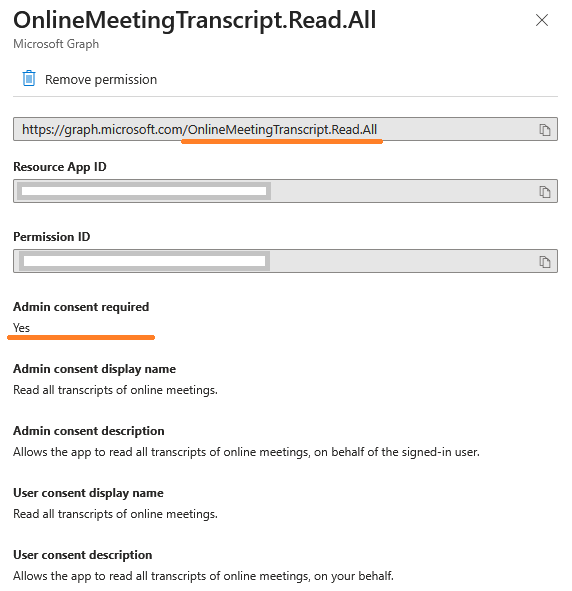

---

## Quick Reference — Common Commands

```powershell
# Build & verify auth
docker compose run --rm smoke

# List chats (find a SOURCE_CHAT_ID)
docker compose run --rm list-chats

# Read messages from a chat
docker compose run --rm app python read_messages.py "<chat_id>" --top 20

# Create the notification chat (idempotent)
docker compose run --rm app python create_notification_chat.py

# Summarize and post back into Teams
docker compose run --rm --build app python summarize_and_notify.py "<source_chat_id>" --top 20

# Download a meeting transcript (.docx) via Graph (first run = new device-code flow for OnlineMeetingTranscript scope)
docker compose run --rm app python download_transcript.py --join-url "<teams_meeting_join_url>" --format docx --out /data/transcript.docx

# Or list all your transcripts in the last N days (no join URL needed)
docker compose run --rm app python download_transcript.py --list-recent --days 14

# Or just grab the most recent transcript
docker compose run --rm app python download_transcript.py --latest --days 14 --format docx --out /data/transcript.docx
```

## Hygiene Reminder

Before pushing this folder anywhere:

- Confirm `.env` and `data/` are gitignored (they already are in [.gitignore](.gitignore)).
- Delete or manually obscure any screenshots containing real chat ids, names, tokens, or tenant URLs.
- For sharable markdown logs, replace personal names with `Stiven Pupkin`, organization with `ACME`, GUIDs with `xxxxxxxx-xxxx-xxxx-xxxx-xxxxxxxxxxxx`, chat ids with `19:xxxxxxxxxxxxxxxxxxxxxxxxxxxxxxxx@thread.v2`.
