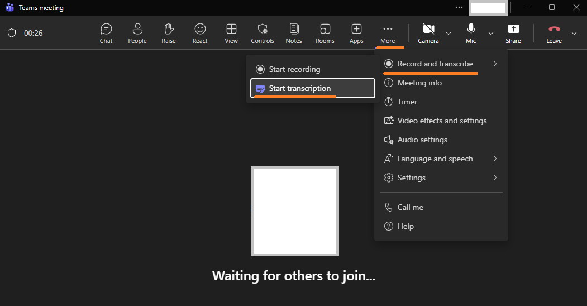
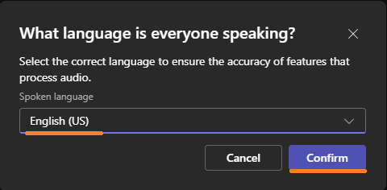
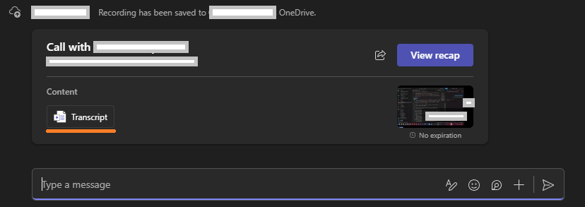
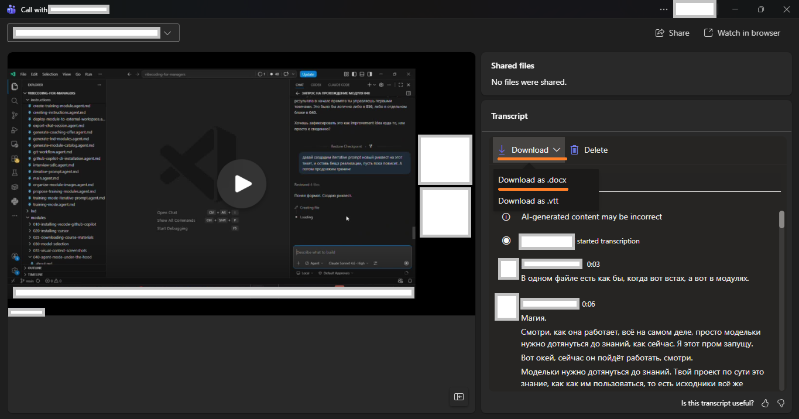

# Microsoft Teams Meeting Transcription - Hands-on Walkthrough

In this short module you wire up a tiny pipeline that converts a Microsoft Teams transcript (`.docx`) into a clean `.txt` that an LLM can consume. We do not write the parser by hand — instead, the existing repo instruction [`transform-meeting-transcript.agent.md`](../../instructions/transform-meeting-transcript.agent.md) already contains the full algorithm. Your job is to point the agent at it (locally or via its public GitHub URL), pick the mode you want (named or anonymized), and run.

## Prerequisites

See [module overview](about.md) for the full prerequisites list.

---

## What We'll Build

| Component | Description |
|---|---|
| Source instruction | `instructions/transform-meeting-transcript.agent.md` — the full extraction + anonymization recipe |
| Extracted `.txt` | Clean plain-text transcript next to the source `.docx` |
| Optional `.mapping.json` | Sidecar file containing real-name → pseudonym mapping (anonymized mode only) |

**Time estimate:** 15-25 minutes end to end.

---

## Part 1: Get a Transcript from Microsoft Teams

### What we'll do
Enable live transcription in a Teams meeting and download the resulting `.docx` file.

### Action

**Step 1 — Start transcription during the meeting.**
In an active Teams call, click **More (⋯)** in the top toolbar → **Record and transcribe** → **Start transcription**.



**Step 2 — Confirm the spoken language.**
Teams will ask what language everyone is speaking. Select the correct locale and click **Confirm**.



**Step 3 — Wait for the transcript to appear in the call chat.**
After the meeting ends the transcript is posted automatically into the chat thread.



**Step 4 — Download as `.docx`.**
Click **Download** in the Transcript panel → choose **Download as .docx**. This is the file the parser will consume.



### What happened
You now have a `.docx` transcript file — actually a ZIP archive containing `word/document.xml`, which is what the extraction instruction parses.

---

## Part 2: Bootstrap the Instruction in Your Workspace

### What we'll do
Either reuse the instruction from this repo, or pull it into a different project where you don't yet have it.

### Action

**If you are inside this repo** — the instruction is already at [`instructions/transform-meeting-transcript.agent.md`](../../instructions/transform-meeting-transcript.agent.md). Skip to Part 2.

**If you are inside a fresh / unrelated project** — open a new agent session and type:

```
Setup https://github.com/codenjoyme/vibecoding-training/blob/main/instructions/transform-meeting-transcript.agent.md
```

The agent will:
1. Fetch the instruction.
2. Save it as `instructions/transform-meeting-transcript.agent.md` in your project.
3. Register it in `instructions/main.agent.md` (creating that catalog if missing).

> This is the same bootstrap pattern you saw in [Module 070 — Custom Instructions](../070-custom-instructions/walkthrough.md). The instruction itself is the artifact you ship between projects, not a script.

### What happened
You now have a single, version-controlled source of truth for transcript transformation. Any future agent session in this project can find it via `main.agent.md`.

---

## Part 3: Locate Your Source `.docx`

### What we'll do
Pick a Teams transcript to work with.

### Action

1. In Microsoft Teams, open a recorded meeting → **Recordings & Transcripts** → **Download transcript** → choose **Document (.docx)**.
2. Place the `.docx` somewhere outside Git — for example `work/620-task/<topic>.docx`. The `work/` folder is gitignored.

### What happened
You have a real input file. The `.docx` is actually a ZIP archive — you can rename it to `.zip` and open it to see `word/document.xml` inside. That XML is exactly what the instruction parses.

---

## Part 4: Extract Anonymized Text (the default)

### What we'll do
Run `Extract-DocxText`. By design it anonymizes — speaker names are replaced with `Speaker 1`, `Speaker 2`, … at parse time. Real names never leave the parser.

### Action

Open the agent and ask, in plain language:

> Following `instructions/transform-meeting-transcript.agent.md`, extract `work/620-task/<your-file>.docx` into `<your-file>.anon.txt` using `Extract-DocxText -MappingPath <your-file>.mapping.json`.

The agent will:
1. Open the `.docx` as a ZIP, read `word/document.xml`.
2. Walk `<w:p>` paragraphs. For every `<w:r>` whose `<w:rPr>` has the Teams "speaker name" formatting (`<w:b/>` + `<w:color w:val="616161"/>` + `<w:sz w:val="24"/>`), substitute `Speaker N` directly — never emit the real name.
3. Write `<your-file>.anon.txt`.
4. Write `<your-file>.mapping.json` with `original_name → pseudonym`.

### What happened
You now have two files of very different sensitivity:

| File | Trust level | Use it for |
|---|---|---|
| `<your-file>.anon.txt` | **Safe** to send to any external LLM | Summarization, search, analysis |
| `<your-file>.mapping.json` | **Sensitive** — never commit, never send anywhere | Local de-anonymization of LLM output |

Add `*.mapping.json` to your `.gitignore` immediately if it's not already there.

---

## Part 5: When You Genuinely Need the Real Names (`-KeepNames`)

### What we'll do
Run with `-KeepNames` — the explicit opt-in for keeping real speaker names. Use this only when you actually need the original names (e.g. an internal accountability log) and never inside an agent chat.

### Action

In a **private** terminal (not in the agent chat), run:

```powershell
Extract-DocxText -docxPath work/620-task/<your-file>.docx -KeepNames | Set-Content -Encoding UTF8 work/620-task/<your-file>.named.txt
```

> ⚠️ **Operator rule.** Do not paste the contents of `<your-file>.named.txt` into any chat with an AI agent. Do not commit it. Treat it like the `.mapping.json` — local-only.

### What happened
You have a named copy strictly for offline human use. Anything that goes to an LLM still uses the `.anon.txt` from Part 3.

---

## Part 6: Use the Output

### What we'll do
Hand the clean `.txt` off to whatever consumes it — an LLM summary, a search index, a follow-up module like [600 — Microsoft Teams AI Chat Summarizer](../600-teams-ai-chat-summarizer/about.md), or a simple `grep` for action items.

### Action

Examples:

- **Summary:** open the agent and ask *"Summarize `<your-file>.anon.txt` using the Generic Meeting Summary Format from `transform-meeting-transcript.agent.md`."*
- **Action items only:** *"Extract just the Action Items section from `<your-file>.anon.txt`."*
- **Pipe into module 600:** if you want the summary posted back into Teams, follow [600 — Microsoft Teams AI Chat Summarizer](../600-teams-ai-chat-summarizer/about.md).

### What happened
The instruction-as-skill pattern paid off: you did not maintain a custom Python parser. You used the agent + the canonical instruction. If the parsing logic ever needs to change (new Teams export format, new metadata field), you update **one file** and every project that uses it benefits.

---

## Success Criteria

- ✅ The instruction `instructions/transform-meeting-transcript.agent.md` is reachable in your workspace
- ✅ A real `.docx` was extracted into a `.txt` with real names
- ✅ The same `.docx` was re-extracted into an `<...>.anon.txt` with `Speaker N` pseudonyms and a sidecar `.mapping.json`
- ✅ `*.mapping.json` is in `.gitignore`
- ✅ You produced at least one downstream artifact from the `.txt` (summary, action items, or feed into module 600)

## Understanding Check

1. **Why is a `.docx` parseable without `python-docx` or any other library?**
   *Expected:* Because it is a ZIP archive containing `word/document.xml`. Both `System.IO.Compression` (PowerShell/.NET) and Python's built-in `zipfile` can open it; the inner XML follows the WordprocessingML schema.
2. **In the `.anon.txt`, why must longer original names be replaced before shorter ones?**
   *Expected:* Otherwise `Stiven` would be replaced first inside `Stiven Pupkin`, leaving a stray `Pupkin` in the output. Sorting keys by length (descending) prevents partial collisions.
3. **What is the trust difference between `.anon.txt` and `.mapping.json`?**
   *Expected:* The `.txt` is anonymized — safe to send to any LLM. The `.mapping.json` contains the original-name table — it is the **only** thing that can de-anonymize the file and must never be committed or sent anywhere.
4. **Why do we ship a single instruction file instead of a Python package?**
   *Expected:* The agent + a clear instruction is more portable, version-controllable as plain markdown, easier to share between projects via the `Setup <github-url>` bootstrap, and avoids dependency drift. Same pattern as Module 070.
5. **In what situation is anonymization unnecessary or counter-productive?**
   *Expected:* For internal/technical reviews where roles, decisions, and follow-ups need to be attributed — losing names destroys accountability. Use anonymization only when the output crosses a trust boundary.

## Troubleshooting

| Symptom | Likely cause | Fix |
|---|---|---|
| `Cannot find file: word/document.xml` | The `.docx` came from a non-Word source (Pages, ODT-converted, …) | Re-export from Teams as a real `.docx`, or open in Word and Save As |
| Speaker headers are missing in the output | Teams transcript style omits the `Name HH:MM` separator | Add a regex to your instruction's pass 1 that also accepts the alternate style; or transform the headers in Word first |
| Stray real names appear in `.anon.txt` | Body uses a nickname or partial name not present in the speaker headers | Add aliases manually to the mapping; or use a wider regex (case-insensitive, with diminutives) for body redaction |
| `.mapping.json` ended up in a commit | `.gitignore` missed the pattern | Rewrite the file out of history with `git filter-repo` or rotate the meeting (delete & re-process); always pre-add `*.mapping.json` to `.gitignore` |

## Next Steps

After completing this module:

- Move on to [600 — Microsoft Teams AI Chat Summarizer](../600-teams-ai-chat-summarizer/about.md) to feed the `.anon.txt` into a Dockerized summarizer that posts back into Teams
- Or to [196 — Reverse Engineering Project Knowledge](../196-reverse-engineering-project-knowledge/about.md) to extract conventions from many transcripts at once
