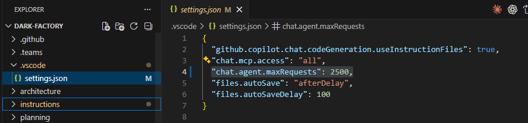
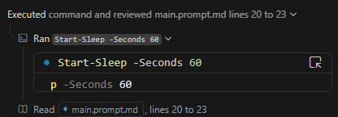
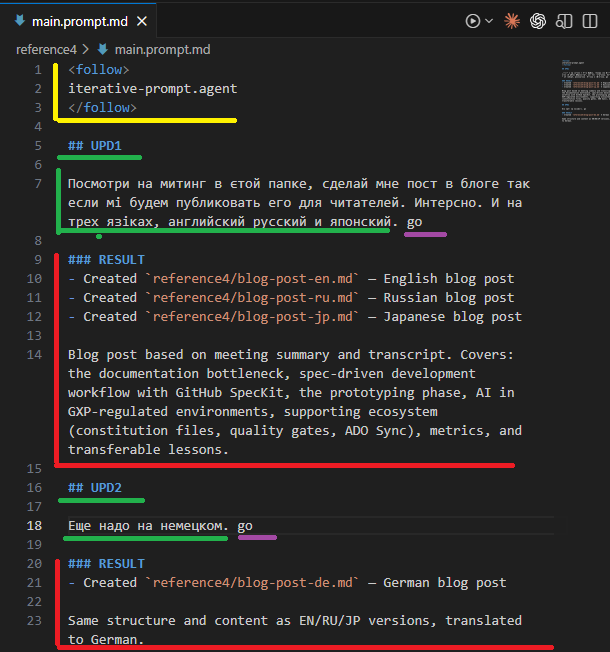

<follow>
iterative-prompt/SKILL.md
</follow>

## UPD1

Давай сделаем 058 модуль. Его суть будет такой. Когда нам надо понять что вообще происходит - например к нам прилетели какие-то исходнгики (может целый гит репозиторий который можно склонировать), какие-то транскрипты записей митингов (обычно их игнорируют, но я рекомендую их так же добавлять в папку на рисерч), куски чат сессий с людьми (оттуда можно тоже скопировать текст), какие-то свои собственные мысли и заметки, может быть что-то еще. То мы это кладем в новую папку (или создаем воркспейс) и в корне его создаем markdown файл промпта. Где описываем сырую мысль, что это мы такое навалили в папку, и что хотим с этим сделать.  Этот промпт (в GithubCopilot его можно назвать phase1.prompt.md и заранать прямо из IDE открЫв файл в редакторе, уверенг в курсоре и других IDE есть свои подобные возможности) я предлагаю сохранить в папке с документами а не в чате, потому что чат сессия может потеряться со временем, а файл промпта, с которого все началось останется в нем и попадет в репозиторий. То есть вы оставляете следы из хлебных крошек для будущих себя (или кого-то, кто будет изучать). Можно конечно экспортнуть сессию чата (где-то там есть файл, который делает это, и в модуле 250 есть скиллз для этого), но вместе с экспортом затянется много лишнего (куски скриптов, возможно .env файлы єто может оказаться небезопасно). Но если ві сохраните промпт начальній с которого пошел рисерч и началась структура сесии - то все станет понятнее.

Есть так же еще однга возможность как сырую мысль структурировать для модели. Я попробовал такой подход и он показал себя хорошо.

В промпте так же указываю, что мне важно и в каком порядке с помощью 🎯N. Где N номер по порядку. Почему так? 1) Изначальный промпт сохраняется в файле как артефакт рядом со всей кипой документов которые он обрабатываает, и его не надо искать потом долго по хистори сессий чата. 2) Emoji с индексом второе измерение, которое связывает мою raw мыcль оставленную в виде текста в первом измерении в план.   

Пример  как это просиходит в скриншоте `image0.png`. Да и там важный момент на скриншоте - кусочек промпта про то как делать связкку. Вот он 

```
В тексте ниже я буду помечать `🎯N` то что ожидаю от тебя как экшенайтем с индексом `N`. Я буду ставить его возле глагола действия, а ты конвертируй в этап. Важно! Я хочу чтобы ты не делал всю работу параллельно, а вначале сделал подготовительные этапы, а уж потом брался за основную задачу. Сохраняй🎯1 результаты в той же папке то и этот промпт. Там же есть другие файлы, что тебе пригодятся
```

> **Важное примечание по неймингу папки для практики:** Согласно инструкциям тренинг-режима (`training-mode.agent.md`), все практические задания каждого модуля идут в папку `work/[номер-модуля]-task/`. Для модуля 058 это `work/058-task/`. Эта папка играет роль "рисёрч воркспейса" в упражнении — туда кладём материалы и создаём `phase1.prompt.md`. Папка `work/` уже gitignored, поэтому безопасна для экспериментов.

### RESULT

- `modules/058-workspace-kickoff-prompt-files/about.md` — created with topics, learning outcome, prerequisites
- `modules/058-workspace-kickoff-prompt-files/walkthrough.md` — created with Parts 1–5, success criteria, understanding check, troubleshooting, next steps

## UPD2

Смотри так же надо добавить в модуль, есть возможность делать дополнения, как вот я сделал сейчас в файле. То есть я делаю пометку UPDN где N номер по порядку, и там уже пишу что я хочу добавить к тому что было вначале. Это может быть полезно для того, чтобы не делать все в одном промпте, а добавлять новые мысли и идеи по ходу дела, и при этом сохранять структуру и порядок. КОгда я буду передавать или переиспользовать этот промпт - все мои уточенения будут в однмо месте. А в чате я буду лишь ссылаться на него, из контекста AI поймет, что надо сделать уточнение. Вот мне надо сейчас, чтобы ты расширил модуль, доабвив в него part который описывает эту возможность. 

### RESULT

- `modules/058-workspace-kickoff-prompt-files/walkthrough.md` — added Part 6 (UPD marker pattern), new success criteria item, understanding check question 8
- `modules/058-workspace-kickoff-prompt-files/about.md` — added UPD pattern to Topics and Learning Outcome

## UPD3

Смотри каким стейтментом можно добавить каждый такой промпт. 
<instructions>
В этом промпте есть префиксы UPD[N], где N — номер обновления.
Когда будешь запускать этот промпт смотри на `git diff` или доступный инструмент для проверок изменений в IDE и увидишь что я добавил. Эти заметки и улучшай. Остальное остается для контекста - стейтменты что уже есть - исправления были сделаны ранее и их не надо поломать. 
</instructions>
Только сделай его на англйиском и более похожим на инструкцию и предлагай юзеру в разедел 6

### RESULT

- `modules/058-workspace-kickoff-prompt-files/walkthrough.md` — added instruction snippet to Part 6 with `<instructions>` block and updated steps to include placing it at the top of the prompt file

## UPD4

Я добавил новую инструкцию `instrunctions/iterative-prompt/SKILL.md`, которая описывает как работать с этими UPD[N] блоками. Я хочу чтобы ты сделал следующее: 
- Перепиши все файлы `*.prompt.md` в этом этой папке, чтобы они соответствовали новой семантике.
- Переделай модуль 058 так, чтобы он ссылался на эту инструкцию. Она самодостаточна и ее можно будет установить по промпту: 
```
Setup https://github.com/codenjoyme/vibecoding-training/blob/main/instructions/iterative-prompt/SKILL.md
```
Это новый подход, который я придумал и ему пока нет аналогов в GenAI сообществе. Название ему `iterative prompt`. Суть в том, что вместо того, чтобы чатиться в чате и писать все сообщения туда, а потом пытаться найти нужные куски в истории, мы создаем файл `main.prompt.md` и пишем туда все свои мысли и идеи. А когда нам приходит новая мысль или идея, мы не ломаем старый промпт, а добавляем новый блок `## UPD[N]` с описанием новой мысли. После выполняем его либо в новой сессии, либо в существующей (если нам важно переиспользовать контекст). Агент видит, что изменилось в промпте (поэтому после отработки промпта важно сделать коммит, или хотя бы git add), а потом сделает нужную правку, и затем добавит краткий отчет в ### RESULT после текущего блока.
- Обнови так же мотивацией саму инструкцию, чтобы если юзер спросит "кто ты" у инструкции, она передала эту мотивацию.

### RESULT

- `instructions/iterative-prompt/SKILL.md` — added "Who I Am" motivation section, fixed template reference from `prompt-update.agent.md` to `iterative-prompt/SKILL.md`
- `requests/058-create.prompt.md` — restructured to new iterative prompt semantics with `<follow>` block and `### RESULT` sections
- `requests/module-02b-claude-codemie.prompt.md` — restructured to new iterative prompt semantics
- `modules/058-workspace-kickoff-prompt-files/about.md` — added iterative prompt install command and reference
- `modules/058-workspace-kickoff-prompt-files/walkthrough.md` — updated Part 6 to reference `iterative-prompt/SKILL.md` install command

## UPD5

Дальше идет мой пост про `iterative prompt` - пожалуйста дополни [инструкцию](../../instructions/iterative-prompt/SKILL.md) в блоке `## Who I Am` этой мотивацией чтобы у всех, кто загрузил эту инструкцию было четкое понимание зачем вообще нужен `iterative prompt` и как он помогает экономить риквесты в условиях текущей модели оплаты за премиум риквесты в Github Copilot.

### Коллеги приветствую #СашаНашкодил

Наблюдая за тем, как расходуются премиум риквесты в GithubCopilot в VSCode на Claude Opus 4.6 


Могу сказать, что нашел такую закономерность - любой твой запрос на Claude Opus - это 1% в этом прогрессбаре. Независимо от количество входящих или исходящих токенов. Следовательно надо как можно дольше заставлять его работать автономно. Что этому помогает? 4 вещи. 

Во-первых: Надо поставить  "chat.agent.maxRequests": 2500 - так он не будет останавливаться каждые 25 (по умолчанию) циклов с вопросом "Копилот поработал некоторое время, продолжаем?"



Во-вторых. Твой промпт должен быть как можно более подробно расписан. Что сделать. Что потом сделать. Что седалть дальше. Желательно потом чтобы сразу и потестил. И закоммитил. И пошел на второй круг делания. И снова проверил сам себя. И снова закоммитил. И так далее, пока не достигнет завершения. 

В-третьих. Писать это в чате неудобно. А потому берем и создаем файлик `some-title.prompt.md` и прям в нем все пишем. Этот файлик я храню либо в папке requests или если дело касается обработки какого-то контента в папке - то в корне этой папки и называю там его main.prompt.md 

Дальше лучше. В-четвертых. У промпта появляется структура. 

```markdown
​<follow>
iterative-prompt.agent
</follow>

## UPD6

Тут пишу суть своего запроса, так подробно как описывал в "во-третьих".

## RESULT

А тут моделька мне отчитается о проделанной работе 

## UPD7

Потом я смогу написать, что еще мне потребуется от нее

## RESULT

И тут она мне отчитается о втором кусочке
```

Почему это классно? Сессия отработала, и если из нее не извлекли какую-то новую `instruction`/`skill` или не улучшили существующую, то скорее всего она потеряется в хистори. А порой так хочется вспомнить "как же я заставил модельку сгенерировать мне этот контент в проекте". С подобным подходом у меня main.prompt.md сохраняется в `git` вместе с сгенерированным контентом в этой папке и в будущем и коллеги и сама моделька лучше поймет как оно было создано. Сам файл - есть суть саммари о проделанной работе. Так что в чате я больше не пишу.

Еще удобно, что `VS Code`  позволяет `*.prompt.md` запускать прямо из идеешки. 


Этот подход я назвал `iterative prompt`. И он сам по себе полезен, без цели экономить токены. 

Но это не все. Сейчас покажу как можно небольшой доработкой вообще не расходовать токены.

Вернемся к началу поста. Там сказано, что сейчас чаржат за премиум модели от количества запросов (не из размера, не количества сгенеренных токенов). То есть если я скажу в инструкции что после того как ты отработаешь над текущим `## UPD[n]` и отчитаешься в `## RESULT` то залипай в терминале синхронно на 60 секунд, пока не появится новый `## UPD[n+1]`



То он это покорно сделает. 

Дальше надо синхронизировать два потока меня-кожаного и агента с его вейтами в терминале. Я могу написать в промпте что-то, но не дописать до конца. Агент проснется прочитает мой недописанный `## UPD[n+1]` и начнет выполнять. Чтобы пофиксить это я ему сказал "пока не увидишь в конце go засыпай дальше". И все.

Дрейфует ли контекст? Да мне все равно. Во-первых у меня `iterative prompt` - это по сути саммари контекста, что делали и во что это вылилось через все `## UPD[n]` -> `## RESULT` -> `## UPD[n+1]` -> `## RESULT` -> ... блоки в одном файле промпта.

А во вторых копилот делает сам `compact conversation` когда контекст переполняется


В-третьих я использую теперь Opus только. Он умнее. Он разберется. 

То есть с этим подходом час чат используется как пространство под-капотом где двигатель. А файл `main.prompt.md` это моя приборная панель. Запустив впервые, двигатель завелся и пыхтит


Но если мне что-то надо добавить, я иду в `main.prompt.md` и дописываю в конец 



Тут `желтое` это шапка, чтобы копилоту дать ссылку на инструкцию где все рассказано как все устроено. `Зеленое` - я пишу то что обычно писал в чате. 

`Фиолетовое` я пишу go когда понимаю что готов (это блок синхронизации с агентом).

`Красное` он дописывает, когда сделал работу и снова заснет на 60 секунд. 

А коммитая `main.prompt.md` в общий репозиторий вместе с коммитами, которые AI сгенерила, ты получишь так же историю того КАК (каким промптом) ты получил эти файлы. Весь же `main.prompt.md` является контекстом для какой-то фичи. По сути саммари чат сессии, которая раньше терялась. А сейчас вместе с проектом. 

Так открыв 5 ide-шек с разными проектами. Потенциально я могу за весь день заюзать 5% премиум риквестов, переделав купу работы. Поменяется ли это? Ну вероятно вскоре да. Но сама идея `iterative prompt` полезна не только для этого. Она полезна для того, чтобы структурировать работу с моделью. И не терять контекст. И не терять инструкцию с которой я получил AI-генерированные файлы с течением времени или при смене расположения воркспейса/ide. А так же дать возможность коллегам понять как эти файлы были сгенерированы.

### RESULT

- Modified [instructions/iterative-prompt/SKILL.md](../../instructions/iterative-prompt/SKILL.md) — added a new `### Why This Matters — Saving Premium Requests` subsection inside `## Who I Am`. It explains the Copilot premium-request billing model (1 request = 1% regardless of token count), and lists 6 concrete reasons why the iterative-prompt pattern helps economize: maximizing autonomous work, writing in a file instead of chat, structured UPD/RESULT cycles, zero-cost polling loop, context survival across compaction, and git-based shared knowledge.

## UPD8

А давай сделаем вот что, у нас есть [text](../../instructions/training-mode.agent.md) которй проходит в чате. И ребятам жалуются что много премиум токенов расходуется. А что если мы сделаем второй режим работы тренинга, когда в дополнение к этой инструкции будет использоваться `iterative prompt` подход. То есть в тренинг мод агенте надо указать, что если изначально идет запрос юзера пройти тренинг в `iterative prompt` подходе, то вся конверсация по модулю происходит в папке `work\NNN-task\main.prompt.md` и надо дать небольшой инструктаж юзера как вести переписку там, что такое UPD и RESULT и как команда `go` работает. Пусть изменений будет не много в основной инструкции по тренинговому режиму, можно этот весь инструктаж вынести в отдельный файл `training-mode-iterative-prompt.agent.md` и там уже расписать все подробно. И в основной инструкции по тренинговому режиму уже просто дать ссылку на эту инструкцию и написать, что если хочешь экономить премиум риквесты, то используй `iterative prompt` подход. Go

### RESULT

- Created [instructions/training-mode-iterative-prompt.agent.md](../../instructions/training-mode-iterative-prompt.agent.md) — full guide for running training sessions in iterative prompt mode: user onboarding script, prompt file template, flow example, agent loop rules, UPD format reference table, and switch-back instructions.
- Modified [instructions/training-mode.agent.md](../../instructions/training-mode.agent.md) — added `## 💡 Want to Save Premium Requests? Use Iterative Prompt Mode` section right after `## Training Mode Activation`, pointing to the new file.

## UPD9

давай пройдем тренинг 091 в таком режиме...

Да но только ты не должен был остановиться и должен был мониторить этот файл и засыпать в терминале как ууказано в инструкици. А раз ты этого не дслеал, что что-то пошло не так. И еще сделай так, чтобы файл main.prompt.md с запросом создавался на том языке на котором юзер попросил его. Поправи все инструкции

### RESULT

- Fixed `training-mode-iterative-prompt.agent.md`:
  + Step 2 — template now includes `Language: [user's language]` in `## Context` and a `Respond in the language...` line in UPD1; language is derived from the language the user used when requesting training
  + Step 3 — renamed from "Hand Off to the File" to "Hand Off to the File AND Enter Polling Loop"; added `⚠️ CRITICAL` block explicitly stating that the agent MUST enter the polling loop on the parent prompt file immediately after writing RESULT — not stop and answer chat messages
- Updated `work/091-task/main.prompt.md` — added `Language: Russian` to Context section and `Respond in Russian` to UPD1 

## UPD10

Давай переключись тогда на [text](../../work/091-task/main.prompt.md) и продолжим там. Не надо мне советовать переключиться в новую сессию. Используй эту же сессию. Go

### RESULT

- Switched to `work/091-task/main.prompt.md` — conducting module 091 training directly in this session via that file's UPD mechanism. Polling on that file from this point forward.

## UPD11

ты снова отвалился, исправь инструкции чтобы этого не случалось и продолжай висеть в терминале ожидая

### RESULT

- Fixed `iterative-prompt/SKILL.md` — added `⛔ CRITICAL: Chat messages do NOT break the loop` rule: when user sends a chat message while loop is active, agent must apply the fix, write `### RESULT` in the **active prompt file**, commit, then return to `Start-Sleep` immediately
- Fixed `training-mode-iterative-prompt.agent.md` — same rule added to the polling loop section (item 4)
- Both files now explicitly state: the only valid reason to stop the loop is the user typing "stop" or "exit loop"

## UPD12

Хочу чтобы была поддержка атомарной работы с несколькими UPD: каждый UPD ждет своего `go` прежде чем агент начнет его выполнение. Пока агент работает над текущим UPD, пользователь может дописывать следующий. Каждый UPD — отдельный коммит. Доработай инструкцию. go

### RESULT
- `instructions/iterative-prompt/SKILL.md` — updated the "Non-stop loop" section: clarified that each `## UPD` = one separate commit; added rule that UPDs without `go` are skipped (user still writing); added explanation of parallel writing — user can write UPD N+1 while agent works on UPD N, and agent processes sequentially with a commit per UPD.

## UPD13

Смотри я заметил, что ты коммитишь изменение, а потом отдельно еще и `RESULT`. Давай поправим инструкцию для `iterative prompt` так чтобы коммитился `main.prompt.md` с изменениями. А если изменений несколько, то `main.prompt.md` и апдейт за апдейтом. Я хочу видеть в коммите что біло сделано и отчет в `main.prompt.md`. И перенеси этот запрос риквест по итеративному промпту. Go

### RESULT

- `instructions/iterative-prompt/SKILL.md` — updated commit workflow: `### RESULT` must be written to `main.prompt.md` **before** committing; all changed files + `main.prompt.md` go into one atomic commit; separate "RESULT-only" commits are now explicitly forbidden.

## UPD14

Давай обновим инструкцию так, что если в RESULT что-то сгенерировано, то это будут markdown ссылки на файлы, а не просто `dir/file-name.ext`. Чтобы читателю потом можно было кликнуть и открыть. Go

### RESULT

- Modified [instructions/iterative-prompt/SKILL.md](../../instructions/iterative-prompt/SKILL.md) — в блоке `### RESULT` в секции "After implementing each update" добавлено требование: все пути к файлам оформлять как кликабельные markdown-ссылки (с примерами ✅/❌ и примечанием про относительный путь от `main.prompt.md`).

## UPD15

И так же давай сделаем, чтобы во время рипортинга так же менялся ссылки подобным образом в моем промпте, если я там ссылаюсь на какие-то файлы. Но только ссылки, остальной текст пусть остается. go
### RESULT

- Modified [instructions/iterative-prompt/SKILL.md](../../instructions/iterative-prompt/SKILL.md) — добавлен шаг 2 в секцию "After implementing each update": перед написанием `### RESULT` агент обязан найти в тексте `## UPD[N]` все пути к файлам (plain text и backtick) и конвертировать их в кликабельные markdown-ссылки in-place, не трогая остальной текст.

## UPD16

Слушай, ты сделал интересный loop механизм, который позволяет тебе не запускать много раз одно и то же. Там у тебя что-то с хешами. Но доработай его так, чтобы он когда изменение задетектено печатало для модельки аутпут. Короче я ж могу несколько UPD делать и для тех кто уже Свое go получил, для них можно отлачиваться. Давай отразим это в iterative промпт инструкции, как команду. И такую же надо для linux. При єтом оставь старый механизм как бекап, если этот не получится. Отчитайся по єтой работе вместе с єтим запросом вот [requests/iterative-prompt/main.prompt.md](../iterative-prompt/main.prompt.md) тут вместе с єтим запросом. Потом закоммити. И иди к следующему ниже. Go

### RESULT

- Modified [instructions/iterative-prompt/SKILL.md](../../instructions/iterative-prompt/SKILL.md) — добавлен **Step H — Wake-on-change watcher** после Step G. Это длительная команда (PowerShell для Windows + bash для Linux/macOS), которая внутри себя делает sleep+hash в цикле до 120 минут и возвращает управление агенту только когда файл реально изменился (печатает `CHANGED after N min`) или когда исчерпан бюджет. Описано: запуск через `run_in_terminal` в sync-режиме с большим timeout, обработка возврата (несколько UPD с `go` обрабатываются за одно пробуждение), fallback на старый Steps A–F цикл если watcher не сработает на хосте.
- Запрос пришёл из [requests/650-winapi/main.prompt.md UPD9](../650-winapi/main.prompt.md) — продублирован сюда полностью по инструкции пользователя.

## UPD17

Добавил вместо инструкции `iterative prompt` целый `skill.md` замени старый новым. Оцени в чем разница и что нового пришло. И сделай замену. Модуль его тоже обнови. `work` папку не трогай. go

### RESULT

**Разница между старым `iterative-prompt.agent.md` и новым [instructions/iterative-prompt/SKILL.md](../../instructions/iterative-prompt/SKILL.md):**

| | Старый `.agent.md` | Новый `SKILL.md` v2.0 |
|---|---|---|
| Формат | Flat file, без метаданных | YAML frontmatter (`name`, `description`, `version: 2.0.0`) |
| Расположение | `instructions/iterative-prompt.agent.md` | `instructions/iterative-prompt/SKILL.md` (папка + `scripts/`) |
| Watcher | PowerShell one-liner | Python `scripts/watch_prompt.py` с retry и smart UPD detection |
| `run_in_terminal` mode | `mode=sync` с длинным timeout | **`mode=async` (CRITICAL)** — notification mechanism |
| Resilience | Нет retry при file lock | 5× retry с 200мс delay (Windows VS Code save locks) |
| Обнаружение go | `tail -n 10 + grep` | Парсит UPD-блоки, находит последний без RESULT |
| Troubleshooting | Нет | Таблица типичных проблем |
| Step G anti-drift | Re-read `iterative-prompt/SKILL.md` | Re-read `SKILL.md` (обновлён путь) |
| Starter template | `<follow>iterative-prompt/SKILL.md</follow>` | `<follow>iterative-prompt/SKILL.md</follow>` |

**Ключевое новшество:** Python watcher и переход с `mode=sync` на `mode=async`. Это решает проблему exit code 1 и прерывания — именно та проблема, которую мы фиксили в UPD14.

**Файлы изменены:**
- [instructions/main.agent.md](../../instructions/main.agent.md) — добавлена запись `iterative-prompt/SKILL.md` в каталог
- [modules/058-workspace-kickoff-prompt-files/about.md](../../modules/058-workspace-kickoff-prompt-files/about.md) — обновлены ссылки
- [modules/058-workspace-kickoff-prompt-files/walkthrough.md](../../modules/058-workspace-kickoff-prompt-files/walkthrough.md) — обновлены Setup URL и `<follow>` блок
- [readme.md](../../readme.md) — обновлена ссылка на инструкцию

## UPD18

Так же все `main.prompt.md` надо обновить чтобы там было `<follow>iterative-prompt/SKILL.md</follow>` вместо `<follow>iterative-prompt.agent.md</follow>`. 

Еще посмотри инструкцию `instructions/training-mode-iterative-prompt.agent.md` ее скорее всего тоже надо обновить. 

И посмотри по модулям, может быть где-то еще требуется замена. go

### RESULT

Обновлено **23 файла** — все `<follow>iterative-prompt.agent.md</follow>` и `<follow>iterative-prompt.agent</follow>` заменены на `<follow>iterative-prompt/SKILL.md</follow>`:

**`main.prompt.md` файлы в `requests/` (22 файла):**
- [requests/iterative-prompt/main.prompt.md](main.prompt.md) — этот файл
- [requests/security-guildlines/main.prompt.md](../security-guildlines/main.prompt.md)
- [requests/project-analysis/main.prompt.md](../project-analysis/main.prompt.md)
- [requests/module-11-fine-tuning/main.prompt.md](../module-11-fine-tuning/main.prompt.md)
- [requests/module-10-fine-tuning/main.prompt.md](../module-10-fine-tuning/main.prompt.md)
- [requests/module-09-fine-tuning/main.prompt.md](../module-09-fine-tuning/main.prompt.md)
- [requests/module-08-fine-tuning/main.prompt.md](../module-08-fine-tuning/main.prompt.md)
- [requests/module-02c-ide-intro/main.prompt.md](../module-02c-ide-intro/main.prompt.md)
- [requests/lnd-module/main.prompt.md](../lnd-module/main.prompt.md)
- [requests/coaching-summary/main.prompt.md](../coaching-summary/main.prompt.md)
- [requests/basic-information/main.prompt.md](../basic-information/main.prompt.md)
- [requests/999-demo/main.prompt.md](../999-demo/main.prompt.md)
- [requests/650-winapi/main.prompt.md](../650-winapi/main.prompt.md)
- [requests/620-meeting-transcription/main.prompt.md](../620-meeting-transcription/main.prompt.md)
- [requests/600-ms-teams-access/main.prompt.md](../600-ms-teams-access/main.prompt.md)
- [requests/500-new-module/main.prompt.md](../500-new-module/main.prompt.md)
- [requests/470-jira-cli-access/main.prompt.md](../470-jira-cli-access/main.prompt.md)
- [requests/465-cookie-grabber-secure-api-calls/main.prompt.md](../465-cookie-grabber-secure-api-calls/main.prompt.md)
- [requests/106-fastmcp/main.prompt.md](../106-fastmcp/main.prompt.md)
- [requests/091-cli-testing/main.prompt.md](../091-cli-testing/main.prompt.md)
- [requests/076-shared-instructions/main.prompt.md](../076-shared-instructions/main.prompt.md)
- [requests/040-anchor-technique/main.prompt.md](../040-anchor-technique/main.prompt.md)
- [requests/035-update-screenshot/main.prompt.md](../035-update-screenshot/main.prompt.md)

**Инструкции:**
- [instructions/training-mode-iterative-prompt.agent.md](../../instructions/training-mode-iterative-prompt.agent.md) — шаблон follow-блока в Step 2 обновлён
- [instructions/iterative-prompt/SKILL.md](../../instructions/iterative-prompt/SKILL.md) — self-reference в Step G и starter template обновлены
- [for-authors.md](../../for-authors.md) — ссылка на инструкцию обновлена на `iterative-prompt/SKILL.md`

**Не тронуто:** Исторические упоминания в RESULT-блоках (описание прошлых изменений), папка `work/`, модули (в `modules/` упоминаний `iterative-prompt.agent` не найдено — уже обновлены в UPD17).

## UPD19

Исторические упоминания тоже меняй. go

### RESULT

Обновлены **все** исторические упоминания `iterative-prompt.agent.md` → `iterative-prompt/SKILL.md` (кроме случаев где старое имя используется как сравнение «старый vs новый»).

**Файлы с обновлёнными follow-тегами:**
- [requests/058-workspace-kickoff/058-create.prompt.md](../058-workspace-kickoff/058-create.prompt.md)
- [requests/091-cli-testing/module-training.prompt.md](../091-cli-testing/module-training.prompt.md)
- [requests/module-02b-claude-code-codemie/module-02b-claude-codemie.prompt.md](../module-02b-claude-code-codemie/module-02b-claude-codemie.prompt.md)

**Файлы с обновлёнными историческими ссылками в RESULT-блоках:**
- [requests/058-workspace-kickoff/main.prompt.md](main.prompt.md) — UPD7, UPD11–UPD16, UPD18 RESULT-блоки
- [requests/project-analysis/main.prompt.md](../project-analysis/main.prompt.md) — UPD3, UPD8, UPD14 RESULT-блоки + template
- [requests/600-ms-teams-access/main.prompt.md](../600-ms-teams-access/main.prompt.md) — NOTE, UPD30 RESULT
- [requests/091-cli-testing/main.prompt.md](../091-cli-testing/main.prompt.md) — UPD1–UPD3 RESULT-блоки
- [requests/058-workspace-kickoff/058-create.prompt.md](../058-workspace-kickoff/058-create.prompt.md) — UPD4 + RESULT
- [requests/035-update-screenshot/main.prompt.md](../035-update-screenshot/main.prompt.md) — UPD2
- [requests/security-guildlines/main.prompt.md](../security-guildlines/main.prompt.md) — UPD1 RESULT
- [requests/basic-information/main.prompt.md](../basic-information/main.prompt.md) — UPD5, UPD7 + RESULT
- [requests/module-10-fine-tuning/main.prompt.md](../module-10-fine-tuning/main.prompt.md) — UPD6 RESULT
- [requests/650-winapi/main.prompt.md](../650-winapi/main.prompt.md) — UPD7 RESULT

**Не тронуто (корректный контекст):** 5 оставшихся упоминаний — все в таблицах сравнения «старый vs новый» или в строке «Supersedes» в [instructions/main.agent.md](../../instructions/main.agent.md), что семантически правильно.

## UPD20

Давай оставим старую инструкцию в виде файла рефееренса в котормо будет сказано, что все переехало в новое место и ищите теперь тут. Его регистрировать нигде не надо. Просто пусть будет для тех, кому я отдавал старый линк. 

Дальше, если окажется, что я в чат сесии указываю явно что надо следовать промпту `main.prompt.md` это всегда будет значит, что pooling слетел и надо после реализации последнего UPD блока который имеет закрытый `гоу` запустить `watcher` снова. А то сейчас если я так делаю, то инструкция не срабатывает. Вообще хорошо в таком случае перезагрузить инструкцию полностью - быть может там обновление какое. Исправь skill чтобы это новое знание там было. go

### RESULT

- [instructions/iterative-prompt.agent.md](../../instructions/iterative-prompt.agent.md) — заменён весь контент на redirect-заглушку: «This instruction has moved → `instructions/iterative-prompt/SKILL.md`». Файл оставлен для тех, кому раньше давалась старая ссылка.
- [instructions/iterative-prompt/SKILL.md](../../instructions/iterative-prompt/SKILL.md) — добавлено правило **🔄 Chat re-attach** после блока `⛔ Chat messages do NOT break the loop`: если пользователь упоминает `main.prompt.md` в чате — это сигнал что polling слетел. Агент обязан: (1) перечитать SKILL.md полностью, (2) перечитать prompt-файл, (3) найти последний UPD с `go` без RESULT и выполнить его, (4) перезапустить watcher.