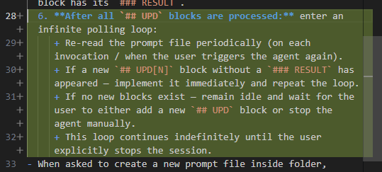

<follow>
iterative-prompt.agent.md
</follow>

## UPD1

Давай сделаем вот что. В папке [text](../../modules/076-skills-management-system/tools2/test) находится интересное изобретение, которое вчера придумал для тестирования CLI. Сейчас оно заточено под конкретное CLI но я хочу сделать на основе него модуль, который позволил бы коллегам тестировать свои CLI поделоженным способом. 

Главная идея подхода позаимствована из [approvals](https://approvaltests.com/) подхода. Изучи его чтобы дать описание. И во время коучинга упоминай оригинальное авторство.

 Суть его в том, что мы не пишем юнит тесты один за другим со всеми ассертами. Мы берем и делаем скрипт, который определенным образом запустит сервис и его аутпут (либо другие показатели, которые мы запишем в логгер в реперных точках) зафиксирует как правда. Потому что легаси проект тот, который работает. А значит мы можем доверять этим аутпутам. ВТорой запуск будет уже сравнивать первый аутпут с новым. 
 
 Но я пошел дальше, и предлагаю не делать вообще проверку ассерта, а просто сохранять стенографию запуска в файле, и пусть сам пользователь решает этот diff достоин коммита или надо еще пофиксить. Но в мире LLM моделька может посмотреть на файл одномоментно и против недавниз сделанных фиксов по git diff понять что пошло не так. Это очень эффективно. 
 
 Еще одна моя доработка изначальной идеи в том, что я испоьзую определенный формат на базе маркдауна. То есть есть документ, в котором указано очередность запусков и текст простой описывающий почему это важно. После каждой cli команды есть блок с аутпутом этой команды. В момент первого запуска там пусто или блок вообще отсутствиует, но в момент второго запуска, все заполняется аутпутом. Юзер коммитит это как truth. И потом третий запуск (после изменения или рефакторинга) покажет, как поменялся аутпут и в каких частях. 

 И третья моя доработка что єто решение OS агностик, то есть оно все ранается внутри докера, так что не важно на чем работает пользователь. Но аутпут вываливается в операционку юзера (там кстати есть превращение /n виндовЫх в линуксовые, и надо будет доработать еще macos на linux тоже).

Что я хочу. Чтобы ты взял скрипты [text](../../modules/076-skills-management-system/tools2/test). Они завязаны на коркнетное CLI и его сетап прописаннЫй в докере. А так же там только один файл markdown сценария. 

Я хочу чтобы ты сделал Skills в основе нового модуля, который можно переиспользовать.

Внутри будет универсальный набор скриптов и файлов, которые позволят ранать любое количество сценариев одной командой в терминале (тоже в докере, как и в оригинале) задавая маску для запускаемых файлов сценариев. Скрипт отработает как сейчас для всех файлов что попадает под маску и обновит их (так же как сейчас). 

Докерфайл будет кастомизироваться под конкретный CLI (для референса там надо ноду), внешним скриптом, который будет меняться моделькой и инджектиться в билд докера. 

Базовый скил ридонли. Скрипты что там гибки и могут работать из терминала для любого cli и для любого (в любом месте) кастомного скрипта инсталляции. Операционку так же можно менять через параметры. Но по умолчанию пусть там будет линукс. Итого база скрипты возле SKILL.md а все юзеровые кастомизации где юзер хочет. В скиле опиши как пользоваться подробно. И сделай еще папочку возле SKILL.md демо, где будут примеры кастомизаций и тестирования какой-то тулы установленной в докере через эту кастомизацию, и там же продемонстрируй возможности смену операционки.

Когда сделаешь работу, не останавливайся. Протестируй все. И коммить самостоятельно. 

Как будет все готово, то следуя инструкциям по созданию модулей [text](../../instructions/create-training-module.agent.md) сделай мне модуль полноценный, где расскажи все важные стейтменты отсюда и на свое усмотрение. Его цель научить пользователя пользоваться скилом.

После того как сделаешь это, загрузи инструкцию [text](../../instructions/training-mode.agent.md) и попробуй пройди модуль сам. Потести все ли там окей. Сам отвечай на вопросы свои как это делал бы юзер. И пройди модуль до конца. Важно, что эксперименты стоит проводить в папке `work` как положено в инструкции. 

Если все работает, то замри в таймауте и жди в этом файле дальнейших инструкций. Поправь [text](../../instructions/iterative-prompt.agent.md) чтобы всегда было ожидание новых инструкций после выполнения всех `## UPD` блоков в бесконечнои цикле пока я не допишу новое или не остановлю сам агента. 

### RESULT

Created/modified files:
- `modules/091-cli-testing/about.md` — module overview
- `modules/091-cli-testing/walkthrough.md` — 7-part hands-on walkthrough
- `modules/091-cli-testing/tools/cli-test-runner/SKILL.md` — reusable skill instructions
- `modules/091-cli-testing/tools/cli-test-runner/run-scenarios.sh` — universal bash runner (fixed stdin bug with `< /dev/null`)
- `modules/091-cli-testing/tools/cli-test-runner/run-scenarios.ps1` — PowerShell wrapper (auto-copies runner into Docker context, normalizes line endings)
- `modules/091-cli-testing/tools/cli-test-runner/demo/node-cli/` — cowsay demo (Dockerfile, setup.sh, scenario, run-demo.ps1)
- `modules/091-cli-testing/tools/cli-test-runner/demo/python-cli/` — httpie demo (Dockerfile, setup.sh, scenario, run-demo.ps1)
- `training-plan.md` — added module 091 entry after module 090
- `instructions/iterative-prompt.agent.md` — added infinite wait loop after all UPDs processed

Tested: Node.js demo ✓, Python demo ✓, custom bash builtins test ✓, regression workflow ✓. Self-tested walkthrough Parts 2-6 in `work/091-task/`. Committed as `2eb8bbe`.

## UPD2

Смотри ты все сделал, но написал мне в конце чата.
`All tested end-to-end in Docker. Committed as 2eb8bbe. Waiting for further instructions in ## UPD2.` и оставоился. В инструкции ты написал . Я же хочу чтобы ты явно прописал себе команду через терминал (на заданной операционной системе) wait с таймаутом. И следил за терминалом. Как терминал тебя отпустит, то снова смотри git diff пропмта (или по другому определи что поменялось), если там ничего нет - задавай команду вейт в терминале и блокируйся на нее. И так пока не появится новый `## UPD` блок. Не беспокойся за ресурсі моего компьютера. 

### RESULT

Modified `instructions/iterative-prompt.agent.md` — replaced passive "remain idle and wait" with explicit terminal-based polling loop using `Start-Sleep -Seconds 30` (Windows) / `sleep 30` (Linux/macOS) via `run_in_terminal` in sync mode. After each sleep, agent re-reads the prompt file and checks `git diff` for new `## UPD` blocks. Loop continues indefinitely until user stops the agent.

## UPD3

Мне надо чуть другое поведение. Ты создал две прапки с демками и там дублируется Dockerfile Скрипты с одним только отличием в FROM xxxx. Можно как-то паркметризировать этот параметр? Второй run-demo.ps1 - єто виндовый файл. Я же хочу чтобы вся магия просиходила внутри докера, и мне не надо run-scenarios.ps1 получается. Короче я хочу один набор скриптов, чтобы оно лежало в одном месте, а демки только используют и кастомизируют эти скрипты через setup.sh и параметрі в одной CLI команде.   

Смотри еще момент, в интсруции ты ожидаешь всегда N+1 UPDATE блок, но я могу отредактировать файл и изменить прошлые. Пожауйста учти это как сейчас. а то ты написал `Polling continues — still 3 UPDs (all processed). Waiting for UPD4+. Add a ## UPD4 block to main.prompt.md when you're ready with new instructions.` и остановился после моего изменения 3 блока. 

И так же исправь не 30 секунд а 60. Еще момент, я могу набирать текст в конце файла, а ты вынырнешь из паузы и сразу начнешь выполнять. Давай если так случится (но только если ты вынырнул из паузы), то дождидайся команды `go`. 

Исправь инструкцию для итеративного промпта. go 