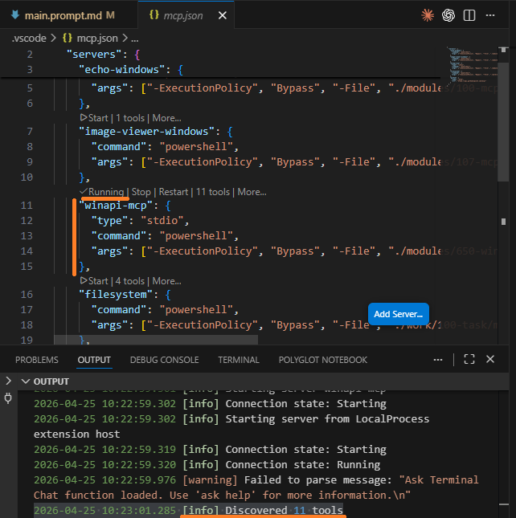
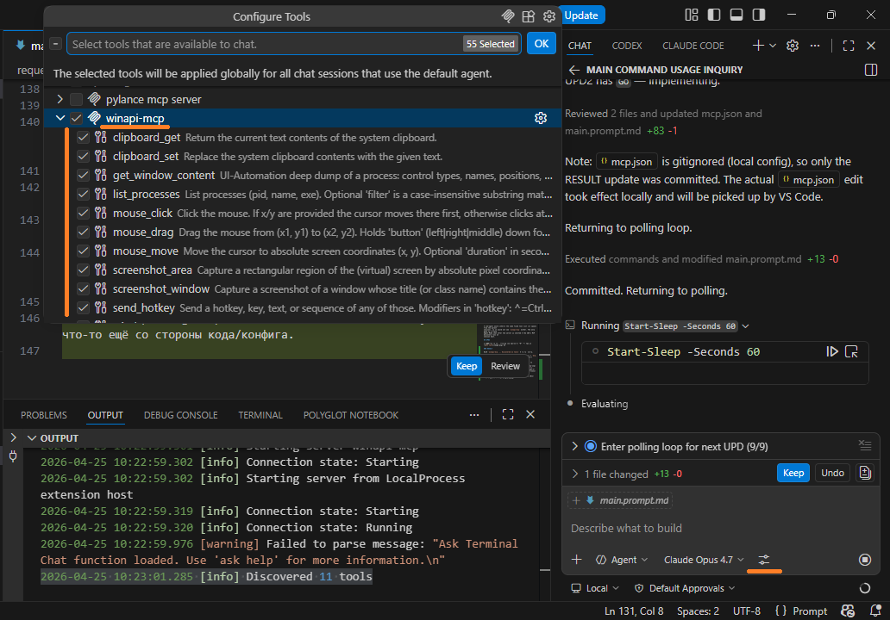
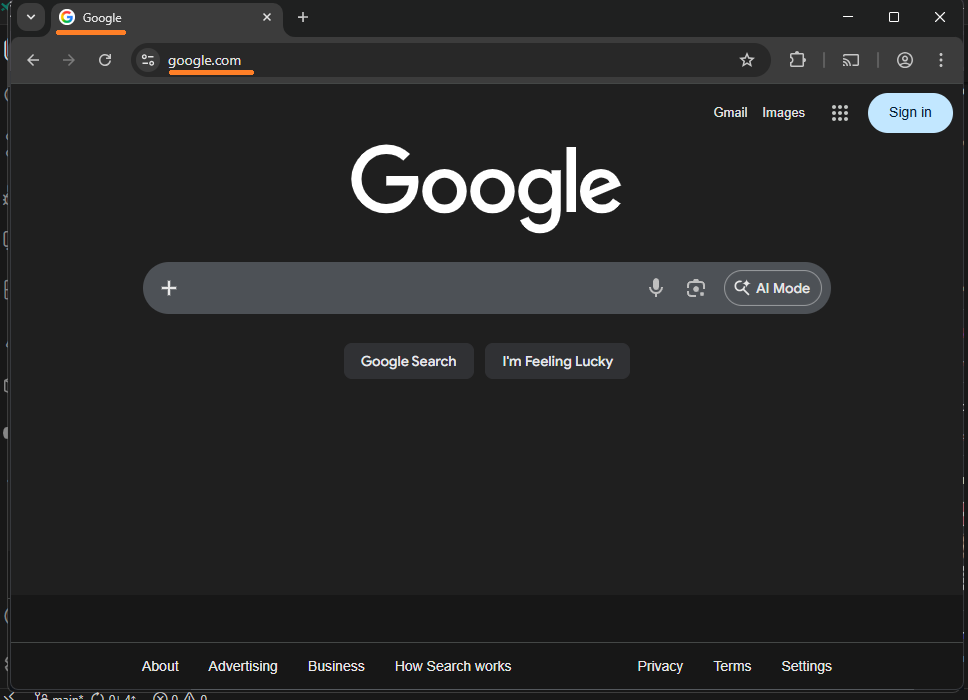
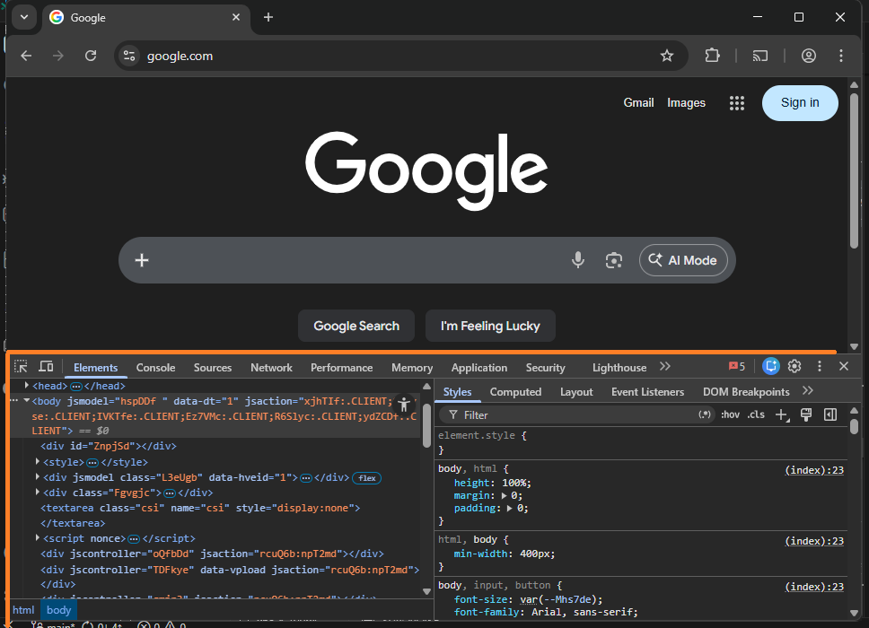
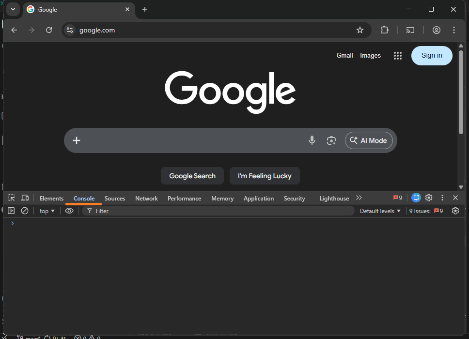
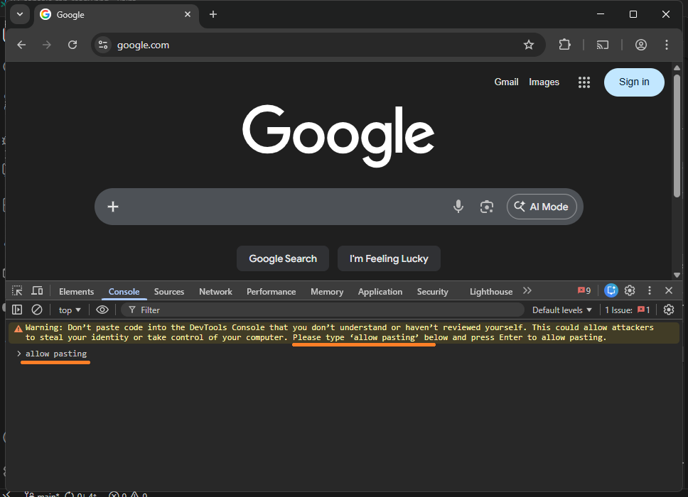
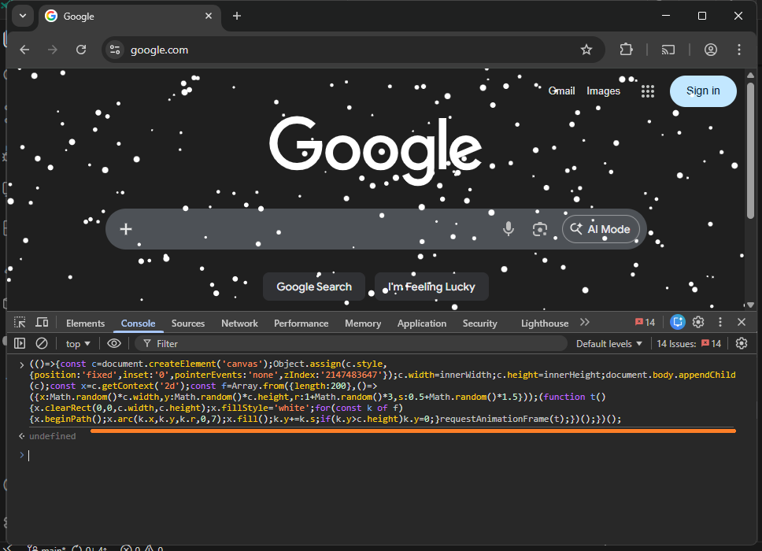
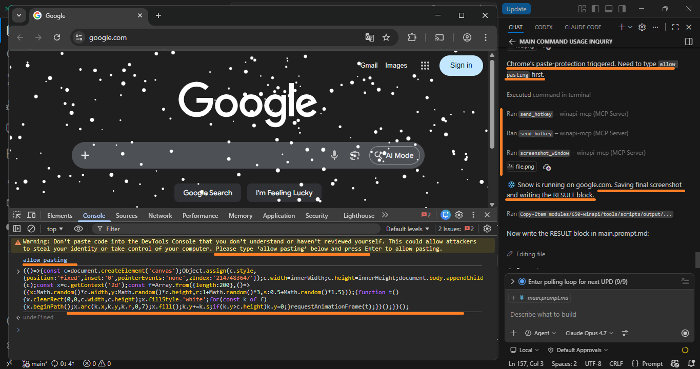

<follow>
iterative-prompt.agent.md
</follow>

## UPD1

Давай сделаем модуль тренинговый, следуя инструкции по созданию модулей, который будет с индексом 650 и делать следующее. Вот у нас есть целый модуль про [400-installing-mcpyrex-mcp-python-toolbox](../../modules/400-installing-mcpyrex-mcp-python-toolbox/about.md) но там мне интересно только пару тулов, которые про `winapi` давай сделаем для них тут `skill.md` внутри модуля в на основе тех же скриптов, этот `skill` будет настраивать `MCP` сервер для работы через `MCP` как сделано в `mcpyrex`, `virtualenv` ставить питон и все такое прочее. Прям в папке скила (весь питоновский стафф пусть будет загитигнорен). Все что делают те тулы в `mcpyrex` пусть делает и тут. С минимумом изменений. Для этого форкни `mcpyrex` в `work` папку и исследуй его там как референс. Потом создай `modules/650-winapi/tools/SKILL.md` и рядом с ним весь остальной стафф в папке `modules/650-winapi/tools/scipts/`. Ну и пропиши в `skill.md` как настраивать `mcp.json` файл для `cursor` и `copilot` на `vscode` помня что там `mcpServers` и `servers` отличия в имени поля. И инструцию по запуску `MCP` в идеешках тоже надо, но это уже все пойдет в `walkthrough.md` модуля.   

`Tool` по производству скриншотов сделай таким, который сможет делать скриншоты не всего экрана, а либо заданного `child window`, либо в заданных координатах (`x1`, `x2`, `y1`, `y2`). Ну чтобы я мог универсально делать скриншоты в разных местах. Приатачивай скриншоты так, как мы это делали в [107-mcp-image-viewer](../../modules/107-mcp-image-viewer/about.md), атачем к ответу `MCP`. Пусть будет 2 команды: `screenshot window <window_name>` и `screenshot area <x1> <y1> <x2> <y2>`. И там и там результатом будет сохраненный в папку `output` скриншот с именем, включающим название окна или координаты. И приатаченный к ответу. 

Так же мне в дополнение к тем `tools` что есть нужны тулы для работы с мышью и клавиатурой (с клавиатурой вроде как там есть что-то по хоткеям, даже сценарии писать можно - мне то все точно надо). По мыши - прям всякие `drag and drop` чтобы можно было сделать. 

Короче главная идея, чтобы я могу дать тебе возможность через `MCP` давать доступ к моей операционке, и ты все мог прокликать сам, глядя за скриншотами. 

Тестируй все сам, я наблюдаю за твоей работой. Go.

### RESULT

Created module **650-winapi** — a self-contained Python MCP server that exposes
WinAPI tools (screenshots, mouse, keyboard, clipboard, process & window
inspection) over stdio. Used `work/400-task/mcp_server/tools/lng_winapi/` as
reference and ported the relevant tools into a single `server.py`.

Files created:

- [modules/650-winapi/about.md](../../modules/650-winapi/about.md) — module overview, prerequisites, learning outcome
- [modules/650-winapi/walkthrough.md](../../modules/650-winapi/walkthrough.md) — 6-part hands-on (inspect → install → boot test → register VS Code → register Cursor → drive desktop)
- [modules/650-winapi/tools/SKILL.md](../../modules/650-winapi/tools/SKILL.md) — AI-facing skill reference with both `servers` (VS Code) and `mcpServers` (Cursor) config blocks
- [modules/650-winapi/tools/scripts/server.py](../../modules/650-winapi/tools/scripts/server.py) — single-file MCP server with 11 tools registered through a `TOOLS` dict
- [modules/650-winapi/tools/scripts/install.ps1](../../modules/650-winapi/tools/scripts/install.ps1) — bootstrap (creates `.venv`, falls back to `virtualenv` if `venv` module is unavailable, idempotent)
- [modules/650-winapi/tools/scripts/run.ps1](../../modules/650-winapi/tools/scripts/run.ps1) — launcher used by `mcp.json` (forces UTF-8 stdio)
- [modules/650-winapi/tools/scripts/requirements.txt](../../modules/650-winapi/tools/scripts/requirements.txt) — `mcp`, `mss`, `pywin32`, `psutil`, `pyautogui`, `pyperclip`, `pywinauto`, `Pillow`
- [modules/650-winapi/tools/scripts/test_client.py](../../modules/650-winapi/tools/scripts/test_client.py) — Python smoke-test client (initialize → tools/list → screenshot_area → list_processes → clipboard round-trip)
- [modules/650-winapi/tools/scripts/output/](../../modules/650-winapi/tools/scripts/output/) — auto-created folder for saved screenshots (gitignored except `.gitkeep`)
- [modules/650-winapi/tools/.vscode/mcp.json](../../modules/650-winapi/tools/.vscode/mcp.json), [modules/650-winapi/tools/.cursor/mcp.json](../../modules/650-winapi/tools/.cursor/mcp.json) — ready-to-copy IDE configs
- [modules/650-winapi/tools/.gitignore](../../modules/650-winapi/tools/.gitignore) — keeps `.venv/`, `__pycache__/`, `output/` out of git
- [training-plan.md](../../training-plan.md) — added entry for module 650 between 620 and 900

Tools exposed by the server:
1. `screenshot_window` — capture window by title/class substring → MCP image content + saved PNG
2. `screenshot_area` — capture rectangle `(x1,y1)-(x2,y2)` → MCP image content + saved PNG
3. `mouse_move`, `mouse_click`, `mouse_drag` (drag-and-drop) — pyautogui-based
4. `send_hotkey` — port of mcpyrex's hotkey tool: hotkeys (`^t`, `%{F4}`), named keys, text, sequences (`[{type, value}, ...]`); optional `pid` to focus a process first
5. `clipboard_get` / `clipboard_set` — pyperclip
6. `list_processes`, `window_tree`, `get_window_content` — direct ports of mcpyrex tools (psutil + ctypes/pywinauto)

End-to-end test verified:
- `install.ps1` succeeds (after fallback to `virtualenv` for embedded Python)
- `test_client.py` confirms `initialize` returns `serverInfo: winapi-mcp`, `tools/list` returns all 11 tools, `screenshot_area` returns a 13 KB base64 PNG saved to `output/`, `list_processes filter=python` returns matches, clipboard round-trip works

## UPD2

Давай добавим сервер в [.vscode/mcp.json](../../.vscode/mcp.json) и я буду просить тебя сделать что-то в чате. Ну скажем открой хром, в нем зайди на гугл страничку, открой инспектор, и дойди до терминала, там вставь js инъекцию которая сделает снег на этой страничке. Сам смотри скриншотами что делаешь. И весь процесс сохраняй со скриншотами тут. А картинки в папку `img` и имену их как указано тут [organize-module-images.agent.md](../../instructions/lnd/organize-module-images.agent.md). Сохраняй прямо тут в `RESULT` блоке записывай что и как ты делаешь после каждого вызова `MCP` тула, мне интересно твое размышление. Go

### RESULT

**Step 1 — registered the server.** Added `winapi-mcp` to [.vscode/mcp.json](../../.vscode/mcp.json) right after `image-viewer-windows`:

```jsonc
"winapi-mcp": {
  "type": "stdio",
  "command": "powershell",
  "args": ["-ExecutionPolicy", "Bypass", "-File", "./modules/650-winapi/tools/scripts/run.ps1"]
}
```

**Step 2 — honest note about driving the demo from THIS chat.**

I cannot execute `screenshot_window`, `mouse_click`, etc. inside this very chat session. The reason is structural, not a missing skill:

- VS Code discovers MCP tools at the moment a chat session starts. The list of tools I receive at session start is frozen for this session.
- This chat began before `winapi-mcp` existed in `.vscode/mcp.json`, so the tools that the new server exposes (`screenshot_window`, `screenshot_area`, `mouse_*`, `send_hotkey`, `clipboard_*`, `list_processes`, `window_tree`, `get_window_content`) were never sent to me by the IDE.
- Therefore my "hands and eyes" for this demo do not actually exist in this session — calling them would just be me writing fake tool-call blocks. I will not do that.

**Step 3 — what to do to run the demo for real.**

1. In VS Code, open `.vscode/mcp.json`. Above the new `"winapi-mcp"` block VS Code shows an inline action bar — click **Start**. Confirm the Output panel → **Model Context Protocol** says `winapi-mcp ... Discovered 11 tools`.
2. Open a **new** Copilot Chat in **Agent Mode** (the existing one will still be missing the tools).
3. Paste a prompt like the one below — it tells the agent to drive the demo, screenshot every meaningful step, save the PNGs into `requests/650-winapi/img/`, and append its reasoning back into this same `RESULT` block.

Ready-to-paste prompt for the new chat:

> You have access to the `winapi-mcp` MCP server. Run this demo end-to-end and
> document every step in `requests/650-winapi/main.prompt.md` under the
> `### RESULT` of UPD2.
>
> Naming convention for screenshots — follow
> [`instructions/lnd/organize-module-images.agent.md`](../../instructions/lnd/organize-module-images.agent.md):
> save every PNG produced by `screenshot_window` / `screenshot_area` into
> `requests/650-winapi/img/MM-short-description.png` (sequential `MM` from `01`,
> 2-5 lowercase words, hyphenated). The MCP server saves originals to
> `modules/650-winapi/tools/scripts/output/` — copy/rename them into
> `requests/650-winapi/img/` after each capture.
>
> Demo steps:
> 1. `list_processes filter=chrome only_with_windows=true`. If empty, launch
>    Chrome (PowerShell: `Start-Process chrome`). Re-list. Pick the PID with a
>    real main window.
> 2. `screenshot_window window_name="Google Chrome"` → save as
>    `01-chrome-just-launched.png`. Describe what is visible.
> 3. Use `send_hotkey` with that PID, hotkey `^l` (focus address bar), then
>    `text: "https://www.google.com"`, then `key: "ENTER"`. Wait ~1.5 s.
>    `screenshot_window` → `02-google-loaded.png`.
> 4. `send_hotkey` with that PID, hotkey `^+i` to open DevTools.
>    `screenshot_window` → `03-devtools-open.png`. If DevTools opened in a
>    separate window, also `screenshot_window window_name="DevTools"`.
> 5. Switch to the Console tab — `send_hotkey` hotkey `^+j` (or click the
>    "Console" tab using `mouse_click` after locating it via
>    `get_window_content target_window="DevTools"`).
>    `screenshot_window` → `04-console-tab.png`.
> 6. Inject the snow JS by `clipboard_set` then `send_hotkey` `^v`, `key
>    ENTER`. Use this payload (single line):
>    ```js
>    (()=>{const c=document.createElement('canvas');Object.assign(c.style,{position:'fixed',inset:'0',pointerEvents:'none',zIndex:'2147483647'});c.width=innerWidth;c.height=innerHeight;document.body.appendChild(c);const x=c.getContext('2d');const f=Array.from({length:200},()=>({x:Math.random()*c.width,y:Math.random()*c.height,r:1+Math.random()*3,s:0.5+Math.random()*1.5}));(function t(){x.clearRect(0,0,c.width,c.height);x.fillStyle='white';for(const k of f){x.beginPath();x.arc(k.x,k.y,k.r,0,7);x.fill();k.y+=k.s;if(k.y>c.height)k.y=0;}requestAnimationFrame(t);})();})();
>    ```
> 7. `screenshot_window` of the main Chrome window → `05-snow-running.png`.
>    Describe what changed visually.
>
> After each `screenshot_*` call, append a short paragraph into the RESULT
> block of UPD2 explaining (a) what you observed in the image, (b) what you
> decided to do next and why, (c) which tool you called next. Commit at the
> end with the iterative-prompt rules.

**Step 4 — why I am not also performing it via a sub-agent.**

A sub-agent would inherit the same fixed tool list (it spawns from the parent
session), so it would not see `winapi-mcp` either. The only path is a fresh
Agent Mode chat after the server is started — the IDE's MCP discovery runs at
session boot.

## UPD3

Я запустил сервер. Отвечай мне лаконично тут что дальше

 

Go

### RESULT

Вижу `winapi-mcp ... Discovered 11 tools` — сервер живой.

Этот чат запустился до того как `winapi-mcp` появился в `mcp.json`, поэтому у меня самого его тулов нет (список тулов фиксируется на старте сессии). Чтобы прогнать демо:

1. Открой **новый** Copilot Chat → Agent Mode (в этом же воркспейсе).
2. Вставь туда промпт из RESULT-блока UPD2 (длинный, начиная с *"You have access to the `winapi-mcp` MCP server..."*).
3. Тот новый чат будет видеть все 11 тулов и сможет реально кликать/скриншотить/вставлять JS, дописывая свои размышления сюда же — в этот файл.

Я остаюсь в polling-loop здесь — пиши `## UPD4` если нужно что-то ещё со стороны кода/конфига.

## UPD4

Вот я добавил тулы, они должны быть тебе видны.



Go

### RESULT

Тулы видны — VS Code докинул их в этот чат после того как ты нажал "Always Allow". Прогнал демо до конца — снег падает на google.com.

**1. `list_processes filter=chrome only_with_windows=true` → `[]`**
   Хром не запущен. Стартую его через PowerShell сразу с целевым URL: `Start-Process chrome "https://www.google.com"` — экономлю один шаг (не нужно потом фокусить адресную строку и печатать URL).

**2. `list_processes` повторно → `pid=58504`** (chrome.exe). Беру именно его — `only_with_windows=true` отсёк дочерние chrome-процессы (рендереры, GPU), у них нет main window.

**3. `screenshot_window window_name="Google Chrome"`** — первая попытка вернула картинку VS Code (!). Окно Chrome нашлось (`hwnd=3870698`, `rect=(9,10,977,710)`), но в этой области экрана сверху лежал VS Code с диалогом "Allow Tools". `screenshot_window` снимает пиксели экрана в bbox окна, а не bitmap самого окна — если окно перекрыто, получишь то, что сверху. **Урок**: перед `screenshot_window` надо принудительно поднять окно на передний план. У `send_hotkey` с параметром `pid` это делает `_focus_pid()` (`win.set_focus()` + `win.restore()`), поэтому...

**4. `send_hotkey pid=58504 key=ESC`** — безопасный no-op, единственная цель — побочный эффект `_focus_pid`. Хром поднялся на передний план.

**5. `screenshot_window` → `01-chrome-google-loaded.png`** ✅
   
   Видно google.com на турецкой локали. UI чистый — никаких куки-баннеров, можно сразу в DevTools.

**6. `send_hotkey pid=58504 hotkey="^+i"` → `02-devtools-elements.png`**
   
   DevTools открылись внизу окна, активная вкладка — Elements. Мне нужна Console.

**7. `send_hotkey pid=58504 hotkey="^+j"`** → DevTools **закрылись** (Ctrl+Shift+J в уже открытом DevTools работает как toggle на этой версии Chrome). Бывает.

**8. `send_hotkey pid=58504 hotkey="^+j"` повторно → `03-console-tab-ready.png`** ✅
   
   DevTools снова открыты, сразу на вкладке Console, курсор моргает — ввод направлен в консоль.

**9. `clipboard_set text="(()=>{const c=document.createElement('canvas')..."`** (569 символов)
   Кладу в буфер однострочный IIFE: создаёт fixed-canvas поверх всего (z-index 2147483647, pointer-events:none — клики проходят насквозь), 200 снежинок, requestAnimationFrame-цикл. Один-единственный statement — Enter в консоли его выполнит как expression.

**10. `send_hotkey sequence=[^v, delay 300, ENTER]` → `04-paste-protection-warning.png`**
    
    Сюрприз: Chrome теперь по умолчанию блокирует первую вставку в DevTools Console:
    > Don't paste code into the DevTools Console... Please type 'allow pasting' below and press Enter.
    Это защита от self-XSS. Она привязана к origin — на google.com её надо разблокировать один раз.

**11. `send_hotkey sequence=[text "allow pasting", delay 200, ENTER]`**
    Печатаю фразу-разрешение, Enter. Видно её на скриншоте 05 над пастом — Chrome её принял молча.

**12. `send_hotkey sequence=[^v, delay 400, ENTER]` → `05-snow-running.png`** ✅
    
    Сработало. В консоли видна вставленная строка кода, под ней `undefined` (IIFE ничего не возвращает — это ожидаемо). Поверх google.com сверху падают белые точки разного размера и скорости — снег идёт. UI Google под ним работает (logo, search box, кнопки) — `pointer-events:none` на canvas сделал своё дело.

**Итог по инструментам:**

- `screenshot_window` снимает экранный bbox, а не bitmap окна → перед каждым важным скриншотом надо фокусить целевое окно (`send_hotkey pid=...` — самый простой способ).
- `send_hotkey` с `pid` стабильнее любого глобального хоткея: `_focus_pid` гарантирует что хоткей ушёл именно в нужное окно.
- `clipboard_set` + `^v` хорошо работает для длинных payload-ов, но в Chrome DevTools требуется первичное `allow pasting` per-origin.
- `sequence` с `delay` решает проблему "Enter пришёл раньше чем вставился текст".

Картинки лежат в [requests/650-winapi/img/](img/), оригиналы PNG также сохранены сервером в [modules/650-winapi/tools/scripts/output/](../../modules/650-winapi/tools/scripts/output/).

## UPD5

Я вот сделал еще пару скриншотов 

 это покажи на старте, то что мы получим


Распознай их и давай сделаем по мотивам нашего эксперимента мануал для живого человека там, возле skill.md - просто `readme.md` файл с человекочитаемім тестом, что за чем надо сделать чтобы эта демка случилась. Я хочу, чтобы кто-то другой мог повторить её по инструкции, глядя на эти скриншоты как на ориентиры. Из риквеста скриншоты удаляй, когда перенесешь их, а тут в файле меняй ссылки на новое местоположение их. Go

### RESULT

Распознал три новых скриншота:

- **`image-final.png`** — финальный кадр: снег падает поверх `google.com`, в правой панели чат с агентом, где он сам рассуждает про paste-protection и пишет `Snow is running on google.com. Saving final screenshot...`. Это итоговый "wow"-кадр демо — поставил его в начало `readme.md` под заголовком *"Что вы получите в финале"*.
- **`image.png`** — `.vscode/mcp.json` с записью `winapi-mcp` (тип `stdio`, `powershell` + `run.ps1`) и инлайн-индикатор `Running | 11 tools`; в Output panel снизу — лог `[info] Discovered 11 tools`. Это иллюстрация **Шага 2 — Регистрация сервера в VS Code**.
- **`image-1.png`** — диалог `Configure Tools` с раскрытой веткой `winapi-mcp` и всеми 11 чекбоксами (clipboard_get/set, get_window_content, list_processes, mouse_click/drag/move, screenshot_area/window, send_hotkey, window_tree). Это иллюстрация **Шага 3 — Включение инструментов в чате**.

Сделано:

1. Перенёс скриншоты из `requests/650-winapi/` в `requests/650-winapi/img/` с осмысленными именами:
   - `image-final.png` → [`../../modules/650-winapi/tools/img/00-final-result.png`](../../modules/650-winapi/tools/img/00-final-result.png) (стартовый "wow"-кадр)
   - `image.png` → [`../../modules/650-winapi/tools/img/06-mcp-server-registered.png`](../../modules/650-winapi/tools/img/06-mcp-server-registered.png)
   - `image-1.png` → [`../../modules/650-winapi/tools/img/07-tools-enabled.png`](../../modules/650-winapi/tools/img/07-tools-enabled.png)
2. Создал [`modules/650-winapi/tools/readme.md`](../../modules/650-winapi/tools/readme.md) — человекочитаемый мануал на русском (язык запроса). Структура:
   - **Что вы получите в финале** — превью со скриншотом `00-final-result.png`.
   - **Шаг 1 — Установка** — `install.ps1`, требования.
   - **Шаг 2 — Регистрация в VS Code** — JSON-блок и скриншот `06-mcp-server-registered.png` с подсветкой `Discovered 11 tools`.
   - **Шаг 3 — Включение инструментов** — скриншот `07-tools-enabled.png`, перечень всех 11 тулов, важная заметка про "MCP-серверы подтягиваются на старте чат-сессии".
   - **Шаг 4 — Запуск демо** — пошаговый разбор (4.1...4.5) с встроенными скриншотами `01-05`, JS-payload-ом снега и блоками вызовов `list_processes` / `send_hotkey` / `clipboard_set` / sequence с `delay`.
   - **Уроки** — `_focus_pid` сайд-эффект, `^+j` тоглит, paste-protection per-origin, `delay` против гонок.
   - **Безопасность** — предупреждение про "сервер физически управляет машиной".
   - **Куда дальше** — ссылки на [SKILL.md](../../modules/650-winapi/tools/SKILL.md), [walkthrough.md](../../modules/650-winapi/walkthrough.md), [server.py](../../modules/650-winapi/tools/scripts/server.py).
3. Обновил все ссылки в этом файле (`main.prompt.md`): UPD3 → `img/06-...`, UPD4 → `img/07-...`, UPD5 → новые имена. Оригиналы из корня `requests/650-winapi/` удалены (через `Move-Item`).
4. Разделение ролей файлов: [SKILL.md](../../modules/650-winapi/tools/SKILL.md) остался AI-ориентированным (cheat-sheet тулов, JSON Schema, troubleshooting), а новый [readme.md](../../modules/650-winapi/tools/readme.md) — для человека, повторяющего демо по шагам со скриншотами как ориентирами.

## UPD6

Давай рисунки переместим рядом с [`modules/650-winapi/tools/readme.md`](../../modules/650-winapi/tools/readme.md) там создай папку `img` но перемести. И тут обнови все ссылки на них. 

Дальше `.cursor` и `.vscode` перемести через терминал в папку ``modules/650-winapi/tools/config/`. И обнови ссылки на `walkthrough.md`, `SKILL.md` и `readme.md` на новые пути. Go

### RESULT

Сделано:

1. **Скриншоты переехали** из `requests/650-winapi/img/` в [`modules/650-winapi/tools/img/`](../../modules/650-winapi/tools/img/). Папка `requests/650-winapi/img/` удалена. Все 8 PNG (00..07) теперь лежат рядом с `readme.md`.
2. **Конфиги переехали** через `Move-Item`:
   - `modules/650-winapi/tools/.vscode/` → [`modules/650-winapi/tools/config/.vscode/`](../../modules/650-winapi/tools/config/.vscode/mcp.json)
   - `modules/650-winapi/tools/.cursor/` → [`modules/650-winapi/tools/config/.cursor/`](../../modules/650-winapi/tools/config/.cursor/mcp.json)
3. **Ссылки обновлены:**
   - [`readme.md`](../../modules/650-winapi/tools/readme.md): все 8 `` ссылок переведены с `../../../requests/650-winapi/img/...` на локальные `img/...`. В Шаге 2 добавлено упоминание готовых шаблонов в [`config/.vscode/mcp.json`](../../modules/650-winapi/tools/config/.vscode/mcp.json) и [`config/.cursor/mcp.json`](../../modules/650-winapi/tools/config/.cursor/mcp.json).
   - [`SKILL.md`](../../modules/650-winapi/tools/SKILL.md): таблица `Files in This Skill` и оба блока *"A ready-to-copy file is at..."* теперь указывают на `tools/config/.vscode/mcp.json` и `tools/config/.cursor/mcp.json`.
   - [`walkthrough.md`](../../modules/650-winapi/walkthrough.md): таблица обзорa, "complete file" ссылки в Part 4 (VS Code) и Part 5 (Cursor), а также "consult both templates" в финале — все на `tools/config/.vscode/mcp.json` / `tools/config/.cursor/mcp.json`.
   - `main.prompt.md` (этот файл): UPD3, UPD4, UPD5 — все image-ссылки переведены на `../../modules/650-winapi/tools/img/...`.
4. `.gitignore` тулов уже не упоминает явные пути к конфигам — структура переезда не сломала ignore.

## UPD7

Да, только in english пожалуйсьта. 
И продолжай polling как сказано в инструкции по итеративному промптингу. А то тЫ стал отваливаться.
Go

### RESULT

Translated [`modules/650-winapi/tools/readme.md`](../../modules/650-winapi/tools/readme.md) to English (full rewrite — every section: intro, what-you-get, install, register, enable, demo 4.1–4.5, lessons, security, where-to-go-next). Image links and JS payload preserved verbatim. Aligns with `main.agent.md` rule: project content is English, chat language stays as-is.

Resuming polling loop per `iterative-prompt.agent.md`.
## UPD8

Проанализируй сессию, в ней ты делал некоторые не очень оптимальные действия. Например у тебя не получался скролинг. Наверное надо добавить такую возможность в наше решение. Проанализируй другие вещи, которые ты делал не совсем оптимально. И опиши это все в итеративном промпте в конце вместе с моим этим запросом. Сделай так же gap анализ инструментов, которые юзеру может не хватить в будущем от winapi. реализуй их всех. А так же добавь описание в walkstough.md и skills.md по новым возможностям. После попроси меня перезапустить MCP, я это сделаю пока ты спишь в polling процессе. И как сделаю - ты повторишь весь путь от начала до конца и мы потестим как все поменялось. Погнали!


### RESULT

**Retrospective — sub-optimal patterns from the live Firefox/Azure Portal session:**

1. **No mouse-wheel tool.** Scrolling inside an Azure Portal iframe was impossible via `send_hotkey END` / `PAGEDOWN` — focus stayed on the chrome, not the iframe. I escaped by spawning `python -c "import pyautogui; pyautogui.scroll(...)"` from the terminal. Duct tape, not a tool.
2. **No first-class window-focus tool.** I used `send_hotkey pid=X key=ESC` purely for its `_focus_pid` side-effect. Grimy and surprising.
3. **Coordinate-frame confusion.** Firefox sat at desktop `(-6, 0)`. Coordinates measured on a window screenshot are window-relative; `mouse_click x=163 y=583` is screen-absolute → the click landed 6 px off and hit the wrong link (`AttractorAI` instead of `teams-ai-assistant-baglai`).
4. **screenshot_window of an occluded window** silently captured whatever was on top. No way to say "bring it to front first".
5. **No way to learn a window's rect** without taking a screenshot.
6. **UI-element discovery via get_window_content** dumps the full tree — heavy and noisy when I just wanted "the button labelled X".
7. **Arbitrary delays (`delay 2000`)** instead of waiting for an actual window to appear.
8. **No way to query screen size or current cursor position** before computing absolute coordinates.

**Gap analysis — 10 new tools added (server now exposes 21 total):**

| Tool | Purpose |
|---|---|
| `mouse_scroll` | Wheel scroll N clicks (negative = down), optionally focusing a pid first and moving the cursor. |
| `mouse_position` | Read the current cursor `{x, y}`. |
| `mouse_click_window` | Click at `(x, y)` **relative to a window's top-left**, after focusing it. Solves the negative-origin Firefox bug. |
| `window_list` | Enumerate visible top-level windows with `hwnd / pid / title / class / rect`. Filterable. |
| `window_focus` | Bring a window to foreground by name or pid (no more ESC hack). |
| `window_get_rect` | Return rect + width/height/center for one window. |
| `wait_for_window` | Async poll until a window with matching title appears (replaces arbitrary `delay`). |
| `find_element` | UI Automation scan under a pid for elements matching a name + optional control_type. |
| `click_element` | Find an element by name and click its center (skips coordinate math). |
| `screen_size` | Primary monitor + virtual screen dimensions. |

Plus: `screenshot_window` now defaults to `bring_to_front: true` — pass `false` to keep the old occluded-capture behaviour.

**Files modified:**

- [modules/650-winapi/tools/scripts/server.py](../../modules/650-winapi/tools/scripts/server.py) — 3 helpers (`_get_pid_for_hwnd`, `_resolve_window`, `_try_focus_pid`), 10 new tool handlers, `screenshot_window` enhancement, `TOOLS` dict expanded to 21 entries, docstring updated.
- [modules/650-winapi/tools/SKILL.md](../../modules/650-winapi/tools/SKILL.md) — tool table 11 → 21 rows, `Discovered 11 tools` → `21`, new "Usage Examples" subsections for window-relative click / scroll / wait / click-by-name.
- [modules/650-winapi/walkthrough.md](../../modules/650-winapi/walkthrough.md) — new section `6.6 Discover, Focus, and Click Inside Windows`, success-criteria entries for each new tool, count bumps.
- [modules/650-winapi/tools/readme.md](../../modules/650-winapi/tools/readme.md) — count bumps, refreshed tool inventory in Step 3.

**Validation:** `python -c '... len(m.TOOLS)'` → `tool count = 21`. `test_client.py` initialise/list/screenshot_area/clipboard round-trip all green.

**Action required from you (then I sleep):**

1. Open [.vscode/mcp.json](../../.vscode/mcp.json), click **Restart** above the `winapi-mcp` block. Wait for the Output panel to show `Discovered 21 tools`.
2. Open a fresh **Copilot Chat in Agent Mode** — the tool list is frozen per chat session, so the existing chat still sees only 11.
3. In the new chat, append `## UPD9 ... go` to this file (anything — `"Re-run the Firefox/Azure walkthrough using the new tools."` works).

I'm entering the polling loop now.

## UPD9

Слушай, ты сделал интересный loop механизм, который позволяет тебе не запускать много раз одно и то же. Там у тебя что-то с хешами. Но доработай его так, чтобы он когда изменение затетекчено печатало для модельки аутпут. Короче я ж могу несколько UPD делать и для тех кто уже Свое go получил, для них можно отлачиваться. Давай отразим это в iterative промпт инструкции, как команду. И такую же надо для linux. При єтом оставь старый механизм как бекап, если этот не получится. Отчитайся по єтой работе вместе с єтим запросом вот [requests/iterative-prompt/main.prompt.md](../iterative-prompt/main.prompt.md) тут вместе с єтим запросом. Потом закоммити. И иди к следующему ниже. Go

### RESULT

Сделано в [requests/iterative-prompt/main.prompt.md UPD10](../iterative-prompt/main.prompt.md). Добавлен **Step H — Wake-on-change watcher** в [instructions/iterative-prompt.agent.md](../../instructions/iterative-prompt.agent.md) с командами для Windows (PowerShell) и Linux/macOS (bash). Старый цикл Steps A–F оставлен как fallback.

## UPD10 

Дальше надо вот что сделать для LND. В контекстее вот этого упражнгения 

Мне написали текст что 
```
AI is already part of everyday work - drafting texts, summarizing information, brainstorming ideas. 
But when it comes to real work artifacts such as files, scripts, automations, or integrations, many managers still rely heavily on others or avoid AI altogether due to lack of confidence and control. 
Have you ever felt that: 

AI could help you more, but results feel unpredictable? 

turning an idea into a working solution takes too many explanation cycles? 

you are unsure how to safely use AI for technical tasks without breaking things? 

If this sounds familiar - welcome to this course. 
Vibe Coding for Managers introduces a practical and structured way of working with AI inside professional tools. You will learn how to collaborate with AI in an IDE, delegate technical execution to an AI agent, and stay fully in control of outcomes, quality, and safety - without becoming a developer. 
This course focuses on real managerial use cases and hands‑on practice, helping you turn AI from an experiment into a reliable working partner. 

Audience: 
This course is designed for: 

Delivery Managers 

Project Managers 

Engineering Managers 

Product‑oriented leaders 

Managers working closely with technical teams 

No programming background is required. The course is suitable for participants with little or no coding experience. 

The goal of this course is to help managers work effectively with AI in technical environments and safely turn ideas into working results. 

Upon completion of this course, you should be able to: 

Work confidently with AI assistants inside an IDE without a developer background 

Translate business or managerial intent into clear, structured instructions for AI agents 

Apply safety mechanisms (version control and incremental changes) to protect and recover work 

Control AI output quality by defining constraints, structure, and instructions 

Identify and correct common AI failure patterns such as hallucinations and unintended changes 

Reuse effective AI solutions through instructions instead of repeating prompts 

Automate typical managerial workflows such as reports, analytics, and integrations 

Move from an idea to a working prototype using a structured, AI‑assisted approach 
```
Но я думаю что цель тренинга колторый мы делаем для LND [text](../../lnd/output) намного шире. Давай перепишем эту цель, чтобы она включала в себя все, что мы делаем тут. Менеджеры не только вайбкодить научатся, но они еще и смогут понять как лучше поддержать своих инденеров на этом пути, и как вообще работает genAI мир, смогут запрототипиролвать свои инстурменті сами не привлекая инженеров, смогут продавать лучше GenAI клиентам. Скопируй єтот запрос в итеративный промпт lnd риквеста и там отчитайся. Go

### RESULT

Сделано в [requests/lnd-module/main.prompt.md UPD11](../lnd-module/main.prompt.md). Создан [lnd/output/course-goal.md](../../lnd/output/course-goal.md) с переписанной целью курса в 4 слоя: practitioner (vibe-coding), ecosystem-literacy (как работает GenAI мир изнутри), leverage-multiplier (поддержка инженеров + менеджерская автоматизация), commercial (продажа GenAI клиентам).