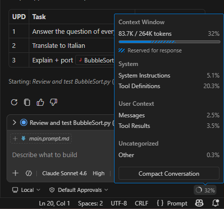
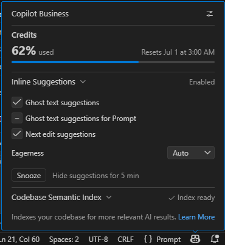
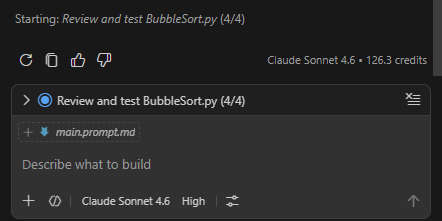

<follow>
iterative-prompt/SKILL.md
</follow>

## UPD1

Смотри какая задача у меня есть. Я уже начал собирать статистику использования токенов во время рана моих риквестов через iterative prompt. Что я собираю. 

```
Дата|Время старта написания промпта|Время окончания написания промпта|Время запуска промпта|Время окончания реализации|Время старта изучения результатов|Время окончания изучения результатов|Количество AI кредитов в начале|Количество AI кредитов в конце|Кредитов потрачено|Сколько контекстного окна было на момент запуска использовано|Был ли compact посреди|Сколько контекстного окна было на момент завершения запроса|В чате написано сколько кредитов использовано|Helm log file|Запрос|Текст запроса|Текст ответа|Модель|Контекстное окно максимально|Thinking effort|Вендор
```

Вот пример данных.

```
2026-06-15|9:21|9:47|10:00|10:04|10:06|10:35|11430|11520|90|0|-|72800|104.4|\some-backend\.dark-factory\work\deterministic-sdlc-flow\main.prompt.md|UPD1|"Мы будем исправлять файбрику. Сейчас главная проблема в том, что SDLC компонента, описанная в брике (что тако брик смотри тут [brick](../../instructions/brick)) [sdlc-flow](../../instructions/sdlc-flow) не является детерминированной. То есть инструкции могут быть загружены оркестратором в разном порядке, они могут дрейфовать, и в итоге мы не можем гарантировать, что SDLC будет выполняться в правильном порядке...."|"Выполнена **фаза challenge** (как ты явно попросил «перед тем... почелленджим идею»). Перед написанием кода брика разобрал слабые места гипотезы и предложил дизайн. Артефакт: [`00-challenge-and-design.md`](00-challenge-and-design.md)..."|Claude Opus 4.8|264000|High|GHCP
```

Откуда я беру информацию про контекстное окно - из индикатора плагина Copilot 

Откуда я беру инфу про AI кредиты? Из другого места.  и если навести мышку на % то можно увидеть AI кредиты. Если подождать, то вскоре появится новое число - скорее всего во время навещдения мышки оно обновляется и иждет запрос на сервер. 

Так же после риквеста у меня есть инфа вот тут 
 про фактическое использование токенов в чате (тоже надо навести мышку). 

Вот все остальное я высчитываю. Я делаю замеры до начала выполнения UPD блока и сразу после его завершения, когда RESULT напечатан и коммит сделан. Все это вокруг iterative prompt подхода. 

Внимание вопрос. Можно ли это все автоматизировать в скилл который будет сам ходить эту статистику смотреть не через UI и скриншоты, а через внутреннее API Копилота. Может API нет в явном виде, потому прошу тебя посмотреть на внутренности плагина, чтобЫ найти точку входа.

Так же я потом захочу исследовать jsonl файл который сохраняется плагином на каждую сессию, чтобы видеть что конректно было сделано в рамках этой сессии, и почему столько токенов было потрачено. Возможно это приведет к каким-то файндингам о том, как оптимизировать будущие запросы. go

### RESULT (UPD1)

**Вердикт: да, всё автоматизируется без UI и скриншотов. Нашёл две точки входа.** Это фаза research — кода ещё не писал.

#### Карта источников данных

| Твоя колонка | Источник | Как достать |
|---|---|---|
| Контекстное окно (на старте/финише, 264K, %) | debug-logs JSONL | `llm_request.attrs.maxTokens` + `inputTokens` |
| В чате «токенов использовано» (104.4) | debug-logs JSONL | сумма `inputTokens`+`outputTokens` по turn'ам |
| AI кредиты (старт/конец) | GitHub API `copilot_internal/user` | поля `quota_snapshots`, `quota_reset_date` |
| Модель, Thinking effort, время | debug-logs JSONL | `attrs.model`, `ts`, `dur`, `userRequest` |

#### Точка входа №1 — токены и контекстное окно (без секретов, детерминированно)

Файлы пишет сам плагин на каждую сессию:
`%APPDATA%\Code\User\workspaceStorage\<wsId>\GitHub.copilot-chat\debug-logs\<sessionId>\main.jsonl`

Каждая строка `llm_request` содержит: `model`, `inputTokens`, `outputTokens`, `maxTokens`, `ttft`, `ts` (epoch ms), `dur`, `userRequest`. Проверено на твоей текущей сессии — данные реальные (claude-opus-4.8, 63643→73179 inputTokens, maxTokens 64000).
- «Контекстное окно использовано» = `inputTokens` (а 264K из индикатора — это макс окна модели; per-request `maxTokens` = бюджет ответа).
- «Токенов в чате» = сумма `inputTokens`+`outputTokens` по turn'ам UPD-прогона.
- Формат и схема событий описаны в скилле `troubleshoot` (`SKILL.md`) — там же `turn_start`/`turn_end`, `tool_call`, `agent_response`.

#### Точка входа №2 — AI кредиты (нашёл внутренний API плагина)

Разобрал бандл `resources/app/extensions/copilot/dist/extension.js`. Кредиты плагин берёт с dotcom API:
- `copilotUserInfoURL` = `https://api.github.com/copilot_internal/user` → возвращает `quota_snapshots` + `quota_reset_date`
- обмен токена: `https://api.github.com/copilot_internal/v2/token` → возвращает quota + `refresh_in`
- поля snapshot'а: `percent_remaining`, `overage_count` (additionalUsageUsed), `overage_permitted`, `quota` (-1 = unlimited), `reset_date`
- «62% used» = `100 - percent_remaining`; «Resets Jul 1» = `reset_date`
- ⚠️ требует GitHub OAuth-токен с доступом к Copilot. В публичном `vscode.lm` API квоты нет — нужно дёргать эндпоинт с токеном (это уже работа с секретом).

#### Что мешает на 100% (честно)

- Кредиты нельзя достать из локальных файлов — только живой вызов API с токеном. Значит скилл должен где-то взять токен (`gh auth token` при нужных scope, либо токен из секрет-стора VS Code).
- Сопоставление «UPD-прогон ↔ участок JSONL»: в логах нет явного маркера UPD. Маппить придётся по времени старта/финиша (`ts`) или по тексту `userRequest`/`go`.

## UPD2

У тебя были вопросы. 

- Откуда скилл будет брать GitHub-токен для запроса кредитов? -> давай посмотрим как я могу его получить? Через github pat токен смогу? Расположим в `.env` файле. 

- На чём писать инструмент (по примеру курса — обычно Python CLI)? -> на питоне 

- Что делаем в UPD2 — строим скилл или сначала ещё research? -> Давай сделаем новый модуль следуя и нструкции по созданию модулей. [text](../../instructions/create-training-module.agent.md) но в нем пока не создаем walkthrough.md (потом сделаем) а только skill в папке `tools` модуля и там пусть будет питоновский скрипт и на шем мы будем экспериментировать. А как вытянем все данные, что нам надо из github по статистике, тогда уже сделаем `SKILL.md` и дальше продолжим с тобой - подумаем как подбивать статистику чтобы она сторилась между сессиями где-то в каком-то месте (но это все будет потом). Сейчас задача пробиться статистике гитхаба. 

Токен я засторил в `COPILOT_GITHUB_TOKEN` в файле `.env` в корне репозитория. Не рассекречивай его. Нам для экспериментов возле скрипта надо `.env.example` с рыбой и отдельный `.env` с реальным токеном - он гитигнорится.

Токена я не должен видеть нигде тут в отчетах. 

Если токен не подходит, давай скажи мне какой сгенерить я попробую сделать новый. 
go

### RESULT (UPD2)

Создал новый модуль **084 — Copilot Usage Telemetry** (следуя [create-training-module.agent.md](../../instructions/create-training-module.agent.md)). `walkthrough.md` и `SKILL.md` пока НЕ создавал — как договаривались.

**Созданные файлы:**
- [modules/084-copilot-usage-telemetry/about.md](../../modules/084-copilot-usage-telemetry/about.md) — описание модуля (ссылка на walkthrough помечена «coming soon»)
- [modules/084-copilot-usage-telemetry/tools/scripts/copilot_stats.py](../../modules/084-copilot-usage-telemetry/tools/scripts/copilot_stats.py) — экспериментальный Python CLI: команды `credits`, `raw`, `token-info`; токен читается из `.env` и **нигде не печатается**
- [modules/084-copilot-usage-telemetry/tools/.env.example](../../modules/084-copilot-usage-telemetry/tools/.env.example) — рыба с `COPILOT_GITHUB_TOKEN`
- [training-plan.md](../../training-plan.md) — модуль 084 добавлен после 083
- [modules/module-catalog.md](../../modules/module-catalog.md) — строка 084 добавлена

`.env` в корне уже в `.gitignore` (проверил) — реальный токен не коммитится.

**⚠️ Главный блокер: текущий токен невалиден.**

Скрипт берёт кредиты с приватного эндпоинта `GET https://api.github.com/copilot_internal/user` (заголовки `Authorization: token <…>` + `X-GitHub-Api-Version: 2025-04-01` — формат вытащил из бандла плагина). Результат теста:

| Проверка | Результат |
|---|---|
| Тип токена | `github_pat_…`, длина 93 → **fine-grained PAT** |
| `GET /user` (обычный API) | **401 Bad credentials** |
| `GET /copilot_internal/user` | **401 Bad credentials** |
| Схемы `Bearer` и `token` | обе 401 |

Раз даже обычный `/user` отдаёт «Bad credentials» — проблема **не в эндпоинте, а в самом токене**: он просрочен/отозван/скопирован с ошибкой. (Токен я нигде не показывал — только префикс `github_pat_` и длину.)

**Что сгенерить и попробовать (по порядку):**
1. **Сначала — classic PAT** (`ghp_…`): https://github.com/settings/tokens → *Generate new token (classic)*. Скоупы для чтения профиля: `read:user`. Положи в `COPILOT_GITHUB_TOKEN`, перезапусти `python modules/084-copilot-usage-telemetry/tools/scripts/copilot_stats.py credits`.
   - Я подозреваю, что внутренние `copilot_internal/*` эндпоинты вообще принимают только classic-токены / editor-OAuth, а fine-grained — нет. Поэтому classic стоит проверить первым.
2. Если classic PAT даст **403** (а не 401) на `copilot_internal/user` — значит токен валиден, но эндпоинту нужен именно editor-OAuth токен. Тогда в следующем UPD пойдём через device-flow OAuth (client_id Copilot-приложения) — напишу отдельный шаг.

Как обновишь токен — скажи `go`, прогоню снова. 

## UPD3

Я сделал токен как ты просил. Вот что вижу 
```
python modules/084-copilot-usage-telemetry/tools/scripts/copilot_stats.py credits
Plan:        business
Reset date:  2026-07-01

Quota snapshots:
  chat               used=0.0%  remaining=0  entitlement=0  unlimited=True
  completions        used=0.0%  remaining=0  entitlement=0  unlimited=True
  premium_interactions used=64.0%  remaining=10802  entitlement=30000  unlimited=False
```
Давай пофиксим скрипт, чтобы он искал `.env` от текущей папки рекурсивно вверх. 
Так же давай аутпут сделаем в виде json, в дополнение к text как сейчас. 

Выдай мне так же  максимально много информации что дает этот эндпоинт сейчас. Мне надо максимуми инфу. 

go

### RESULT (UPD3)

Токен заработал (`business` план). Все три задачи сделаны + добавил команду `info` для максимума данных.

**Изменения в [copilot_stats.py](../../modules/084-copilot-usage-telemetry/tools/scripts/copilot_stats.py):**
1. **`.env` ищется рекурсивно вверх** — новая функция `_find_env_file()` идёт вверх от двух якорей: текущей папки (CWD) И папки скрипта. Проверено: запуск из `tools/scripts/` находит корневой `.env`.
2. **JSON-вывод у всех команд** — флаг `--format json` (работает и до, и после имени команды). `raw`/`token-info` всегда JSON.
3. **Новая команда `info`** — выводит максимум полей в читаемом виде; `info --format json` = полный дамп.

**Команды:**
- `credits` — кратко: used%, remaining/entitlement, overage (то, что в статус-баре)
- `info` — максимум: план, фичефлаги, орги, региональные эндпоинты, полные квоты
- `raw` — сырой JSON эндпоинта
- `token-info` — метаданные токена обмена (сам токен redacted)

#### Полный каталог полей `copilot_internal/user` (24 поля)

**Account / plan:** `login`, `copilot_plan` (business), `access_type_sku` (`copilot_for_business_seat_quota`), `token_based_billing`, `assigned_date`, `quota_reset_date` + `quota_reset_date_utc`, `can_upgrade_plan`, `can_signup_for_limited`, `is_staff`, `analytics_tracking_id` (не печатаю), `restricted_telemetry`.

**Feature flags:** `chat_enabled`, `cli_enabled`, `cli_remote_control_enabled`, `cloud_session_storage_enabled`, `copilotignore_enabled`, `editor_preview_features_enabled`, `is_mcp_enabled`.

**`organization_list` / `organization_login_list`** — список орг (у тебя `EPAM-Copilot-Projects`).

**`endpoints`** — региональные URL: `api`, `proxy`, `origin-tracker`, `telemetry` (все `*.business.githubcopilot.com`).

**`quota_snapshots`** — три квоты (`chat`, `completions`, `premium_interactions`), у каждой:

| Поле | Значение / смысл |
|---|---|
| `quota_id` | имя квоты |
| `entitlement` | месячный лимит (premium = **30000**) |
| `remaining` / `quota_remaining` | остаток (целое / дробное) |
| `percent_remaining` | % остатка (premium ≈ **35.9%** → used ≈ **64.1%**) |
| `unlimited` | chat/completions = true, premium = false |
| `overage_count` / `overage_entitlement` / `overage_permitted` | перерасход (premium: permitted=true) |
| `has_quota`, `quota_reset_at`, `token_based_billing`, `timestamp_utc` | служебные |

**Главный вывод для твоей таблицы:** «AI кредиты» = `premium_interactions.remaining` (сейчас **10782 / 30000**). «62% used» из статус-бара = `100 - percent_remaining`. Замер до/после UPD = разница `remaining`.

Дальше (следующие UPD): свяжем это с токенами из debug-logs JSONL и придумаем, где сторить статистику между сессиями. Скажи, когда продолжаем.