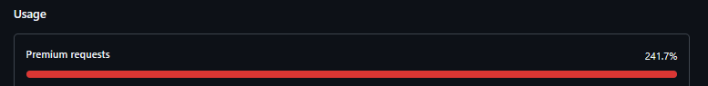
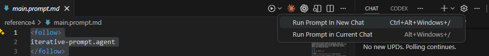
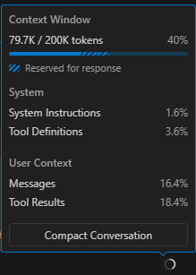
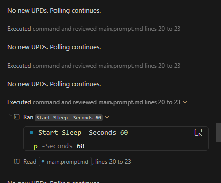

<follow>
iterative-prompt.agent
</follow>

## UPD1

Дальше идет мой пост про `iterative prompt` - пожалуйста дополни [инструкцию](../../instructions/iterative-prompt.agent.md) в блоке `## Who I Am` этой мотивацией чтобы у всех, кто загрузил эту инструкцию было четкое понимание зачем вообще нужен `iterative prompt` и как он помогает экономить риквесты в условиях текущей модели оплаты за премиум риквесты в Github Copilot.

### Коллеги приветствую #СашаНашкодил

Наблюдая за тем, как расходуются премиум риквесты в GithubCopilot в VSCode на Claude Opus 4.6 



Могу сказать, что нашел такую закономерность - любой твой запрос на Claude Opus - это 1% в этом прогрессбаре. Независимо от количество входящих или исходящих токенов. Следовательно надо как можно дольше заставлять его работать автономно. Что этому помогает? 4 вещи. 

Во-первых: Надо поставить  "chat.agent.maxRequests": 2500 - так он не будет останавливаться каждые 25 (по умолчанию) циклов с вопросом "Копилот поработал некоторое время, продолжаем?"


Во-вторых. Твой промпт должен быть как можно более подробно расписан. Что сделать. Что потом сделать. Что седалть дальше. Желательно потом чтобы сразу и потестил. И закоммитил. И пошел на второй круг делания. И снова проверил сам себя. И снова закоммитил. И так далее, пока не достигнет завершения. 

В-третьих. Писать это в чате неудобно. А потому берем и создаем файлик `some-title.prompt.md` и прям в нем все пишем. Этот файлик я храню либо в папке requests или если дело касается обработки какого-то контента в папке - то в корне этой папки и называю там его main.prompt.md 

Дальше лучше. В-четвертых. У промпта появляется структура. 

```markdown
​<follow>
iterative-prompt.agent
</follow>

## UPD1

Тут пишу суть своего запроса, так подробно как описывал в "во-третьих".

## RESULT

А тут моделька мне отчитается о проделанной работе 

## UPD2

Потом я смогу написать, что еще мне потребуется от нее

## RESULT

И тут она мне отчитается о втором кусочке
```

Почему это классно? Сессия отработала, и если из нее не извлекли какую-то новую `instruction`/`skill` или не улучшили существующую, то скорее всего она потеряется в хистори. А порой так хочется вспомнить "как же я заставил модельку сгенерировать мне этот контент в проекте". С подобным подходом у меня main.prompt.md сохраняется в `git` вместе с сгенерированным контентом в этой папке и в будущем и коллеги и сама моделька лучше поймет как оно было создано. Сам файл - есть суть саммари о проделанной работе. Так что в чате я больше не пишу.

Еще удобно, что `VS Code`  позволяет `*.prompt.md` запускать прямо из идеешки. 



Этот подход я назвал `iterative prompt`. И он сам по себе полезен, без цели экономить токены. 

Но это не все. Сейчас покажу как можно небольшой доработкой вообще не расходовать токены.

Вернемся к началу поста. Там сказано, что сейчас чаржат за премиум модели от количества запросов (не из размера, не количества сгенеренных токенов). То есть если я скажу в инструкции что после того как ты отработаешь над текущим `## UPD[n]` и отчитаешься в `## RESULT` то залипай в терминале синхронно на 60 секунд, пока не появится новый `## UPD[n+1]`


То он это покорно сделает. 

Дальше надо синхронизировать два потока меня-кожаного и агента с его вейтами в терминале. Я могу написать в промпте что-то, но не дописать до конца. Агент проснется прочитает мой недописанный `## UPD[n+1]` и начнет выполнять. Чтобы пофиксить это я ему сказал "пока не увидишь в конце go засыпай дальше". И все.

Дрейфует ли контекст? Да мне все равно. Во-первых у меня `iterative prompt` - это по сути саммари контекста, что делали и во что это вылилось через все `## UPD[n]` -> `## RESULT` -> `## UPD[n+1]` -> `## RESULT` -> ... блоки в одном файле промпта.

А во вторых копилот делает сам `compact conversation` когда контекст переполняется



В-третьих я использую теперь Opus только. Он умнее. Он разберется. 

То есть с этим подходом час чат используется как пространство под-капотом где двигатель. А файл `main.prompt.md` это моя приборная панель. Запустив впервые, двигатель завелся и пыхтит



Но если мне что-то надо добавить, я иду в `main.prompt.md` и дописываю в конец 


Тут `желтое` это шапка, чтобы копилоту дать ссылку на инструкцию где все рассказано как все устроено. `Зеленое` - я пишу то что обычно писал в чате. 

`Фиолетовое` я пишу go когда понимаю что готов (это блок синхронизации с агентом).

`Красное` он дописывает, когда сделал работу и снова заснет на 60 секунд. 

А коммитая `main.prompt.md` в общий репозиторий вместе с коммитами, которые AI сгенерила, ты получишь так же историю того КАК (каким промптом) ты получил эти файлы. Весь же `main.prompt.md` является контекстом для какой-то фичи. По сути саммари чат сессии, которая раньше терялась. А сейчас вместе с проектом. 

Так открыв 5 ide-шек с разными проектами. Потенциально я могу за весь день заюзать 5% премиум риквестов, переделав купу работы. Поменяется ли это? Ну вероятно вскоре да. Но сама идея `iterative prompt` полезна не только для этого. Она полезна для того, чтобы структурировать работу с моделью. И не терять контекст. И не терять инструкцию с которой я получил AI-генерированные файлы с течением времени или при смене расположения воркспейса/ide. А так же дать возможность коллегам понять как эти файлы были сгенерированы.

### RESULT

- Modified [instructions/iterative-prompt.agent.md](../../instructions/iterative-prompt.agent.md) — added a new `### Why This Matters — Saving Premium Requests` subsection inside `## Who I Am`. It explains the Copilot premium-request billing model (1 request = 1% regardless of token count), and lists 6 concrete reasons why the iterative-prompt pattern helps economize: maximizing autonomous work, writing in a file instead of chat, structured UPD/RESULT cycles, zero-cost polling loop, context survival across compaction, and git-based shared knowledge.

## UPD2

А давай сделаем вот что, у нас есть [text](../../instructions/training-mode.agent.md) которй проходит в чате. И ребятам жалуются что много премиум токенов расходуется. А что если мы сделаем второй режим работы тренинга, когда в дополнение к этой инструкции будет использоваться `iterative prompt` подход. То есть в тренинг мод агенте надо указать, что если изначально идет запрос юзера пройти тренинг в `iterative prompt` подходе, то вся конверсация по модулю происходит в папке `work\NNN-task\main.prompt.md` и надо дать небольшой инструктаж юзера как вести переписку там, что такое UPD и RESULT и как команда `go` работает. Пусть изменений будет не много в основной инструкции по тренинговому режиму, можно этот весь инструктаж вынести в отдельный файл `training-mode-iterative-prompt.agent.md` и там уже расписать все подробно. И в основной инструкции по тренинговому режиму уже просто дать ссылку на эту инструкцию и написать, что если хочешь экономить премиум риквесты, то используй `iterative prompt` подход. Go

### RESULT

- Created [instructions/training-mode-iterative-prompt.agent.md](../../instructions/training-mode-iterative-prompt.agent.md) — full guide for running training sessions in iterative prompt mode: user onboarding script, prompt file template, flow example, agent loop rules, UPD format reference table, and switch-back instructions.
- Modified [instructions/training-mode.agent.md](../../instructions/training-mode.agent.md) — added `## 💡 Want to Save Premium Requests? Use Iterative Prompt Mode` section right after `## Training Mode Activation`, pointing to the new file.